# DMA-BUF 子系统架构分析

## 1. 概述

DMA-BUF 是 Linux 内核中用于跨设备、跨子系统共享缓冲区的通用框架。它允许不同的硬件设备（GPU、VPU、ISP、显示控制器等）和内核子系统之间高效地共享内存缓冲区，同时提供同步机制来协调对这些缓冲区的并发访问。

### 核心设计目标

- **零拷贝缓冲区共享**：通过文件描述符（FD）在进程和设备间传递缓冲区，无需数据拷贝
- **跨设备同步**：通过 dma-fence 机制实现异步 DMA 操作的跨驱动同步
- **统一抽象**：为不同内存后端（连续内存、非连续内存、用户态内存）提供统一接口
- **隐式/显式同步**：支持 dma-resv 隐式同步和 sync_file 显式同步两种模式

## 2. 整体架构

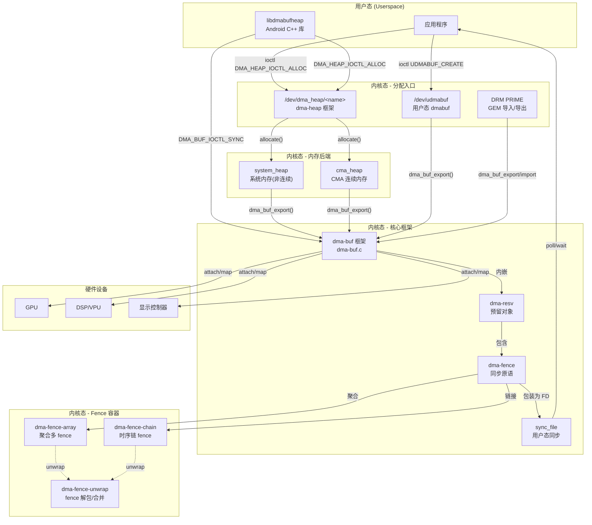

## 3. 模块详解

### 3.1 dma-buf 核心框架 (`dma-buf.c`)

dma-buf 是整个子系统的核心，定义了 `struct dma_buf` 结构体和与之关联的文件操作。

**主要职责：**

| 功能 | API | 说明 |
|------|-----|------|
| 导出缓冲区 | `dma_buf_export()` | 创建 dma-buf 文件描述符 |
| 获取 FD | `dma_buf_fd()` | 将 dma-buf 关联到文件描述符 |
| 设备附加 | `dma_buf_attach()` | 设备附加到缓冲区，获取 sg_table |
| DMA 映射 | `dma_buf_map/unmap()` | 建立/解除设备 DMA 映射 |
| mmap | `dma_buf_mmap()` | 用户态映射 |
| vmap | `dma_buf_vmap/vunmap()` | 内核态虚拟映射 |
| CPU 访问同步 | `begin/end_cpu_access` | CPU 缓存一致性操作 |
| 同步文件导出 | `dma_buf_sync_file_export()` | 导出隐式 fence 为 sync_file |
| 同步文件导入 | `dma_buf_sync_file_import()` | 导入 sync_file 为隐式 fence |
| poll | `dma_buf_poll()` | 用户态 poll 查询 fence 状态 |

**文件系统注册：**

dma-buf 使用伪文件系统（pseudo filesystem）实现，魔法数为 `DMA_BUF_MAGIC`。每个 dma-buf 都是一个匿名 inode 文件，通过 `anon_inode_getfile()` 创建。

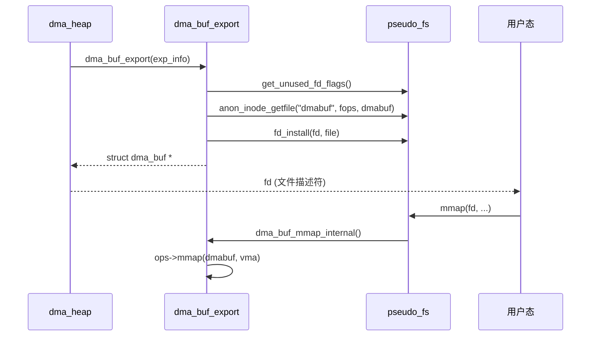

### 3.2 dma-fence 同步原语 (`dma-fence.c`)

dma-fence 是跨设备、跨驱动的异步同步原语，代表一个 DMA 操作的完成信号。

**核心概念：**

- **Context**：每个执行上下文有唯一的 64-bit context ID，同一 context 内的 fence 全序
- **Seqno**：同一 context 内递增的序列号，用于比较 fence 顺序
- **Signal**：fence 从未信号变为已信号的单向状态转换

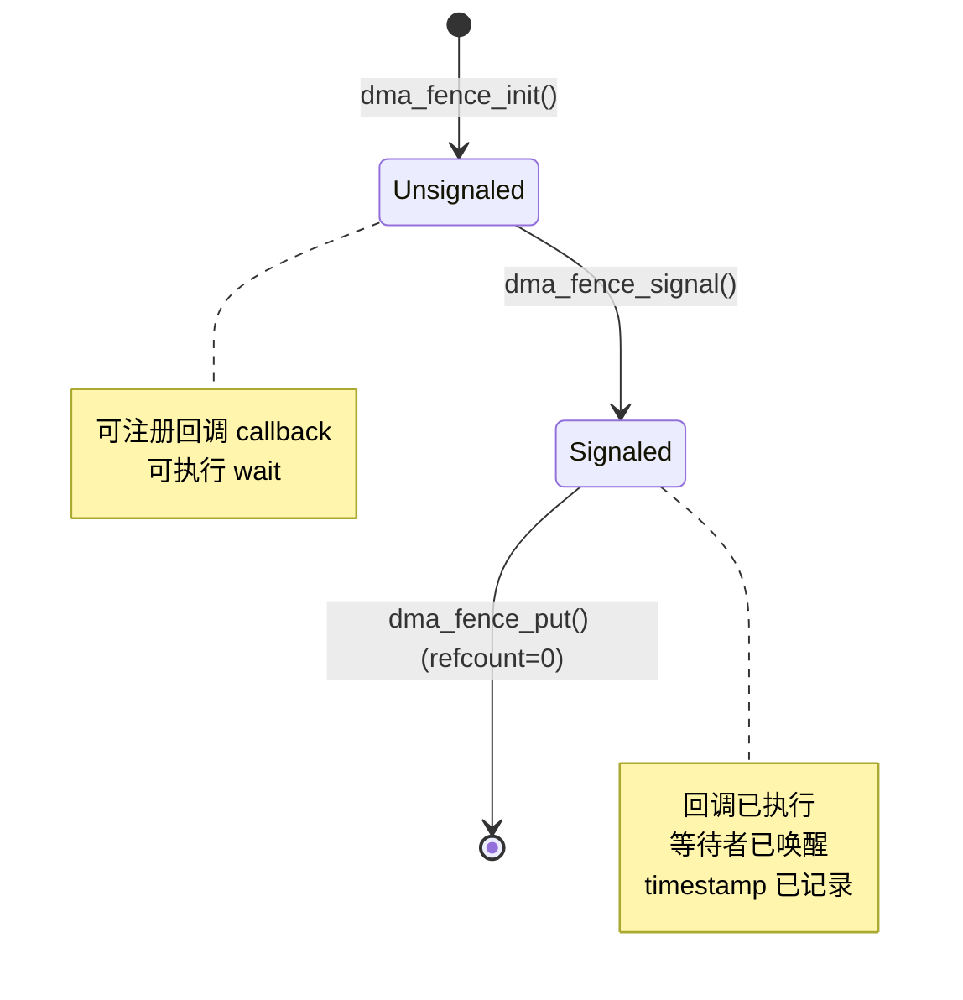

**关键操作：**

| 操作 | 函数 | 说明 |
|------|------|------|
| 初始化 | `dma_fence_init()` | 设置 context、seqno、ops、lock |
| 发信号 | `dma_fence_signal()` | 设置 SIGNALED 标志，执行所有回调 |
| 等待 | `dma_fence_wait()` | 阻塞等待 fence 信号 |
| 添加回调 | `dma_fence_add_callback()` | 注册信号完成回调 |
| 获取引用 | `dma_fence_get/put()` | 引用计数管理 |
| 设置截止时间 | `dma_fence_set_deadline()` | 提示信号方优先级（电源管理） |

**Lockdep 死锁检测：**

通过 `dma_fence_begin_signalling()` 和 `dma_fence_end_signalling()` 注解 fence 发信号的临界区，让 lockdep 能够检测 `dma_fence_wait()` 与 `dma_fence_signal()` 之间的死锁。

### 3.3 dma-fence-array (`dma-fence-array.c`)

将多个 fence 聚合为一个，支持 **全部完成才信号** 和 **任一完成即信号** 两种模式。

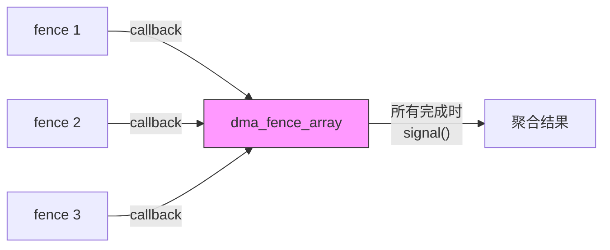

**工作机制：**
1. `enable_signaling` 时为每个子 fence 注册回调
2. 每个子 fence 完成时，原子递减 `num_pending` 计数器
3. 当 `num_pending` 降为 0 时，通过 `irq_work` 发信号
4. 错误传播：第一个子 fence 的错误会被记录到聚合结果中

### 3.4 dma-fence-chain (`dma-fence-chain.c`)

将 fence 按时序链接成链，支持 64-bit 序列号，用于时间线同步。

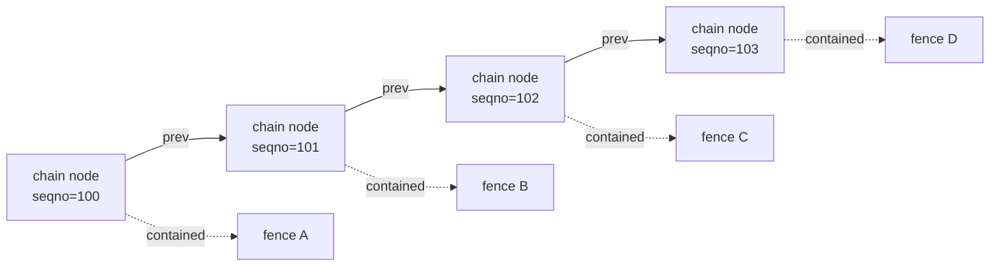

**RCU 垃圾回收：** 已信号的 chain 节点会被跳过并通过 RCU 安全释放，避免遍历已完成的节点。

### 3.5 dma-fence-unwrap (`dma-fence-unwrap.c`)

提供 fence 容器（array、chain）的扁平化解包和合并工具：

- `dma_fence_unwrap_first/next`：迭代嵌套容器中的所有叶 fence
- `dma_fence_merge()`：合并多个 fence 为一个（自动去重同 context fence）

### 3.6 dma-resv 预留对象 (`dma-resv.c`)

管理关联到一个共享资源（如缓冲区）的所有 fence，是隐式同步的核心。

**Fence 使用级别：**

| 级别 | 枚举值 | 说明 |
|------|--------|------|
| KERNEL | 0 | 内核内部使用，不暴露给用户态 |
| WRITE | 1 | 独占写操作 |
| READ | 2 | 共享读操作 |
| BOOKKEEP | 3 | 记账用途，包含所有 fence |

**RCU 保护的迭代器：**

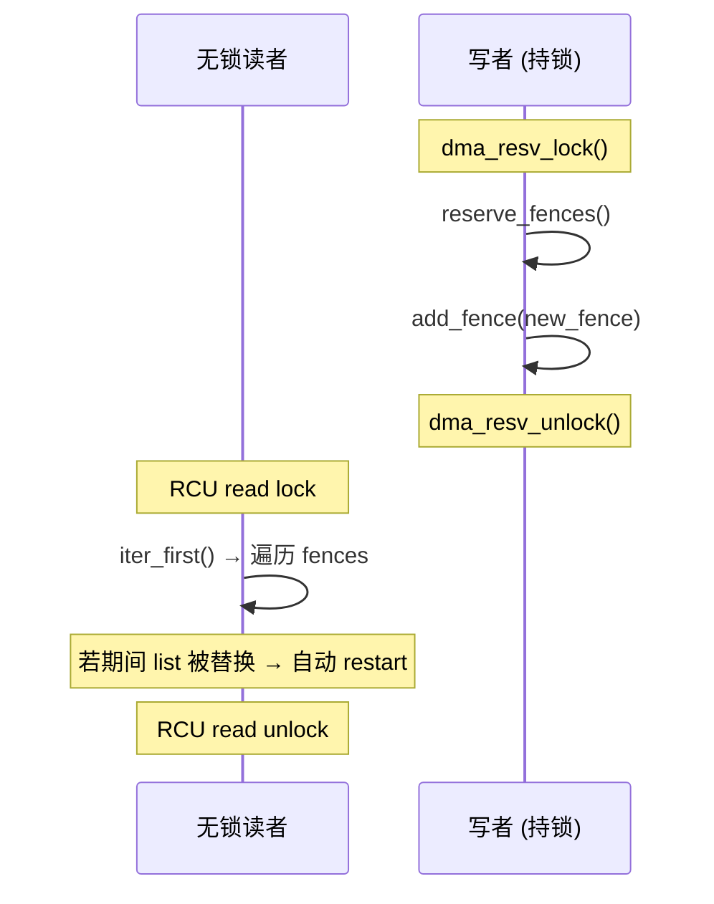

### 3.7 dma-heap 分配框架 (`dma-heap.c`)

为用户态提供统一的缓冲区分配接口，每个 heap 注册为 `/dev/dma_heap/<name>` 字符设备。

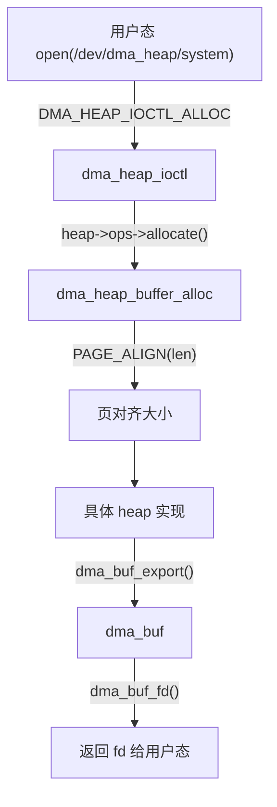

### 3.8 sync_file (`sync_file.c`)

将 dma-fence 包装为文件描述符，支持用户态显式同步。

**IOCTL 接口：**

| 命令 | 说明 |
|------|------|
| `SYNC_IOC_MERGE` | 合并两个 sync_file 为一个新的 |
| `SYNC_IOC_FILE_INFO` | 查询 fence 状态、时间戳、驱动信息 |
| `SYNC_IOC_SET_DEADLINE` | 设置截止时间提示 |

**用户态同步模型：**

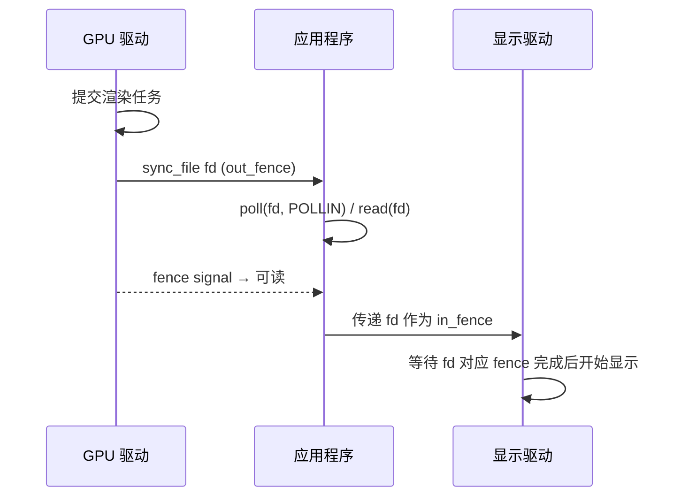

### 3.9 内存后端实现

#### system_heap (`heaps/system_heap.c`)

使用内核 buddy 分配器分配 **非连续物理内存**，通过 scatter-gather table 描述。

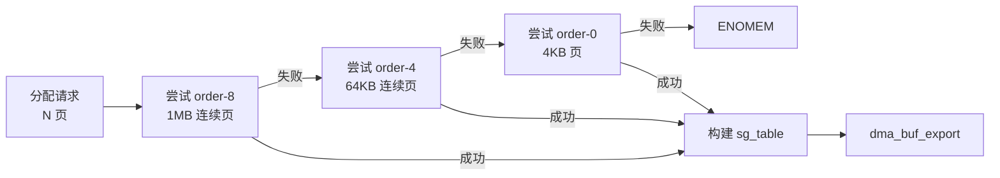

#### cma_heap (`heaps/cma_heap.c`)

使用 **CMA（连续内存分配器）** 分配物理连续内存，适用于对 DMA 地址连续性有要求的设备。

#### udmabuf (`udmabuf.c`)

将用户态 memfd 的页面 pin 住后转换为 dma-buf，适用于 QEMU 虚拟化场景。

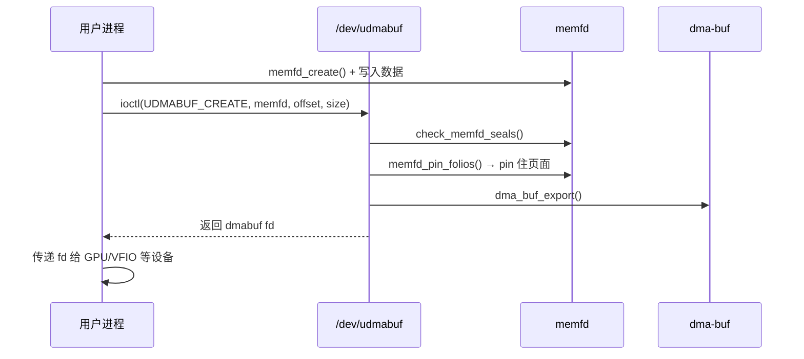

### 3.10 DRM PRIME (`drm_prime.c`)

DRM 子系统与 dma-buf 的桥接层，支持：
- **Export**：将 GEM buffer object 导出为 dma-buf FD
- **Import**：将 dma-buf FD 导入为 GEM buffer object
- 通过 rbtree 缓存 handle↔dmabuf 映射，确保同一对象只对应一个 handle

## 4. 关键数据结构

### 4.1 struct dma_buf (核心缓冲区对象)

```c
struct dma_buf {
    size_t size;                      // 缓冲区字节大小
    struct file *file;                // 关联的文件对象
    struct list_head attachments;     // 所有 device attachment 链表
    const struct dma_buf_ops *ops;    // 操作函数表
    struct mutex lock;                // 自旋锁
    void *priv;                       // 导出者私有数据

    struct dma_resv *resv;            // 预留对象（包含隐式 fence）

    wait_queue_head_t poll;           // poll 等待队列
    struct dma_buf_poll_cb_t cb_in;   // 读方向 poll 回调
    struct dma_buf_poll_cb_t cb_out;  // 写方向 poll 回调

    struct list_head list_node;       // 全局 dma-buf 列表节点
    char *name;                       // 调试用名称
    spinlock_t name_lock;             // name 访问锁
    struct module *owner;             // 拥有模块
    int vmapping_counter;             // 内核映射引用计数
};
```

### 4.2 struct dma_fence (同步原语)

```c
struct dma_fence {
    spinlock_t *lock;                 // 自旋锁（必须 irq-safe）
    const struct dma_fence_ops *ops;  // 操作函数表
    union {
        struct kref refcount;         // 引用计数
    };
    struct rcu_head rcu;              // RCU 释放头

    u64 context;                      // 执行上下文 ID（全局唯一）
    u64 seqno;                        // 上下文内序列号
    unsigned long flags;              // 状态标志
    ktime_t timestamp;                // 信号时间戳
    int error;                        // 完成错误码

    struct list_head cb_list;         // 回调链表
};
```

### 4.3 struct dma_resv (预留对象)

```c
struct dma_resv {
    struct ww_mutex lock;                     // 可重入互斥锁
    struct dma_resv_list __rcu *fences;       // RCU 保护的 fence 数组
};

// 内部 fence 列表结构
struct dma_resv_list {
    struct rcu_head rcu;
    u32 num_fences;                 // 当前 fence 数量
    u32 max_fences;                 // 预分配最大数量
    struct dma_fence __rcu *table[];// fence 指针 + usage 标志
};
// table[i] 低 2 位存储 dma_resv_usage 枚举值
```

### 4.4 struct dma_fence_array (fence 聚合)

```c
struct dma_fence_array {
    struct dma_fence base;          // 基类 fence
    spinlock_t lock;                // 独立锁
    atomic_t num_pending;           // 等待完成的子 fence 数
    struct dma_fence **fences;      // 子 fence 数组
    unsigned int num_fences;        // 子 fence 数量
    struct irq_work work;           // 信号通知 work
    struct dma_fence_array_cb callbacks[]; // 每个 fence 的回调
};
```

### 4.5 struct dma_fence_chain (fence 时序链)

```c
struct dma_fence_chain {
    struct dma_fence base;          // 基类 fence
    spinlock_t lock;
    struct dma_fence_cb cb;         // 当前等待的回调
    struct irq_work work;           // 重新 arm 回调的 work
    struct dma_fence __rcu *prev;   // 前一个 chain 节点
    struct dma_fence *fence;        // 包含的实际 fence
    uint64_t prev_seqno;            // 前节点的 seqno
};
```

### 4.6 struct dma_heap (堆设备)

```c
struct dma_heap {
    const char *name;               // 堆名称（如 "system"）
    const struct dma_heap_ops *ops; // 分配操作
    void *priv;                     // 堆私有数据
    dev_t heap_devt;                // 设备号
    struct list_head list;          // 全局堆列表
    struct cdev heap_cdev;          // 字符设备
};
```

### 4.7 struct dma_buf_ops (操作函数表)

```c
struct dma_buf_ops {
    int (*attach)(struct dma_buf *, struct dma_buf_attachment *);
    void (*detach)(struct dma_buf *, struct dma_buf_attachment *);
    struct sg_table *(*map_dma_buf)(struct dma_buf_attachment *,
                                     enum dma_data_direction);
    void (*unmap_dma_buf)(struct dma_buf_attachment *,
                           struct sg_table *, enum dma_data_direction);
    void (*release)(struct dma_buf *);
    int (*mmap)(struct dma_buf *, struct vm_area_struct *);
    int (*vmap)(struct dma_buf *, struct iosys_map *);
    void (*vunmap)(struct dma_buf *, struct iosys_map *);
    int (*begin_cpu_access)(struct dma_buf *, enum dma_data_direction);
    int (*end_cpu_access)(struct dma_buf *, enum dma_data_direction);
};
```

### 4.8 struct dma_fence_ops (fence 操作函数表)

```c
struct dma_fence_ops {
    const char *(*get_driver_name)(struct dma_fence *);
    const char *(*get_timeline_name)(struct dma_fence *);
    bool (*enable_signaling)(struct dma_fence *);
    bool (*signaled)(struct dma_fence *);
    void (*wait)(struct dma_fence *, bool intr, signed long timeout);
    void (*release)(struct dma_fence *);
    void (*fence_value_str)(struct dma_fence *, char *buf, size_t);
    void (*timeline_value_str)(struct dma_fence *, char *buf, size_t);
    void (*set_deadline)(struct dma_fence *, ktime_t deadline);
};
```

## 5. 关键链路分析

### 5.1 用户态缓冲区分配全链路

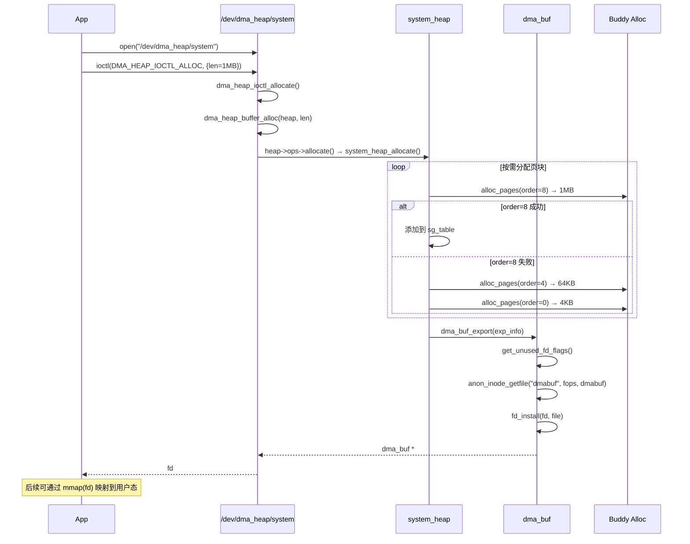

### 5.2 跨设备缓冲区共享链路

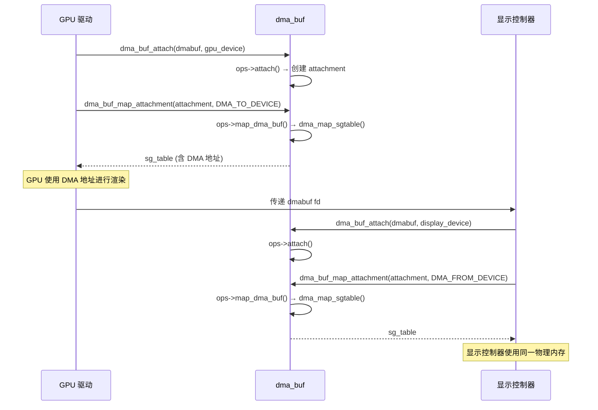

### 5.3 隐式同步链路 (dma-resv)

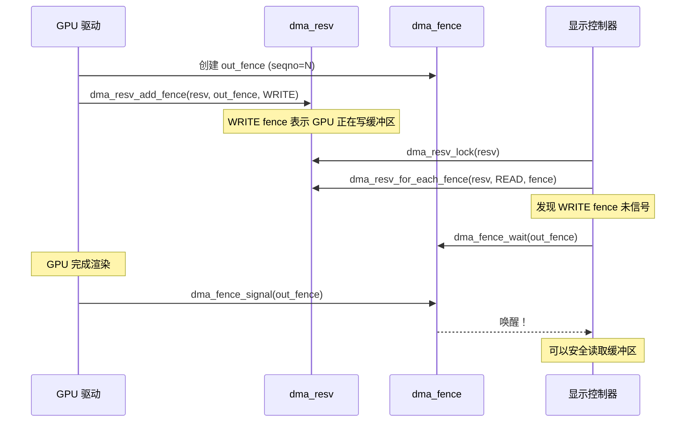

### 5.4 显式同步链路 (sync_file)

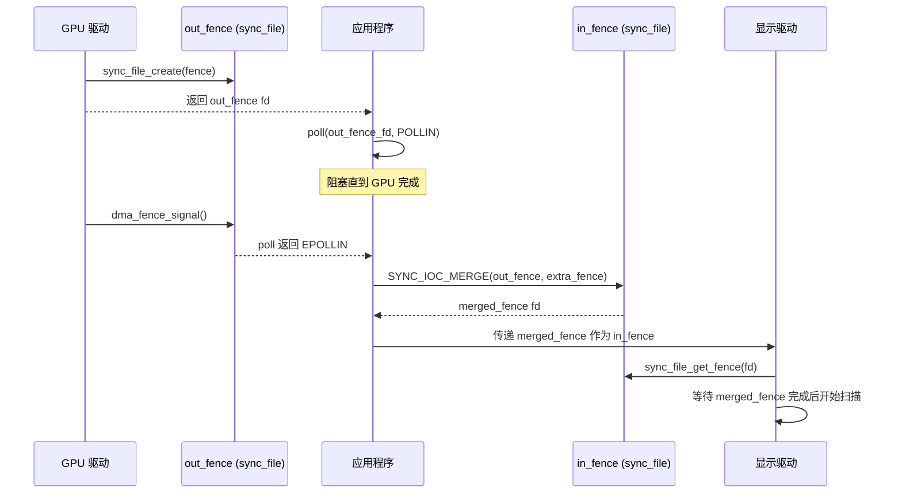

### 5.5 dma-buf 生命周期管理

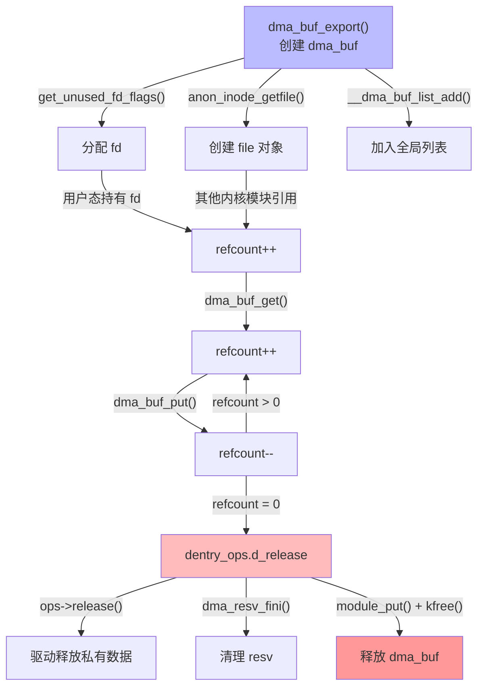

## 6. 用户态使用方式

### 6.1 通过 dma-heap 接口分配（推荐）

```c
// 1. 打开堆设备
int heap_fd = open("/dev/dma_heap/system", O_RDONLY);

// 2. 分配缓冲区
struct dma_heap_allocation_data alloc = {
    .len = 1024 * 1024,      // 1MB
    .fd_flags = O_RDWR | O_CLOEXEC,
    .heap_flags = 0,
};
ioctl(heap_fd, DMA_HEAP_IOCTL_ALLOC, &alloc);
int dmabuf_fd = alloc.fd;

// 3. mmap 到用户态
void *ptr = mmap(NULL, 1024*1024, PROT_READ|PROT_WRITE, MAP_SHARED, dmabuf_fd, 0);

// 4. CPU 缓存同步
struct dma_buf_sync sync = { .flags = DMA_BUF_SYNC_START | DMA_BUF_SYNC_RW };
ioctl(dmabuf_fd, DMA_BUF_IOCTL_SYNC, &sync);
// ... 读写 ptr ...
sync.flags = DMA_BUF_SYNC_END | DMA_BUF_SYNC_RW;
ioctl(dmabuf_fd, DMA_BUF_IOCTL_SYNC, &sync);

// 5. 传递给设备驱动（通过特定驱动 ioctl）
// 6. 显式同步
struct sync_fence_info info;
struct sync_file_info fi = { .num_fences = 0 };
ioctl(dmabuf_fd, DMA_BUF_IOCTL_SYNC_FILE, &fi);  // 导出 fence
poll(fi.fence, POLLIN, -1);  // 等待设备操作完成
```

### 6.2 通过 Android libdmabufheap（封装库）

```cpp
BufferAllocator alloc;
// 自动探测 dma_heap 和 legacy ion
int fd = alloc.Alloc("system", size);
int fd = alloc.AllocSystem(true /*cpu_access*/, size);
alloc.CpuSyncStart(fd, SyncType::kSyncReadWrite);
alloc.CpuSyncEnd(fd, SyncType::kSyncReadWrite);
```

**自动回退机制：**

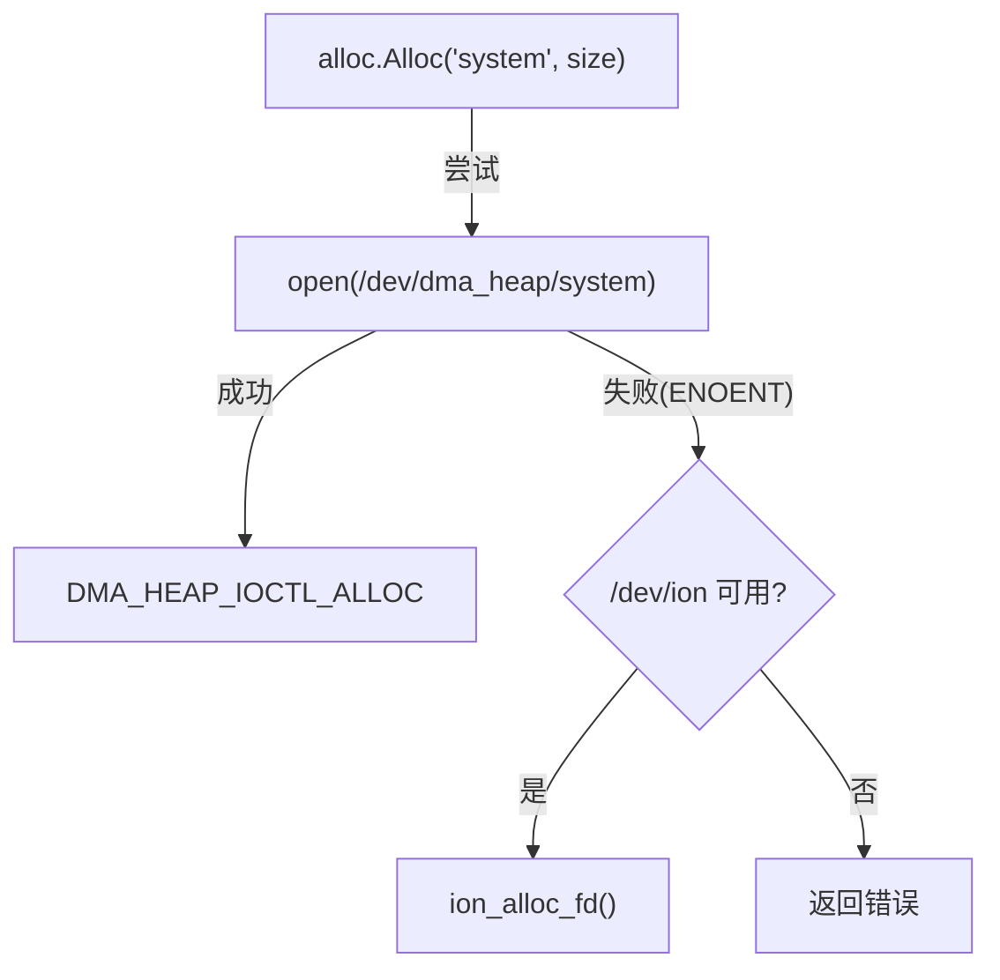

### 6.3 通过 udmabuf 接口（QEMU 场景）

```c
// 1. 创建 memfd 并写入数据
int memfd = memfd_create("guest-fb", MFD_ALLOW_SEALING);
ftruncate(memfd, size);
write(memfd, data, size);
fcntl(memfd, F_ADD_SEALS, F_SEAL_SHRINK | F_SEAL_WRITE | F_SEAL_FUTURE_WRITE);

// 2. 转换为 dmabuf
struct udmabuf_create create = { .memfd = memfd, .offset = 0, .size = size };
int udmabuf_fd = open("/dev/udmabuf", O_RDWR);
ioctl(udmabuf_fd, UDMABUF_CREATE, &create);
int dmabuf_fd = create.fd;  // 可传递给 VFIO/GPU
```

## 7. 内核模块使用方式

### 7.1 导出 dma-buf

```c
// 1. 实现 dma_buf_ops
static const struct dma_buf_ops my_ops = {
    .attach = my_attach,
    .detach = my_detach,
    .map_dma_buf = my_map,
    .unmap_dma_buf = my_unmap,
    .release = my_release,
    .mmap = my_mmap,
    .begin_cpu_access = my_begin_cpu,
    .end_cpu_access = my_end_cpu,
};

// 2. 导出
DEFINE_DMA_BUF_EXPORT_INFO(exp_info);
exp_info.ops = &my_ops;
exp_info.size = buf_size;
exp_info.priv = my_private;
struct dma_buf *dmabuf = dma_buf_export(&exp_info);
int fd = dma_buf_fd(dmabuf, O_CLOEXEC);
```

### 7.2 导入 dma-buf 并 DMA 映射

```c
struct dma_buf *dmabuf = dma_buf_get(fd);
struct dma_buf_attachment *attach = dma_buf_attach(dmabuf, my_dev);
struct sg_table *sgt = dma_buf_map_attachment(attach, DMA_TO_DEVICE);
// 使用 sgt 中的 DMA 地址
// ...
dma_buf_unmap_attachment(attach, sgt, DMA_TO_DEVICE);
dma_buf_detach(dmabuf, attach);
dma_buf_put(dmabuf);
```

### 7.3 注册自定义 dma-heap

```c
static struct dma_buf *my_heap_allocate(struct dma_heap *heap,
                                         unsigned long len,
                                         u32 fd_flags, u64 heap_flags) {
    // 分配内存、构建 sg_table、调用 dma_buf_export
}

static const struct dma_heap_ops my_heap_ops = {
    .allocate = my_heap_allocate,
};

static int __init my_heap_init(void) {
    struct dma_heap_export_info exp_info = {
        .name = "my_custom_heap",
        .ops = &my_heap_ops,
        .priv = NULL,
    };
    return PTR_ERR_OR_ZERO(dma_heap_add(&exp_info));
}
module_init(my_heap_init);
```

## 8. 构建系统

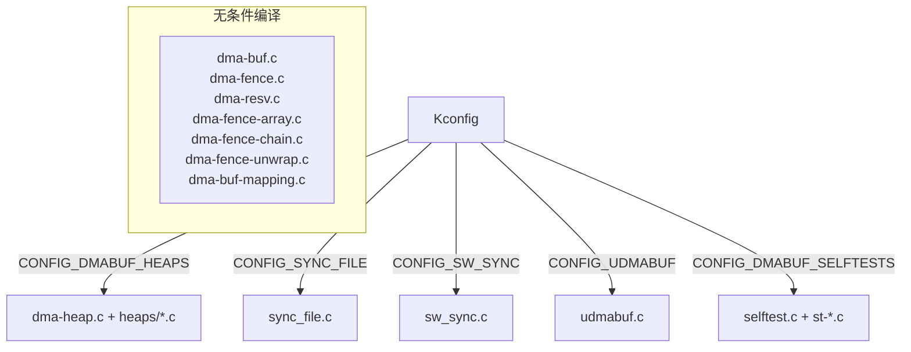

## 9. 同步模型对比

```mermaid
graph TB
    subgraph "隐式同步 (Implicit)"
        I1[dma_buf.resv] --> I2[包含 WRITE/READ fence]
        I2 --> I3[设备自动等待相关 fence]
        I3 --> I4[用户态通过 poll() 查询状态]
    end

    subgraph "显式同步 (Explicit)"
        E1[驱动创建 out_fence] --> E2["sync_file_create()"]
        E2 --> E3[返回 sync_file fd 给用户态]
        E3 --> E4[用户态传递 fd 给下一设备]
        E4 --> E5[下一设备将 fd 作为 in_fence]
        E5 --> E6[设备自动等待 fence]
    end

    style I1 fill:#bfb
    style E1 fill:#fbb
```

## 10. 文件清单与角色

| 文件 | 角色 |
|------|------|
| `dma-buf.c` | 核心：dma_buf 结构体、文件操作、导出/导入、poll、mmap |
| `dma-fence.c` | 核心：dma_fence 同步原语、signal/wait/callback |
| `dma-resv.c` | 核心：dma_resv 预留对象、fence 容器管理 |
| `dma-fence-array.c` | 扩展：多 fence 聚合容器 |
| `dma-fence-chain.c` | 扩展：时序链 fence 容器（64-bit seqno） |
| `dma-fence-unwrap.c` | 工具：fence 解包、去重、合并 |
| `dma-heap.c` | 框架：用户态分配入口（/dev/dma_heap/） |
| `sync_file.c` | 接口：用户态显式同步（sync_file fd） |
| `sw_sync.c` | 调试：软件 sync timeline（debugfs） |
| `udmabuf.c` | 特殊：用户态内存转 dma-buf |
| `heaps/system_heap.c` | 后端：系统内存分配器（非连续） |
| `heaps/cma_heap.c` | 后端：CMA 连续内存分配器 |
| `drm_prime.c` | 桥接：DRM GEM ↔ dma-buf 转换 |
| `libdmabufheap/` | 用户态：Android 分配封装库 |
