# DMA-BUF 多媒体 Pipeline 设计：4路 Camera + VPU + NPU

## 1. 场景概述

本文描述如何利用 DMA-BUF 零拷贝共享和同步机制，构建一个高效的多媒体处理 Pipeline，串联以下组件：

- **4路 Camera（ISP）**：4 个摄像头并行采集，输出 YUV/RAW 帧
- **VPU（Video Processing Unit）**：视频编解码（H.264/H.265/AV1）
- **NPU（Neural Processing Unit）**：AI 推理（目标检测、语义分割等）

### 核心设计原则

| 原则 | 说明 |
|------|------|
| 零拷贝 | 全链路通过 fd 传递 dma-buf，无内存拷贝 |
| 双模式同步 | Pipeline 内部用隐式同步（dma-resv），跨子系统用显式同步（sync_file） |
| 池化分配 | 预分配帧缓冲池，避免运行时分配延迟 |
| Pin 最小化 | 只有正在使用的缓冲区才 pin 在设备地址空间 |

## 2. 整体架构

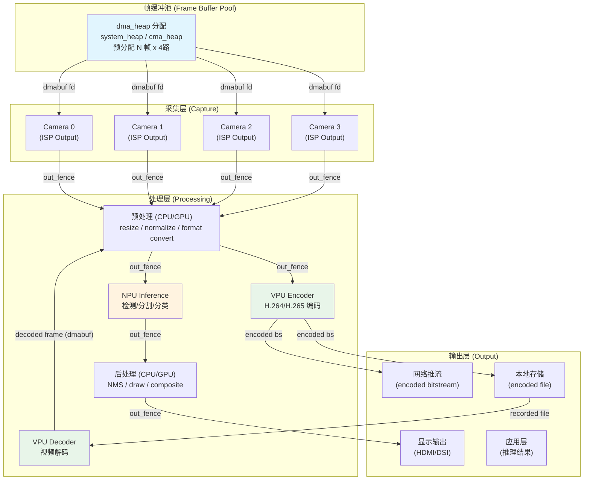

## 3. Pipeline 模式详解

### 3.1 模式一：实时采集 + AI 推理 + 编码存储

最典型的多路摄像头场景：4路摄像头同时采集，画面经 AI 推理处理后编码存储。

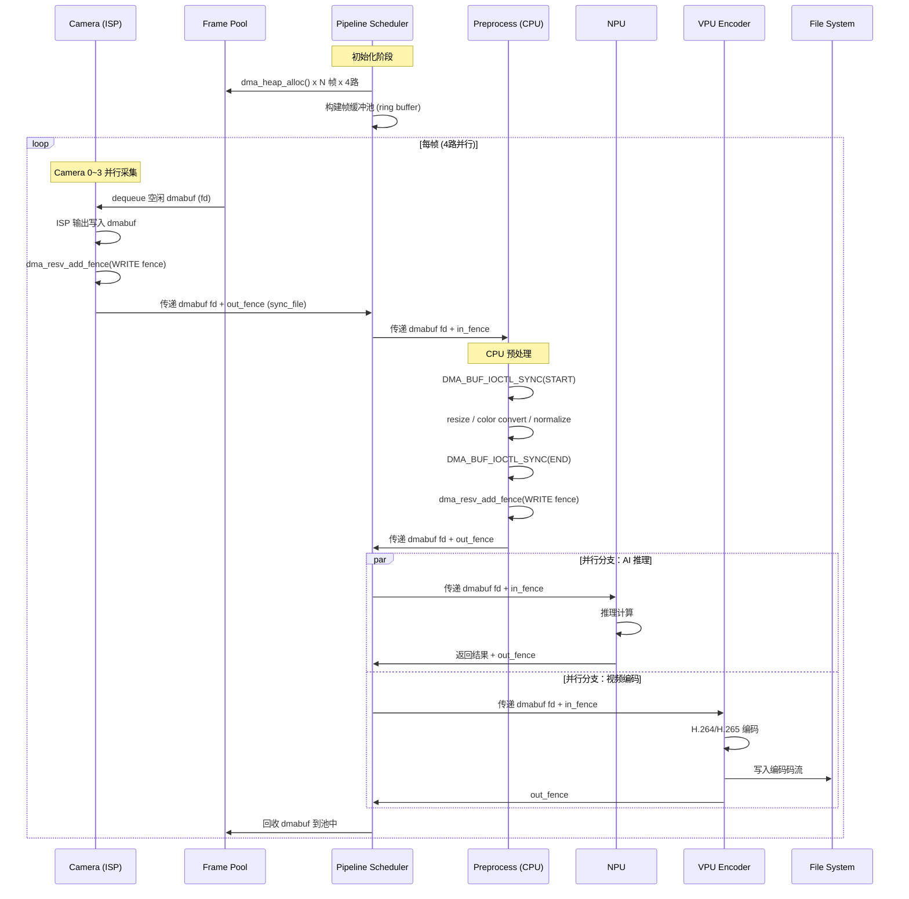

### 3.2 模式二：视频文件解码 + AI 推理

离线场景：读取录制文件，VPU 解码后送 NPU 推理。

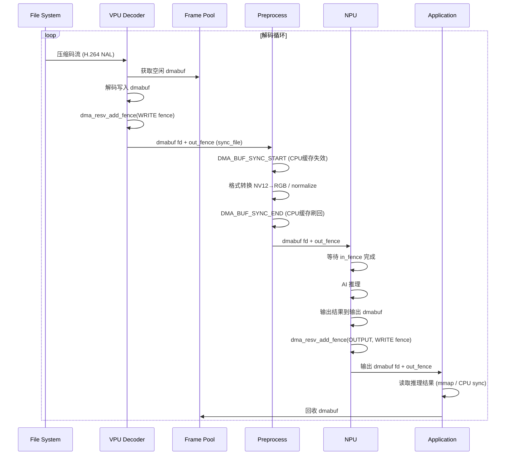

### 3.3 模式三：多路拼接 + 环视 + AI 检测

车载场景：4路摄像头画面拼接成环视，同时做目标检测。

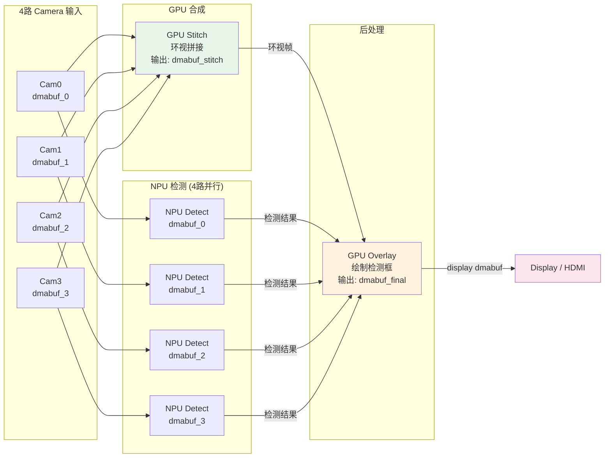

## 4. DMA-BUF 使用详解

### 4.1 帧缓冲池设计

```c
/* 帧缓冲池：预分配避免运行时延迟 */
struct frame_pool {
    int heap_fd;                  /* /dev/dma_heap/system 的 fd */
    struct dmabuf_frame *frames;  /* 预分配的帧数组 */
    int count;                    /* 帧数量 */
    int stride;                   /* 单帧字节数 */
    struct mutex lock;
};

struct dmabuf_frame {
    int dmabuf_fd;                /* dma-buf 文件描述符 */
    void *cpu_addr;               /* mmap 映射的 CPU 地址 */
    size_t size;
    bool in_use;
    struct sync_file *out_fence;  /* 最近一次操作的 out_fence */
};
```

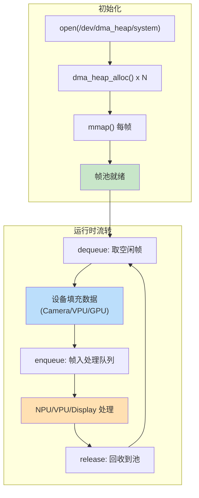

**池初始化代码：**

```c
int frame_pool_init(struct frame_pool *pool, int count, int width, int height)
{
    struct dma_heap_allocation_data alloc = { 0 };
    int i, ret;

    pool->heap_fd = open("/dev/dma_heap/system", O_RDONLY | O_CLOEXEC);
    pool->count = count;
    pool->stride = PAGE_ALIGN(width * height * 3 / 2);  /* NV12 格式 */
    pool->frames = calloc(count, sizeof(*pool->frames));
    mutex_init(&pool->lock);

    for (i = 0; i < count; i++) {
        alloc.len = pool->stride;
        alloc.fd_flags = O_RDWR | O_CLOEXEC;
        ret = ioctl(pool->heap_fd, DMA_HEAP_IOCTL_ALLOC, &alloc);
        if (ret < 0)
            return ret;

        pool->frames[i].dmabuf_fd = alloc.fd;
        pool->frames[i].size = pool->stride;
        pool->frames[i].cpu_addr = mmap(NULL, pool->stride,
                                         PROT_READ | PROT_WRITE,
                                         MAP_SHARED, alloc.fd, 0);
        if (pool->frames[i].cpu_addr == MAP_FAILED)
            return -ENOMEM;
    }
    return 0;
}
```

### 4.2 Camera → Preprocess 同步（隐式 + 显式混合）

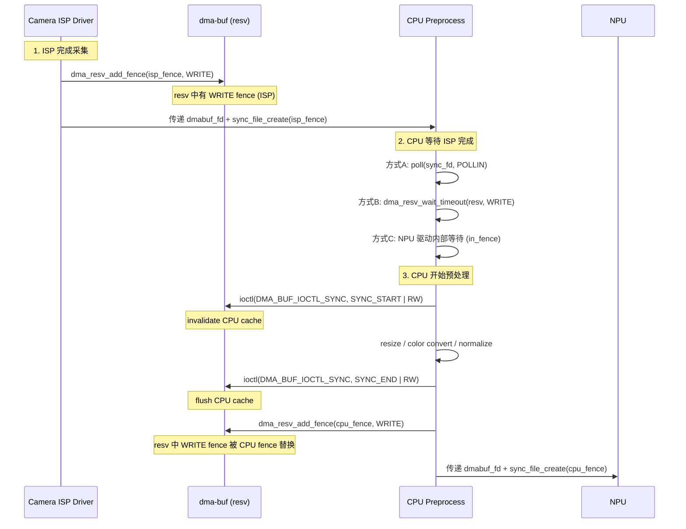

### 4.3 同步 Fence 的传递方式

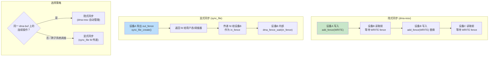

**使用建议：**

| 场景 | 推荐方式 | 原因 |
|------|---------|------|
| ISP → GPU → Display（同一缓冲区直通） | 隐式同步 | 同一 dma-buf 上的连续流水线，dma-resv 自动管理 |
| Camera → NPU（调度器中转） | 显式同步 | 需要用户态调度器协调多路缓冲区 |
| VPU Decode → NPU（同一驱动内） | 隐式同步 | 驱动内部可自动处理 |
| NPU → App 读取结果 | 显式同步 | 用户态需要知道推理何时完成 |
| 多路 Camera 合并输出 | 显式同步 | 需要等待 4 路全部完成后才开始合成 |

### 4.4 4路 Camera 并行 + NPU 的完整同步设计

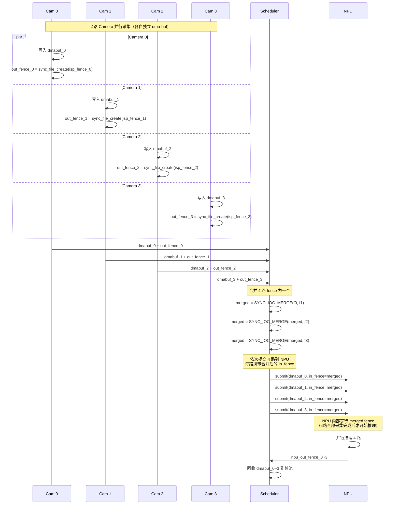

## 5. NPU 推理的 DMA-BUF 交互

### 5.1 NPU 输入输出缓冲区

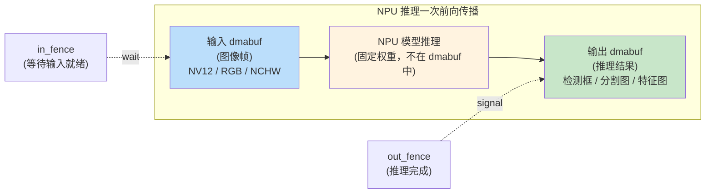

### 5.2 NPU 多批次推理（Batching）

将 4 路摄像头帧合并为一个 batch 送 NPU，提高利用率：

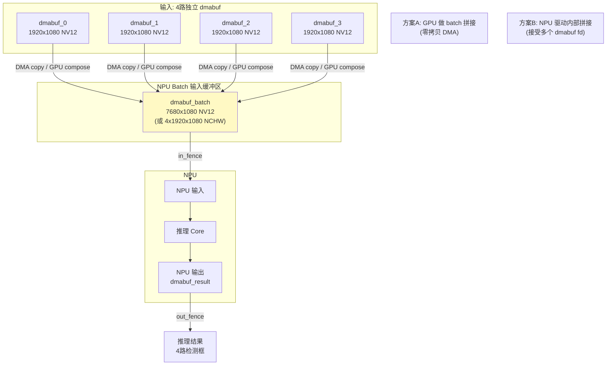

**方案 A（推荐）：GPU 做 batch 拼接**

```c
/* GPU 拼接 4 路帧到一个 batch dmabuf，全程零拷贝 */
int gpu_batch_compose(int batch_fd, int cam_fds[4], int width, int height)
{
    /* 1. GPU attach 到 5 个 dmabuf */
    struct dma_buf *batch = dma_buf_get(batch_fd);
    for (int i = 0; i < 4; i++) {
        struct dma_buf *cam = dma_buf_get(cam_fds[i]);
        dma_buf_attach(cam, gpu_device);
        dma_buf_put(cam);
    }
    dma_buf_attach(batch, gpu_device);

    /* 2. GPU DMA map 所有缓冲区 */
    /* 3. GPU 执行 copy/compose kernel */
    /* 4. GPU 输出 add_fence 到 batch dmabuf 的 resv */
    /* 5. 所有操作通过隐式同步自动串行 */
    return 0;
}
```

### 5.3 NPU 推理结果回读

```c
/*
 * NPU 推理完成后，CPU 读取结果的标准流程：
 * 1. 等待 out_fence 完成
 * 2. 执行 CPU 缓存同步
 * 3. 读取数据
 */
int npu_result_read(int result_fd, struct sync_file *out_fence, void *buf, size_t len)
{
    /* 方式1: 通过 sync_file fd 的 poll 等待 */
    struct pollfd pfd = { .fd = dup(sync_file_fd(out_fence)), .events = POLLIN };
    poll(&pfd, 1, -1);  /* 阻塞直到 NPU 完成 */
    close(pfd.fd);

    /* 方式2: 通过 dma-buf 隐式同步导出的 sync_file */
    /* dma_buf_ioctl(dmabuf_fd, DMA_BUF_IOCTL_EXPORT_SYNC_FILE, &arg); */
    /* poll(arg.fd, POLLIN, -1); */

    /* CPU 缓存同步：确保 NPU 写入的数据对 CPU 可见 */
    struct dma_buf_sync sync = { .flags = DMA_BUF_SYNC_START | DMA_BUF_SYNC_READ };
    ioctl(result_fd, DMA_BUF_IOCTL_SYNC, &sync);

    /* 现在可以安全读取结果 */
    void *addr = mmap(NULL, len, PROT_READ, MAP_SHARED, result_fd, 0);
    memcpy(buf, addr, len);

    /* 结束 CPU 访问 */
    sync.flags = DMA_BUF_SYNC_END | DMA_BUF_SYNC_READ;
    ioctl(result_fd, DMA_BUF_IOCTL_SYNC, &sync);

    munmap(addr, len);
    return 0;
}
```

## 6. 内存后端选择

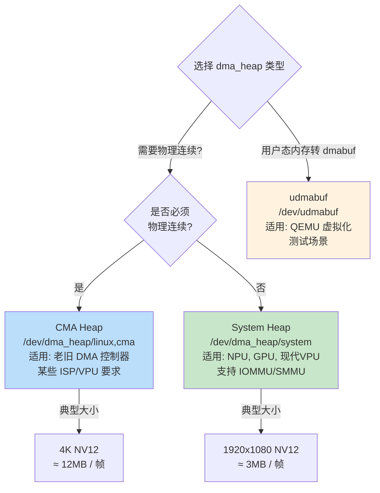

**推荐配置：**

| 组件 | 推荐 Heap | 理由 |
|------|----------|------|
| Camera ISP 输出 | CMA 或 vendor heap | ISP 通常要求物理连续 |
| GPU 中间结果 | system_heap | GPU 有 IOMMU，无需连续 |
| NPU 输入/输出 | system_heap | NPU 有 IOMMU |
| VPU 编码输入 | system_heap | 现代 VPU 支持 scatter-gather |
| VPU 解码输出 | system_heap | 同上 |
| Display 输出 | CMA 或 vendor heap | 显示控制器可能要求连续 |

## 7. Pipeline 调度器设计

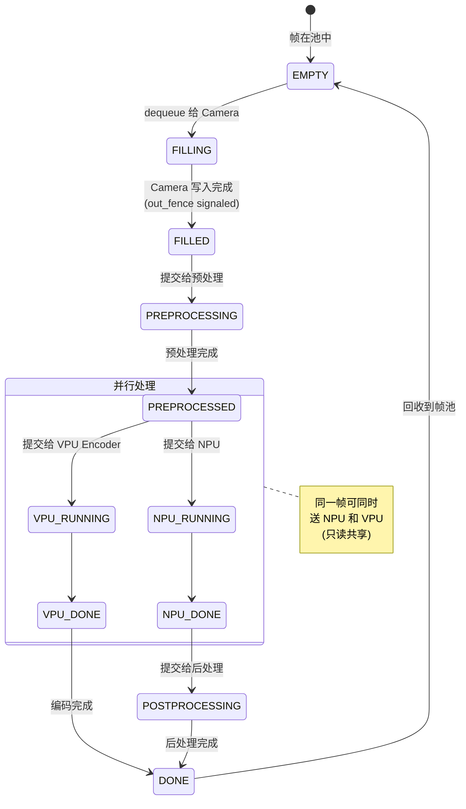

**调度器核心逻辑（伪代码）：**

```c
void pipeline_scheduler_loop(void)
{
    while (running) {
        /* 1. 检查 Camera 输出 */
        for (int cam = 0; cam < 4; cam++) {
            if (camera_frame_ready(cam)) {
                struct dmabuf_frame *frame = frame_pool_dequeue();
                struct sync_file *out_fence = camera_get_out_fence(cam);
                frame->out_fence = out_fence;

                /* 2. 提交预处理 */
                preprocess_submit(frame->dmabuf_fd, out_fence);
            }
        }

        /* 3. 检查预处理完成 */
        while ((frame = preprocess_dequeue())) {
            /* 4. 并行提交 NPU 和 VPU */
            struct sync_file *pre_fence = frame->out_fence;

            /* NPU 推理（需要等预处理完成） */
            npu_submit(frame->dmabuf_fd,
                      sync_file_fd(pre_fence),   /* in_fence */
                      result_pool_dequeue());     /* 输出 dmabuf */

            /* VPU 编码（需要等预处理完成，与 NPU 并行） */
            vpu_encode_submit(frame->dmabuf_fd,
                            sync_file_fd(pre_fence),  /* in_fence */
                            bitstream_fd);
        }

        /* 5. 检查 NPU/VPU 完成，回帧到池 */
        while ((frame = npu_dequeue_done())) {
            /* 读取推理结果，后处理... */
            frame_pool_release(frame);
        }
        while ((frame = vpu_dequeue_done())) {
            frame_pool_release(frame);
        }
    }
}
```

## 8. Fence 合并与等待的最佳实践

### 8.1 多路采集 → 单一 NPU 任务

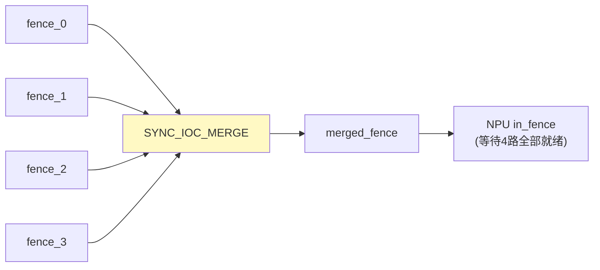

```c
/* 合并 4 路 Camera fence 为一个 */
int merge_4_cam_fences(int fence_fds[4])
{
    struct sync_merge_data data = { .flags = 0 };
    int merged_fd;

    /* 先合并 fence_0 和 fence_1 */
    data.fd2 = fence_fds[1];
    strncpy(data.name, "cam01", sizeof(data.name));
    int fd = open_sync_file(fence_fds[0]);
    ioctl(fd, SYNC_IOC_MERGE, &data);
    merged_fd = data.fence;
    close(fd);

    /* 合并 fence_2 */
    data.fd2 = fence_fds[2];
    strncpy(data.name, "cam012", sizeof(data.name));
    fd = open_sync_file(merged_fd);
    ioctl(fd, SYNC_IOC_MERGE, &data);
    close(merged_fd);
    merged_fd = data.fence;
    close(fd);

    /* 合并 fence_3 */
    data.fd2 = fence_fds[3];
    strncpy(data.name, "cam0123", sizeof(data.name));
    fd = open_sync_file(merged_fd);
    ioctl(fd, SYNC_IOC_MERGE, &data);
    close(merged_fd);
    merged_fd = data.fence;
    close(fd);

    return merged_fd;
}
```

### 8.2 单帧多消费者（NPU + VPU 并行读）

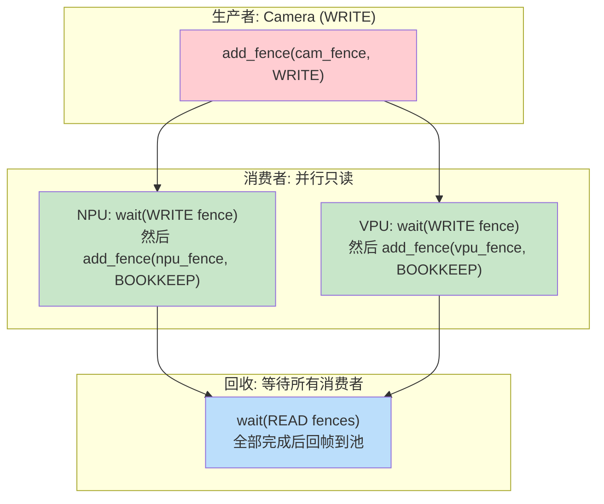

```c
/*
 * 多消费者场景的同步要点：
 * 1. Camera 写入后添加 WRITE fence
 * 2. NPU 和 VPU 都等待 WRITE fence（可并行，因为只读）
 * 3. NPU/VPU 完成后添加 BOOKKEEP 级别 fence（不阻塞写者）
 * 4. 调度器等待所有 BOOKKEEP fence 完成后回帧
 */

/* 步骤3: 消费者完成后添加 BOOKKEEP fence */
void npu_done_notify(int dmabuf_fd, struct dma_fence *npu_fence)
{
    /* 导入 fence 到 dma-resv，使用 BOOKKEEP 级别 */
    struct dma_buf_import_sync_file arg = {
        .flags = DMA_BUF_SYNC_READ,  /* 读操作 */
        .fd = sync_file_fd_create(npu_fence),
    };
    ioctl(dmabuf_fd, DMA_BUF_IOCTL_IMPORT_SYNC_FILE, &arg);
}

/* 步骤4: 等待所有消费者完成 */
int wait_all_consumers(int dmabuf_fd)
{
    struct dma_buf_export_sync_file arg = {
        .flags = DMA_BUF_SYNC_READ,  /* 等待所有 READ/BOOKKEEP fence */
    };
    /* 导出当前所有 READ 级别 fence */
    ioctl(dmabuf_fd, DMA_BUF_IOCTL_EXPORT_SYNC_FILE, &arg);

    struct pollfd pfd = { .fd = arg.fd, .events = POLLIN };
    poll(&pfd, 1, -1);  /* 阻塞等待 */
    close(arg.fd);
    return 0;
}
```

## 9. 性能优化要点

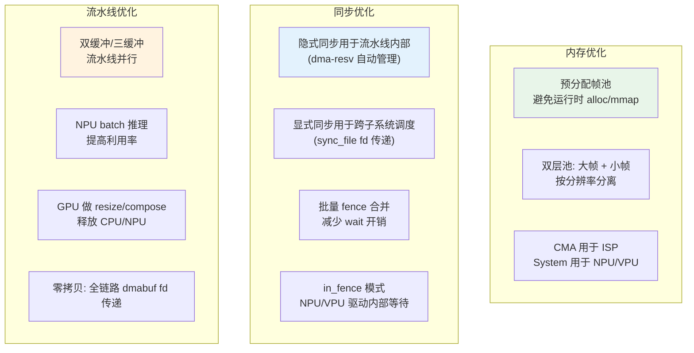

### 关键优化建议

| 优化点 | 方法 | 预期效果 |
|--------|------|---------|
| 避免内存拷贝 | 全链路 dma-buf fd 传递，不经过 CPU 中转 | 吞吐量提升 2-5x |
| 减少 fence 等待 | NPU/VPU 使用 in_fence 模式，驱动内等待 | 延迟降低 1-2ms |
| 批量推理 | GPU 拼接 4 路为 batch，NPU 一次处理 | NPU 利用率 4x |
| 预分配帧池 | 启动时分配所有帧，运行时零分配 | 消除帧分配抖动 |
| CPU 缓存同步最小化 | CPU 只在必要时 sync，其余走隐式同步 | 减少 cache flush 开销 |
| 双缓冲流水线 | 采集 N+2 帧时处理第 N 帧 | 帧率不受处理延迟影响 |

## 10. 典型端到端数据流

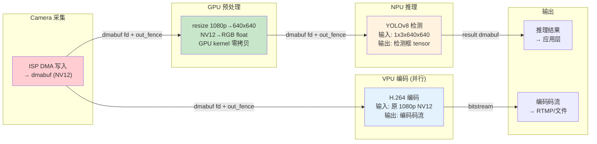

**每帧的数据流与 fence 传递：**

```
┌─────────┐   dmabuf_fd    ┌───────────┐   dmabuf_fd    ┌─────┐
│  Camera  │───+ out_fence──→│ Preprocess │───+ out_fence──→│ NPU │
│  (ISP)   │                │  (CPU/GPU) │                │     │
└─────────┘                └───────────┘                └─────┘
     │                                                       │
     │ dmabuf_fd (原始帧)                                     │ result
     │ + out_fence                                           │ dmabuf_fd
     ▼                                                       ▼
┌─────────┐                                            ┌──────────┐
│   VPU   │                                            │   App    │
│ Encoder │                                            │ (结果读取)│
└─────────┘                                            └──────────┘
     │
     │ encoded bitstream
     ▼
┌──────────┐
│  推流/存储  │
└──────────┘
```
