# QEMU 环境简易 DMA-BUF 模拟系统设计

## 1. 设计目标

在 QEMU 虚拟机中构建一套完整的简易 DMA-BUF 演示系统，涵盖：

- **导出驱动**：分配内核内存并导出为 dma-buf fd
- **导入驱动**：接收 dma-buf fd，设备侧 DMA 访问共享内存
- **自定义 Heap 驱动**：注册 `/dev/dma_heap/demo`，用户态通过 ioctl 分配
- **用户态 Demo**：演示完整的 allocate → share → sync 全流程

通过这套系统，开发者可以在 QEMU 中实际运行和调试 DMA-BUF 的完整生命周期。

## 2. 系统总览

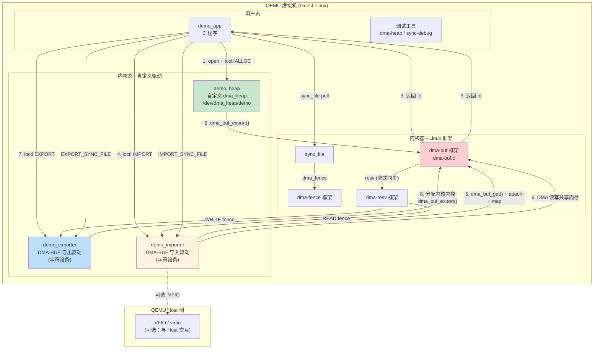
```mermaid
graph TB
    subgraph "QEMU 虚拟机 (Guest Linux)"
        subgraph "用户态"
            DEMO["demo_app<br/>C 程序"]
            TOOLS["调试工具<br/>dma-heap / sync-debug"]
        end

        subgraph "内核态 - 自定义驱动"
            HEAP["demo_heap<br/>自定义 dma_heap<br/>/dev/dma_heap/demo"]
            EXPORTER["demo_exporter<br/>DMA-BUF 导出驱动<br/>(字符设备)"]
            IMPORTER["demo_importer<br/>DMA-BUF 导入驱动<br/>(字符设备)"]
        end

        subgraph "内核态 - Linux 框架"
            DBUF["dma-buf 框架<br/>dma-buf.c"]
            FENCE["dma-fence 框架"]
            RESV["dma-resv 框架"]
            SFILE["sync_file"]
        end
    end

    subgraph "QEMU Host 侧"
        VFIO["VFIO / virtio<br/>(可选：与 Host 交互)"]
    end

    DEMO -->|"1. open + ioctl ALLOC"| HEAP
    HEAP -->|"2. dma_buf_export()"| DBUF
    DBUF -->|"3. 返回 fd"| DEMO

    DEMO -->|"4. ioctl IMPORT"| IMPORTER
    IMPORTER -->|"5. dma_buf_get() + attach + map"| DBUF
    IMPORTER -->|"6. DMA 读写共享内存"| DBUF

    DEMO -->|"7. ioctl EXPORT"| EXPORTER
    EXPORTER -->|"8. 分配内核内存<br/>dma_buf_export()"| DBUF
    DBUF -->|"9. 返回 fd"| DEMO

    DEMO -->|"sync_file poll"| SFILE
    SFILE -->|"dma_fence"| FENCE
    DBUF -->|"resv (隐式同步)"| RESV
    RESV -->|"WRITE fence"| EXPORTER
    RESV -->|"READ fence"| IMPORTER

    DEMO -->|"EXPORT_SYNC_FILE"| EXPORTER
    DEMO -->|"IMPORT_SYNC_FILE"| IMPORTER

    IMPORTER -.->|"可选: VFIO"| VFIO

    style HEAP fill:#c8e6c9
    style EXPORTER fill:#bbdefb
    style IMPORTER fill:#fff3e0
    style DBUF fill:#ffcdd2
```

## 3. 模块架构

### 3.1 模块职责划分

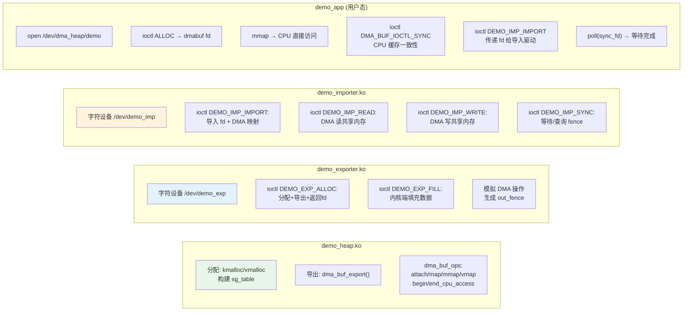
```mermaid
graph LR
    subgraph "demo_heap.ko"
        H1["分配: kmalloc/vmalloc<br/>构建 sg_table"]
        H2["导出: dma_buf_export()"]
        H3["dma_buf_ops:<br/>attach/map/mmap/vmap<br/>begin/end_cpu_access"]
    end

    subgraph "demo_exporter.ko"
        E1["字符设备 /dev/demo_exp"]
        E2["ioctl DEMO_EXP_ALLOC:<br/>分配+导出+返回fd"]
        E3["ioctl DEMO_EXP_FILL:<br/>内核端填充数据"]
        E4["模拟 DMA 操作<br/>生成 out_fence"]
    end

    subgraph "demo_importer.ko"
        I1["字符设备 /dev/demo_imp"]
        I2["ioctl DEMO_IMP_IMPORT:<br/>导入 fd + DMA 映射"]
        I3["ioctl DEMO_IMP_READ:<br/>DMA 读共享内存"]
        I4["ioctl DEMO_IMP_WRITE:<br/>DMA 写共享内存"]
        I5["ioctl DEMO_IMP_SYNC:<br/>等待/查询 fence"]
    end

    subgraph "demo_app (用户态)"
        A1["open /dev/dma_heap/demo"]
        A2["ioctl ALLOC → dmabuf fd"]
        A3["mmap → CPU 直接访问"]
        A4["ioctl DMA_BUF_IOCTL_SYNC<br/>CPU 缓存一致性"]
        A5["ioctl DEMO_IMP_IMPORT<br/>传递 fd 给导入驱动"]
        A6["poll(sync_fd) → 等待完成"]
    end

    style H1 fill:#e8f5e9
    style E1 fill:#e3f2fd
    style I1 fill:#fff3e0
```

## 4. 自定义 Heap 驱动 (demo_heap.ko)

### 4.1 数据结构

```c
/* demo_heap.h - 自定义 heap 驱动的数据结构 */

#include <linux/dma-buf.h>
#include <linux/dma-heap.h>
#include <linux/scatterlist.h>

/* ---------- 堆私有数据 ---------- */
struct demo_heap {
    struct dma_heap *heap;          /* dma_heap 框架句柄 */
    struct device *dev;             /* 用于 DMA 映射的虚拟设备 */
};

/* ---------- 单个缓冲区实例 ---------- */
struct demo_heap_buffer {
    struct dma_heap *heap;
    struct list_head attachments;   /* 设备 attachment 链表 */
    struct mutex lock;
    unsigned long len;              /* 缓冲区字节大小 */
    void *vaddr;                    /* 内核虚拟地址 (vmalloc) */
    struct page **pages;            /* 物理页数组 */
    unsigned int num_pages;         /* 物理页数量 */
    struct sg_table sg_table;       /* scatter-gather 表 */
};

/* ---------- 设备 attachment ---------- */
struct demo_attachment {
    struct device *dev;
    struct sg_table sg_table;       /* 映射后的 sg_table (含 DMA 地址) */
    struct list_head list;
    bool mapped;
};
```

### 4.2 dma_buf_ops 实现

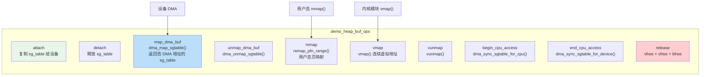
```mermaid
graph TD
    subgraph "demo_heap_buf_ops"
        ATTACH["attach<br/>复制 sg_table 给设备"]
        DETACH["detach<br/>释放 sg_table"]
        MAP["map_dma_buf<br/>dma_map_sgtable()<br/>返回含 DMA 地址的 sg_table"]
        UNMAP["unmap_dma_buf<br/>dma_unmap_sgtable()"]
        MMAP["mmap<br/>remap_pfn_range()<br/>用户态页映射"]
        VMAP["vmap<br/>vmap() 连续虚拟地址"]
        VUNMAP["vunmap<br/>vunmap()"]
        BEGIN["begin_cpu_access<br/>dma_sync_sgtable_for_cpu()"]
        END["end_cpu_access<br/>dma_sync_sgtable_for_device()"]
        RELEASE["release<br/>vfree + vfree + kfree"]
    end

    USER["用户态 mmap()"] --> MMAP
    KERNEL["内核模块 vmap()"] --> VMAP
    DEV["设备 DMA"] --> MAP

    style ATTACH fill:#e8f5e9
    style MAP fill:#bbdefb
    style RELEASE fill:#ffcdd2
```

### 4.3 分配流程

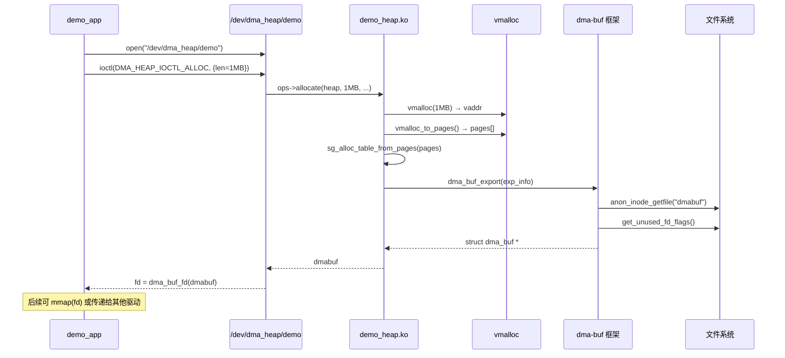
```mermaid
sequenceDiagram
    participant APP as demo_app
    participant HEAP as /dev/dma_heap/demo
    participant DRV as demo_heap.ko
    participant VM as vmalloc
    participant DBUF as dma-buf 框架
    participant FS as 文件系统

    APP->>HEAP: open("/dev/dma_heap/demo")
    APP->>HEAP: ioctl(DMA_HEAP_IOCTL_ALLOC, {len=1MB})
    HEAP->>DRV: ops->allocate(heap, 1MB, ...)

    DRV->>VM: vmalloc(1MB) → vaddr
    DRV->>VM: vmalloc_to_pages() → pages[]
    DRV->>DRV: sg_alloc_table_from_pages(pages)
    DRV->>DBUF: dma_buf_export(exp_info)
    DBUF->>FS: anon_inode_getfile("dmabuf")
    DBUF->>FS: get_unused_fd_flags()
    DBUF-->>DRV: struct dma_buf *
    DRV-->>HEAP: dmabuf
    HEAP-->>APP: fd = dma_buf_fd(dmabuf)

    Note over APP: 后续可 mmap(fd) 或传递给其他驱动
```

### 4.4 核心实现

```c
/* demo_heap.c - 自定义 heap 驱动核心 */

static struct dma_buf *demo_heap_allocate(struct dma_heap *heap,
                                           unsigned long len,
                                           u32 fd_flags,
                                           u64 heap_flags)
{
    struct demo_heap_buffer *buf;
    DEFINE_DMA_BUF_EXPORT_INFO(exp_info);
    struct dma_buf *dmabuf;
    unsigned int num_pages;
    int ret, i;

    len = PAGE_ALIGN(len);
    num_pages = len >> PAGE_SHIFT;

    /* 1. 分配缓冲区结构 */
    buf = kzalloc(sizeof(*buf), GFP_KERNEL);
    if (!buf)
        return ERR_PTR(-ENOMEM);

    buf->heap = heap;
    buf->len = len;
    buf->num_pages = num_pages;
    mutex_init(&buf->lock);
    INIT_LIST_HEAD(&buf->attachments);

    /* 2. 分配内核虚拟内存（非连续物理页） */
    buf->vaddr = vmalloc_user(num_pages * PAGE_SIZE);
    if (!buf->vaddr) {
        ret = -ENOMEM;
        goto free_buf;
    }

    /* 3. 将 vmalloc 地址转换为物理页数组 */
    buf->pages = kvmalloc_array(num_pages, sizeof(*buf->pages), GFP_KERNEL);
    if (!buf->pages) {
        ret = -ENOMEM;
        goto free_vaddr;
    }
    for (i = 0; i < num_pages; i++)
        buf->pages[i] = vmalloc_to_page(buf->vaddr + i * PAGE_SIZE);

    /* 4. 构建 scatter-gather 表 */
    ret = sg_alloc_table_from_pages(&buf->sg_table, buf->pages,
                                     num_pages, 0, len, GFP_KERNEL);
    if (ret)
        goto free_pages;

    /* 5. 通过 dma-buf 框架导出 */
    exp_info.exp_name = "demo_heap";
    exp_info.ops = &demo_heap_buf_ops;
    exp_info.size = len;
    exp_info.flags = fd_flags;
    exp_info.priv = buf;
    dmabuf = dma_buf_export(&exp_info);
    if (IS_ERR(dmabuf)) {
        ret = PTR_ERR(dmabuf);
        goto free_sg;
    }

    /* 清零缓冲区 */
    memset(buf->vaddr, 0, len);
    return dmabuf;

free_sg:
    sg_free_table(&buf->sg_table);
free_pages:
    kvfree(buf->pages);
free_vaddr:
    vfree(buf->vaddr);
free_buf:
    kfree(buf);
    return ERR_PTR(ret);
}

/* 6. 注册堆到 dma-heap 框架 */
static int __init demo_heap_init(void)
{
    struct dma_heap_export_info info = {
        .name = "demo",
        .ops = &demo_heap_ops,
        .priv = &demo_heap_dev,
    };
    demo_heap_dev.heap = dma_heap_add(&info);
    return PTR_ERR_OR_ZERO(demo_heap_dev.heap);
}
module_init(demo_heap_init);
```

## 5. 导出驱动 (demo_exporter.ko)

### 5.1 设计思路

导出驱动模拟一个"虚拟 DMA 设备"，它：
1. 在内核中分配内存
2. 通过 dma-buf 导出给用户态
3. 模拟异步 DMA 操作（延迟写入 + fence 信号）
4. 用户态可通过 sync_file 等待操作完成

### 5.2 驱动架构

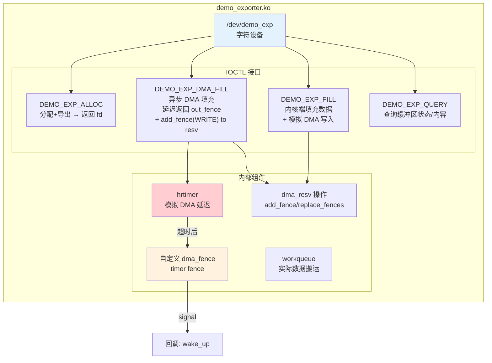
```mermaid
graph TD
    subgraph "demo_exporter.ko"
        CHAR["/dev/demo_exp<br/>字符设备"]

        subgraph "IOCTL 接口"
            ALLOC["DEMO_EXP_ALLOC<br/>分配+导出 → 返回 fd"]
            FILL["DEMO_EXP_FILL<br/>内核端填充数据<br/>+ 模拟 DMA 写入"]
            DMA_FILL["DEMO_EXP_DMA_FILL<br/>异步 DMA 填充<br/>延迟返回 out_fence<br/>+ add_fence(WRITE) to resv"]
            QUERY["DEMO_EXP_QUERY<br/>查询缓冲区状态/内容"]
        end

        subgraph "内部组件"
            TIMER["hrtimer<br/>模拟 DMA 延迟"]
            FENCE["自定义 dma_fence<br/>timer fence"]
            WB["workqueue<br/>实际数据搬运"]
            RESV_OP["dma_resv 操作<br/>add_fence/replace_fences"]
        end
    end

    CHAR --> ALLOC
    CHAR --> FILL
    CHAR --> DMA_FILL
    CHAR --> QUERY

    DMA_FILL --> TIMER
    TIMER -->|"超时后"| FENCE
    FENCE -->|"signal"| CB["回调: wake_up"]
    DMA_FILL --> RESV_OP
    FILL --> RESV_OP

    style CHAR fill:#e3f2fd
    style FENCE fill:#fff3e0
    style TIMER fill:#ffcdd2
```

### 5.3 模拟 DMA 操作的 fence 实现

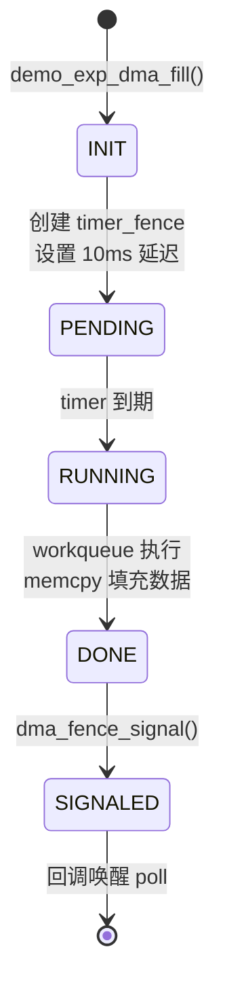
```mermaid
stateDiagram-v2
    [*] --> INIT: demo_exp_dma_fill()
    INIT --> PENDING: 创建 timer_fence<br/>设置 10ms 延迟
    PENDING --> RUNNING: timer 到期
    RUNNING --> DONE: workqueue 执行<br/>memcpy 填充数据
    DONE --> SIGNALED: dma_fence_signal()
    SIGNALED --> [*]: 回调唤醒 poll
```

### 5.4 核心 ioctl 实现

```c
/* demo_exporter.c - 导出驱动 */

/*
 * DEMO_EXP_DMA_FILL: 模拟异步 DMA 操作（集成 dma-resv 隐式同步）
 *
 * 1. 获取 dma-buf，等待 resv 中已有的 WRITE fence 完成
 * 2. 创建定时器 fence（10ms 后信号）
 * 3. 将 fence 添加到 dma-buf 的 resv 中（WRITE usage），实现隐式同步
 * 4. 将 fence 包装为 sync_file 返回给用户态
 * 5. fence 信号后通过 workqueue 实际填充数据
 * 6. 用户态通过 poll(sync_fd) 等待完成，或通过 DMA_BUF_IOCTL_EXPORT_SYNC_FILE 查询
 */
static long demo_exp_dma_fill(struct file *file, unsigned long arg)
{
    struct demo_exp_dma_fill_req req;
    struct dma_buf *dmabuf;
    struct dma_fence *fence;
    struct demo_timer_fence *tf;
    int ret, fd;

    if (copy_from_user(&req, (void __user *)arg, sizeof(req)))
        return -EFAULT;

    /* 1. 获取用户传入的 dma-buf */
    dmabuf = dma_buf_get(req.dmabuf_fd);
    if (IS_ERR(dmabuf))
        return PTR_ERR(dmabuf);

    /*
     * 2. 等待 dma-buf resv 中已有的 WRITE fence 完成
     * 确保没有其他设备正在写入此缓冲区
     * 这是隐式同步的核心：设备在操作前自动等待相关 fence
     */
    ret = dma_resv_wait_timeout(dmabuf->resv, DMA_RESV_USAGE_WRITE,
                                 true, MAX_SCHEDULE_TIMEOUT);
    if (ret < 0) {
        dma_buf_put(dmabuf);
        return ret;
    }

    /* 3. 创建定时器 fence，模拟 DMA 延迟 (10ms) */
    tf = kzalloc(sizeof(*tf), GFP_KERNEL);
    hrtimer_init(&tf->timer, CLOCK_MONOTONIC, HRTIMER_MODE_REL);
    tf->timer.function = demo_timer_cb;
    hrtimer_start(&tf->timer, ms_to_ktime(req.delay_ms ?: 10),
                  HRTIMER_MODE_REL);

    /* 4. fence 信号后，通过 workqueue 填充数据 */
    INIT_WORK(&tf->work, demo_fill_work);
    tf->dmabuf = dmabuf;
    tf->pattern = req.fill_pattern;

    dma_fence_init(&tf->base, &demo_timer_fence_ops, &tf->lock,
                   dma_fence_context_alloc(1), 1);

    /*
     * 5. 将 fence 添加到 dma-buf 的 resv 中（隐式同步关键步骤）
     * WRITE usage 表示：导出者正在写入此缓冲区
     * 其他设备在读取前会自动等待此 fence
     */
    dma_resv_lock(dmabuf->resv, NULL);
    ret = dma_resv_reserve_fences(dmabuf->resv, 1);
    if (!ret)
        dma_resv_add_fence(dmabuf->resv, &tf->base, DMA_RESV_USAGE_WRITE);
    dma_resv_unlock(dmabuf->resv);

    if (ret) {
        dma_fence_signal(&tf->base);  /* 清理：立即释放 fence */
        dma_buf_put(dmabuf);
        return ret;
    }

    /* 6. 包装为 sync_file fd 返回给用户态（显式同步路径） */
    struct sync_file *sf = sync_file_create(&tf->base);
    fd = get_unused_fd_flags(O_CLOEXEC);
    fd_install(fd, sf->file);

    req.out_fence_fd = fd;
    if (copy_to_user((void __user *)arg, &req, sizeof(req)))
        ret = -EFAULT;

    /*
     * 注意：不调用 dma_buf_put(dmabuf)
     * dma_resv_add_fence() 已经通过 dma_fence_get() 增加了引用
     * workqueue 回调中会调用 dma_buf_put() 释放
     */
    return ret;
}

/* workqueue 回调：实际"搬运"数据 */
static void demo_fill_work(struct work_struct *work)
{
    struct demo_timer_fence *tf =
        container_of(work, struct demo_timer_fence, work);
    struct dma_buf *dmabuf = tf->dmabuf;

    /*
     * 获取内核虚拟地址并填充模式数据。
     * begin_cpu_access 内部会通过 dma_resv_wait_timeout()
     * 等待 resv 中的隐式 fence（防御性编程，此处 fence 已 add 未 signal）
     */
    dma_buf_begin_cpu_access(dmabuf, DMA_TO_DEVICE);
    void *vaddr = dma_buf_vmap(dmabuf).vaddr;
    memset(vaddr, tf->pattern, dmabuf->size);
    dma_buf_end_cpu_access(dmabuf, DMA_TO_DEVICE);
    dma_buf_vunmap(dmabuf);

    /* 发信号：通知用户态 DMA 完成，同时解除 resv 中的隐式阻塞 */
    dma_fence_signal(&tf->base);
    dma_buf_put(dmabuf);
}
```

## 6. 导入驱动 (demo_importer.ko)

### 6.1 设计思路

导入驱动模拟一个"虚拟 DMA 消费设备"，它：
1. 接收用户态传入的 dma-buf fd
2. 在内核中 attach + map，获取设备 DMA 地址
3. 通过 DMA 地址读取/修改共享内存内容
4. 完成后通过 fence 通知

### 6.2 驱动架构

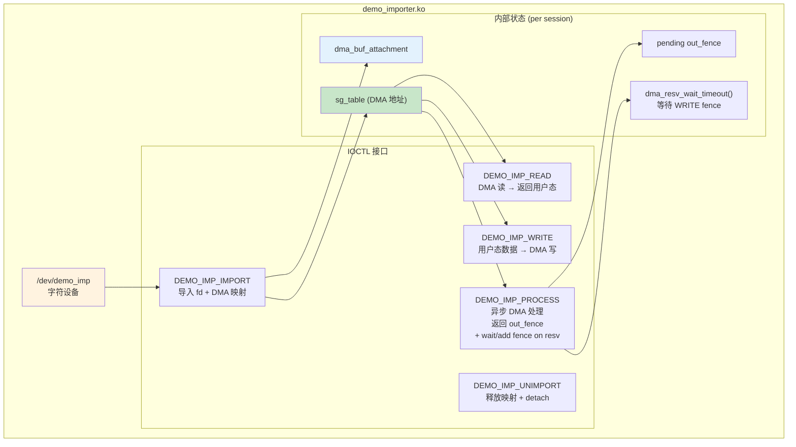
```mermaid
graph TD
    subgraph "demo_importer.ko"
        CHAR["/dev/demo_imp<br/>字符设备"]

        subgraph "IOCTL 接口"
            IMPORT["DEMO_IMP_IMPORT<br/>导入 fd + DMA 映射"]
            READ["DEMO_IMP_READ<br/>DMA 读 → 返回用户态"]
            WRITE["DEMO_IMP_WRITE<br/>用户态数据 → DMA 写"]
            PROCESS["DEMO_IMP_PROCESS<br/>异步 DMA 处理<br/>返回 out_fence<br/>+ wait/add fence on resv"]
            UNIMPORT["DEMO_IMP_UNIMPORT<br/>释放映射 + detach"]
        end

        subgraph "内部状态 (per session)"
            ATT["dma_buf_attachment"]
            SGT["sg_table (DMA 地址)"]
            FENCE["pending out_fence"]
            RESV_WAIT["dma_resv_wait_timeout()<br/>等待 WRITE fence"]
        end
    end

    CHAR --> IMPORT
    IMPORT --> ATT
    IMPORT --> SGT
    SGT --> READ
    SGT --> WRITE
    SGT --> PROCESS
    PROCESS --> FENCE
    PROCESS --> RESV_WAIT

    style CHAR fill:#fff3e0
    style ATT fill:#e3f2fd
    style SGT fill:#c8e6c9
```

### 6.3 导入与 DMA 映射流程

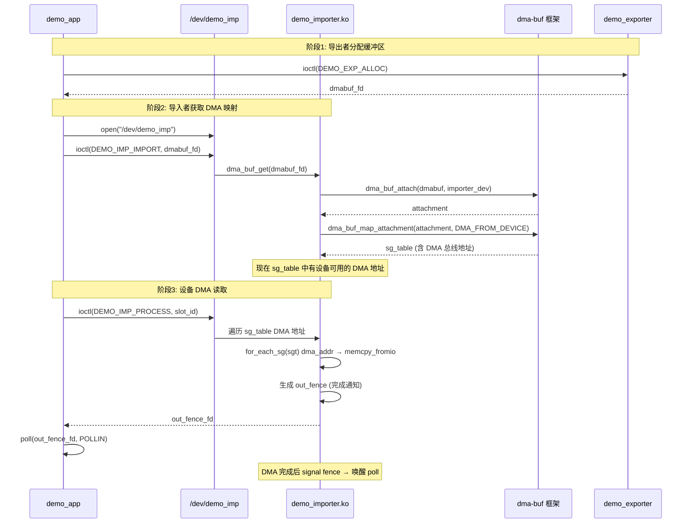
```mermaid
sequenceDiagram
    participant APP as demo_app
    participant IMP as /dev/demo_imp
    participant DRV as demo_importer.ko
    participant DBUF as dma-buf 框架
    participant EXPORTER as demo_exporter

    Note over APP,EXPORTER: 阶段1: 导出者分配缓冲区

    APP->>EXPORTER: ioctl(DEMO_EXP_ALLOC)
    EXPORTER-->>APP: dmabuf_fd

    Note over APP,DRV: 阶段2: 导入者获取 DMA 映射

    APP->>IMP: open("/dev/demo_imp")
    APP->>IMP: ioctl(DEMO_IMP_IMPORT, dmabuf_fd)

    IMP->>DRV: dma_buf_get(dmabuf_fd)
    DRV->>DBUF: dma_buf_attach(dmabuf, importer_dev)
    DBUF-->>DRV: attachment
    DRV->>DBUF: dma_buf_map_attachment(attachment, DMA_FROM_DEVICE)
    DBUF-->>DRV: sg_table (含 DMA 总线地址)
    Note over DRV: 现在 sg_table 中有设备可用的 DMA 地址

    Note over APP,DRV: 阶段3: 设备 DMA 读取

    APP->>IMP: ioctl(DEMO_IMP_PROCESS, slot_id)
    IMP->>DRV: 遍历 sg_table DMA 地址
    DRV->>DRV: for_each_sg(sgt) dma_addr → memcpy_fromio
    DRV->>DRV: 生成 out_fence (完成通知)
    DRV-->>APP: out_fence_fd

    APP->>APP: poll(out_fence_fd, POLLIN)
    Note over DRV: DMA 完成后 signal fence → 唤醒 poll
```

### 6.4 核心 ioctl 实现

```c
/* demo_importer.c - 导入驱动 */

struct demo_import_session {
    struct dma_buf *dmabuf;              /* 导入的 dma-buf */
    struct dma_buf_attachment *attach;   /* attachment */
    struct sg_table *sgt;                /* DMA 映射后的 sg_table */
    bool mapped;
};

/*
 * DEMO_IMP_IMPORT: 导入 dma-buf 并建立 DMA 映射
 */
static long demo_imp_import(struct file *file, unsigned long arg)
{
    struct demo_imp_import_req req;
    struct demo_import_session *sess;
    struct dma_buf *dmabuf;

    if (copy_from_user(&req, (void __user *)arg, sizeof(req)))
        return -EFAULT;

    sess = kzalloc(sizeof(*sess), GFP_KERNEL);
    if (!sess)
        return -ENOMEM;

    /* 1. 从 fd 获取 dma-buf */
    dmabuf = dma_buf_get(req.dmabuf_fd);
    if (IS_ERR(dmabuf)) {
        kfree(sess);
        return PTR_ERR(dmabuf);
    }
    sess->dmabuf = dmabuf;

    /* 2. 设备 attach */
    sess->attach = dma_buf_attach(dmabuf, importer_device);
    if (IS_ERR(sess->attach)) {
        dma_buf_put(dmabuf);
        kfree(sess);
        return PTR_ERR(sess->attach);
    }

    /* 3. DMA 映射（获取设备可访问的 DMA 总线地址） */
    sess->sgt = dma_buf_map_attachment(sess->attach, DMA_BIDIRECTIONAL);
    if (IS_ERR(sess->sgt)) {
        dma_buf_detach(dmabuf, sess->attach);
        dma_buf_put(dmabuf);
        kfree(sess);
        return PTR_ERR(sess->sgt);
    }
    sess->mapped = true;

    file->private_data = sess;

    /* 返回映射信息给用户态（调试用） */
    req.num_sg_entries = sess->sgt->nents;
    if (copy_to_user((void __user *)arg, &req, sizeof(req)))
        return -EFAULT;

    return 0;
}

/*
 * DEMO_IMP_PROCESS: 模拟设备 DMA 处理（集成 dma-resv 隐式同步）
 *
 * 1. 等待 dma-buf resv 中的 WRITE fence（确保缓冲区写入已完成）
 * 2. 遍历 sg_table 中的 DMA 地址，模拟设备读取共享内存
 * 3. 将设备自身的 READ fence 添加到 resv（通知其他消费者此设备正在读取）
 * 4. 生成 checksum 作为验证，通过 out_fence 通知完成
 */
static long demo_imp_process(struct file *file, unsigned long arg)
{
    struct demo_import_session *sess = file->private_data;
    struct demo_imp_process_req req;
    struct dma_fence *fence;
    u32 checksum = 0;
    struct scatterlist *sg;
    int i, ret;

    if (copy_from_user(&req, (void __user *)arg, sizeof(req)))
        return -EFAULT;

    /*
     * 1. 隐式同步：等待 dma-buf resv 中所有 WRITE fence 完成
     *    这确保了缓冲区的生产者（如 exporter）已经完成数据写入。
     *    这是 dma-resv 隐式同步的核心使用方式。
     */
    ret = dma_resv_wait_timeout(sess->dmabuf->resv,
                                 DMA_RESV_USAGE_WRITE,
                                 true, MAX_SCHEDULE_TIMEOUT);
    if (ret < 0) {
        pr_err("demo_imp: wait for WRITE fence failed: %d\n", ret);
        return ret;
    }

    /*
     * 2. 将设备的 READ fence 添加到 resv
     *    BOOKKEEP usage: 不阻塞后续写者，仅用于完成追踪
     *    如果需要阻塞写者（独占读），使用 DMA_RESV_USAGE_READ
     */
    fence = demo_create_completion_fence(0);  /* checksum 稍后填充 */
    dma_resv_lock(sess->dmabuf->resv, NULL);
    ret = dma_resv_reserve_fences(sess->dmabuf->resv, 1);
    if (!ret)
        dma_resv_add_fence(sess->dmabuf->resv, fence,
                            DMA_RESV_USAGE_BOOKKEEP);
    dma_resv_unlock(sess->dmabuf->resv);

    /* 3. 模拟设备 DMA 读取：遍历所有 DMA 地址段 */
    for_each_sgtable_dma_sg(sess->sgt, sg, i) {
        dma_addr_t addr = sg_dma_address(sg);
        size_t len = sg_dma_len(sg);

        /*
         * 真实设备会通过 MMIO 寄存器发起 DMA 传输：
         *   writel(addr, DEV_SRC_ADDR);
         *   writel(len, DEV_LENGTH);
         *   writel(CMD_START, DEV_CONTROL);
         *
         * 这里直接通过 CPU 读取（演示用），
         * 但地址来自 DMA 映射，证明设备可以用这些地址。
         */
        void *vaddr = dma_buf_vmap(sess->dmabuf).vaddr;
        /* 计算校验和验证数据一致性 */
        for (size_t j = 0; j < len; j++)
            checksum += ((u8 *)vaddr)[j];
        dma_buf_vunmap(sess->dmabuf);
    }

    /* 4. 更新 fence 的 checksum 并发信号 */
    demo_fence_set_checksum(fence, checksum);
    dma_fence_signal(fence);

    req.checksum = checksum;
    req.out_fence_fd = sync_file_fd_create(fence);
    if (req.out_fence_fd < 0) {
        dma_fence_put(fence);
        return req.out_fence_fd;
    }

    if (copy_to_user((void __user *)arg, &req, sizeof(req))) {
        close_fd(req.out_fence_fd);
        dma_fence_put(fence);
        return -EFAULT;
    }

    dma_fence_put(fence);
    return 0;
}
```

## 7. dma-resv 预留对象（隐式同步核心）

### 7.1 概述

`dma-resv`（Reservation Object）是 DMA-BUF 隐式同步的核心机制。每个 `dma_buf` 内嵌一个 `dma_resv`，作为该缓冲区所有 fence 的集中管理容器。当设备驱动对缓冲区执行 DMA 操作时，将对应的 fence 添加到 resv 中；其他设备在访问同一缓冲区前，自动等待 resv 中相关 fence 完成。

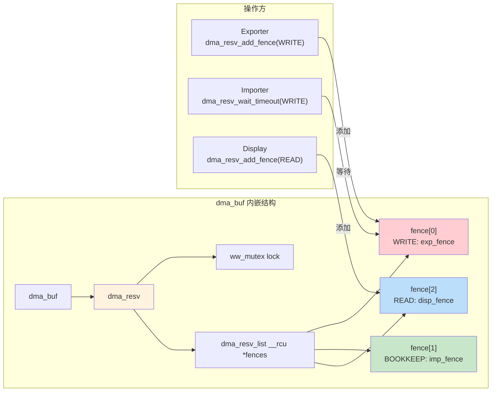
```mermaid
graph LR
    subgraph "dma_buf 内嵌结构"
        DB["dma_buf"] --> RESV["dma_resv"]
        RESV --> LOCK["ww_mutex lock"]
        RESV --> FLIST["dma_resv_list __rcu *fences"]
        FLIST --> F1["fence[0]<br/>WRITE: exp_fence"]
        FLIST --> F2["fence[1]<br/>BOOKKEEP: imp_fence"]
        FLIST --> F3["fence[2]<br/>READ: disp_fence"]
    end

    subgraph "操作方"
        EXP["Exporter<br/>dma_resv_add_fence(WRITE)"]
        IMP["Importer<br/>dma_resv_wait_timeout(WRITE)"]
        DISP["Display<br/>dma_resv_add_fence(READ)"]
    end

    EXP -->|"添加"| F1
    IMP -->|"等待"| F1
    DISP -->|"添加"| F3

    style RESV fill:#fff3e0
    style F1 fill:#ffcdd2
    style F2 fill:#c8e6c9
    style F3 fill:#bbdefb
```

### 7.2 数据结构

```c
/* dma-resv 核心数据结构 */

/* 预留对象：管理一个共享资源的所有 fence */
struct dma_resv {
    struct ww_mutex lock;                     /* 可重入互斥锁（支持死锁检测） */
    struct dma_resv_list __rcu *fences;       /* RCU 保护的 fence 数组 */
};

/* 内部 fence 列表 */
struct dma_resv_list {
    struct rcu_head rcu;                      /* RCU 延迟释放 */
    u32 num_fences;                           /* 当前 fence 数量 */
    u32 max_fences;                           /* 预分配最大数量 */
    struct dma_fence __rcu *table[];          /* fence 指针 + usage 标志 */
};
/*
 * table[i] 编码方式：
 *   低 2 位 = dma_resv_usage 枚举值（KERNEL/WRITE/READ/BOOKKEEP）
 *   高位   = dma_fence 指针
 *
 * 通过指针对齐保证：fence 指针低 2 位始终为 0，可安全复用。
 */
```

### 7.3 Fence 使用级别 (usage)

`dma_resv_usage` 定义了 fence 的使用语义，决定了隐式同步的行为：

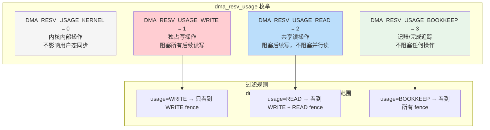
```mermaid
graph TB
    subgraph "dma_resv_usage 枚举"
        K["DMA_RESV_USAGE_KERNEL = 0<br/>内核内部操作<br/>不影响用户态同步"]
        W["DMA_RESV_USAGE_WRITE = 1<br/>独占写操作<br/>阻塞所有后续读写"]
        R["DMA_RESV_USAGE_READ = 2<br/>共享读操作<br/>阻塞后续写，不阻塞并行读"]
        B["DMA_RESV_USAGE_BOOKKEEP = 3<br/>记账/完成追踪<br/>不阻塞任何操作"]
    end

    subgraph "过滤规则<br/>dma_resv_iter 的 usage 参数控制迭代范围"
        R1["usage=WRITE → 只看到 WRITE fence"]
        R2["usage=READ → 看到 WRITE + READ fence"]
        R3["usage=BOOKKEEP → 看到所有 fence"]
    end

    W --> R1
    R --> R2
    B --> R3

    style W fill:#ffcdd2
    style R fill:#bbdefb
    style B fill:#e8f5e9
    style K fill:#f5f5f5
```

**使用场景对照：**

| 场景 | 生产者 usage | 消费者 wait usage | 消费者 add usage | 说明 |
|------|-------------|-------------------|-----------------|------|
| GPU 渲染 → 显示扫描 | WRITE | READ | READ | 显示等 GPU 写完再读 |
| ISP 采集 → NPU 推理 | WRITE | WRITE | BOOKKEEP | NPU 读完后不阻塞后续写 |
| CPU 预处理 → GPU 渲染 | WRITE (via ioctl) | WRITE | WRITE | CPU 通过 import_sync_file 添加 |
| 多设备并行读 | WRITE | READ | BOOKKEEP | 多个消费者同时读，用 BOOKKEEP 追踪 |

### 7.4 锁机制与死锁避免

`dma_resv` 使用 `ww_mutex`（wound-wait mutex）实现，支持多 resv 的安全锁定顺序：

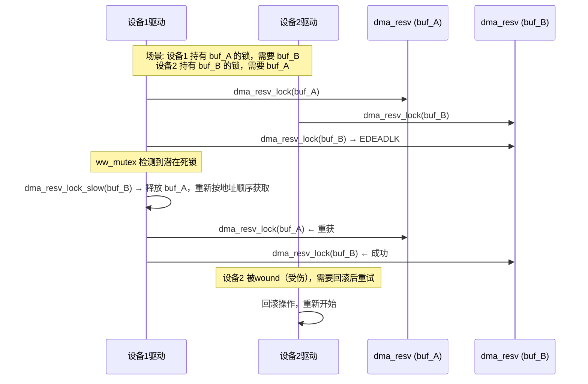
```mermaid
sequenceDiagram
    participant D1 as 设备1驱动
    participant D2 as 设备2驱动
    participant R1 as dma_resv (buf_A)
    participant R2 as dma_resv (buf_B)

    Note over D1,D2: 场景: 设备1 持有 buf_A 的锁，需要 buf_B<br/>设备2 持有 buf_B 的锁，需要 buf_A

    D1->>R1: dma_resv_lock(buf_A)
    D2->>R2: dma_resv_lock(buf_B)

    D1->>R2: dma_resv_lock(buf_B) → EDEADLK
    Note over D1: ww_mutex 检测到潜在死锁
    D1->>D1: dma_resv_lock_slow(buf_B) → 释放 buf_A，重新按地址顺序获取
    D1->>R1: dma_resv_lock(buf_A) ← 重获
    D1->>R2: dma_resv_lock(buf_B) ← 成功

    Note over D2: 设备2 被wound（受伤），需要回滚后重试
    D2->>D2: 回滚操作，重新开始
```

**关键 API：**

```c
/* 锁定单个 resv */
int dma_resv_lock(struct dma_resv *obj, struct ww_acquire_ctx *ctx);
void dma_resv_unlock(struct dma_resv *obj);

/* 死锁恢复：释放后慢路径重试 */
int dma_resv_lock_slow(struct dma_resv *obj, struct ww_acquire_ctx *ctx);

/* 锁断言（调试用） */
void dma_resv_assert_held(struct dma_resv *obj);

/* 锁定两个 resv（自动处理顺序） */
int dma_resv_lock_interruptible(struct dma_resv *obj, struct ww_acquire_ctx *ctx);
```

### 7.5 RCU 保护的迭代器

`dma_resv` 的读操作（遍历 fence）通过 RCU 机制实现无锁读取，避免与写操作竞争：

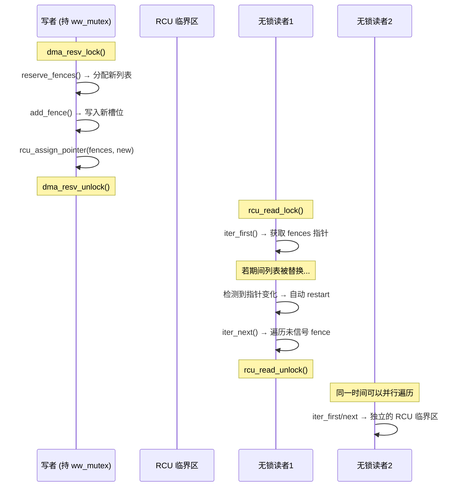
```mermaid
sequenceDiagram
    participant Writer as 写者 (持 ww_mutex)
    participant RCU as RCU 临界区
    participant Reader1 as 无锁读者1
    participant Reader2 as 无锁读者2

    Note over Writer: dma_resv_lock()

    Writer->>Writer: reserve_fences() → 分配新列表
    Writer->>Writer: add_fence() → 写入新槽位
    Writer->>Writer: rcu_assign_pointer(fences, new)

    Note over Writer: dma_resv_unlock()

    Note over Reader1: rcu_read_lock()
    Reader1->>Reader1: iter_first() → 获取 fences 指针
    Note over Reader1: 若期间列表被替换...
    Reader1->>Reader1: 检测到指针变化 → 自动 restart
    Reader1->>Reader1: iter_next() → 遍历未信号 fence
    Note over Reader1: rcu_read_unlock()

    Note over Reader2: 同一时间可以并行遍历
    Reader2->>Reader2: iter_first/next → 独立的 RCU 临界区
```

**迭代器 API：**

```c
/* ===== 持锁迭代（推荐，不会 restart） ===== */
struct dma_resv_iter cursor;
struct dma_fence *fence;

dma_resv_for_each_fence(&cursor, &resv, DMA_RESV_USAGE_READ, fence) {
    /* fence: 当前未信号的 fence (引用已 get) */
    /* dma_resv_iter_usage(&cursor): 获取 usage */
    /* 对 fence 执行等待或检查操作 */
    dma_fence_put(fence);  /* 用完释放引用 */
}

/* ===== 无锁迭代（可能 restart） ===== */
struct dma_resv_iter cursor;
struct dma_fence *fence;

dma_resv_iter_begin(&cursor, &resv, DMA_RESV_USAGE_READ);
dma_resv_for_each_fence_unlocked(&cursor, fence) {
    if (dma_resv_iter_is_restarted(&cursor)) {
        /* 遍历被中断，需要重新开始累积统计 */
        /* 不能依赖之前的临时结果 */
    }
    /* 处理 fence... */
}
dma_resv_iter_end(&cursor);
```

### 7.6 核心 API 详解

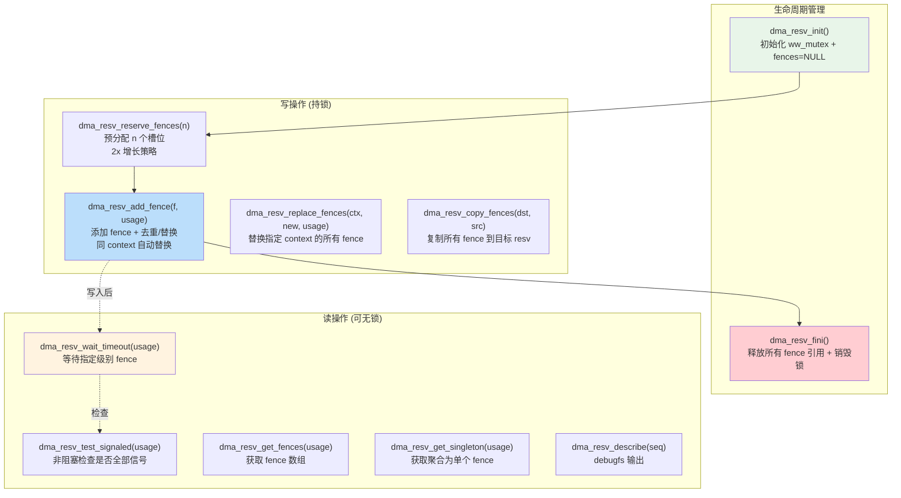
```mermaid
graph TD
    subgraph "生命周期管理"
        INIT["dma_resv_init()<br/>初始化 ww_mutex + fences=NULL"]
        FINI["dma_resv_fini()<br/>释放所有 fence 引用 + 销毁锁"]
    end

    subgraph "写操作 (持锁)"
        RESERVE["dma_resv_reserve_fences(n)<br/>预分配 n 个槽位<br/>2x 增长策略"]
        ADD["dma_resv_add_fence(f, usage)<br/>添加 fence + 去重/替换<br/>同 context 自动替换"]
        REPLACE["dma_resv_replace_fences(ctx, new, usage)<br/>替换指定 context 的所有 fence"]
        COPY["dma_resv_copy_fences(dst, src)<br/>复制所有 fence 到目标 resv"]
    end

    subgraph "读操作 (可无锁)"
        WAIT["dma_resv_wait_timeout(usage)<br/>等待指定级别 fence"]
        TEST["dma_resv_test_signaled(usage)<br/>非阻塞检查是否全部信号"]
        GET["dma_resv_get_fences(usage)<br/>获取 fence 数组"]
        SINGLE["dma_resv_get_singleton(usage)<br/>获取聚合为单个 fence"]
        DESCRIBE["dma_resv_describe(seq)<br/>debugfs 输出"]
    end

    INIT --> RESERVE
    RESERVE --> ADD
    ADD --> FINI

    ADD -.->|"写入后"| WAIT
    WAIT -.->|"检查"| TEST

    style INIT fill:#e8f5e9
    style ADD fill:#bbdefb
    style WAIT fill:#fff3e0
    style FINI fill:#ffcdd2
```

**关键实现细节：**

```c
/*
 * dma_resv_reserve_fences - 预分配 fence 槽位
 *
 * 扩容策略：
 *   - 首次分配: max(4, roundup_pow_of_two(num_fences))
 *   - 后续扩容: max(当前需求, 旧容量 * 2)
 *
 * 扩容时顺便清理已信号 fence（减少内存占用）。
 * 预分配的槽位在解锁后失效，下次 add_fence 前需重新 reserve。
 */
int dma_resv_reserve_fences(struct dma_resv *obj, unsigned int num_fences);

/*
 * dma_resv_add_fence - 添加 fence（核心去重逻辑）
 *
 * 去重/替换规则：
 *   1. 同一 context + 旧 usage >= 新 usage + 新 seqno >= 旧 seqno → 替换
 *   2. 旧 fence 已信号 → 替换
 *   3. 否则 → 追加到末尾
 *
 * 这保证了同一设备的后续操作自动覆盖前序操作，
 * 避免列表无限增长。
 */
void dma_resv_add_fence(struct dma_resv *obj, struct dma_fence *fence,
                        enum dma_resv_usage usage);

/*
 * dma_resv_wait_timeout - 等待指定级别的 fence
 *
 * 使用迭代器遍历所有匹配 usage 的未信号 fence，
 * 逐个调用 dma_fence_wait_timeout()。
 * 支持 interruptible 和 timeout 参数。
 * 可在不持锁的情况下调用。
 */
long dma_resv_wait_timeout(struct dma_resv *obj, enum dma_resv_usage usage,
                           bool intr, unsigned long timeout);
```

### 7.7 隐式同步与显式同步的桥接

用户态可通过 dma-buf 的 ioctl 将 sync_file（显式）转换为 resv fence（隐式），反之亦然：

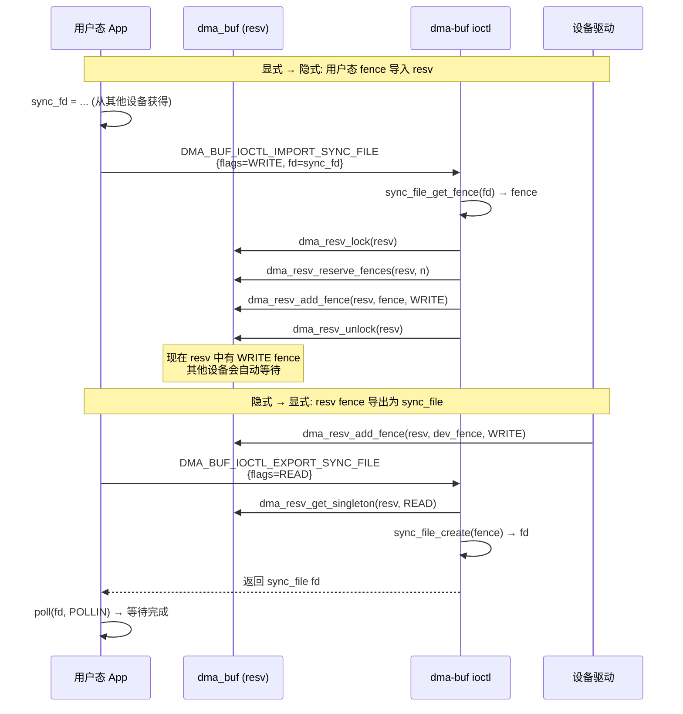
```mermaid
sequenceDiagram
    participant APP as 用户态 App
    participant DBUF as dma_buf (resv)
    participant IOCTL as dma-buf ioctl
    participant DRV as 设备驱动

    Note over APP,DRV: 显式 → 隐式: 用户态 fence 导入 resv

    APP->>APP: sync_fd = ... (从其他设备获得)
    APP->>IOCTL: DMA_BUF_IOCTL_IMPORT_SYNC_FILE<br/>{flags=WRITE, fd=sync_fd}
    IOCTL->>IOCTL: sync_file_get_fence(fd) → fence
    IOCTL->>DBUF: dma_resv_lock(resv)
    IOCTL->>DBUF: dma_resv_reserve_fences(resv, n)
    IOCTL->>DBUF: dma_resv_add_fence(resv, fence, WRITE)
    IOCTL->>DBUF: dma_resv_unlock(resv)
    Note over DBUF: 现在 resv 中有 WRITE fence<br/>其他设备会自动等待

    Note over APP,DRV: 隐式 → 显式: resv fence 导出为 sync_file

    DRV->>DBUF: dma_resv_add_fence(resv, dev_fence, WRITE)
    APP->>IOCTL: DMA_BUF_IOCTL_EXPORT_SYNC_FILE<br/>{flags=READ}
    IOCTL->>DBUF: dma_resv_get_singleton(resv, READ)
    IOCTL->>IOCTL: sync_file_create(fence) → fd
    IOCTL-->>APP: 返回 sync_file fd
    APP->>APP: poll(fd, POLLIN) → 等待完成
```

### 7.8 在 QEMU Demo 中的集成方式

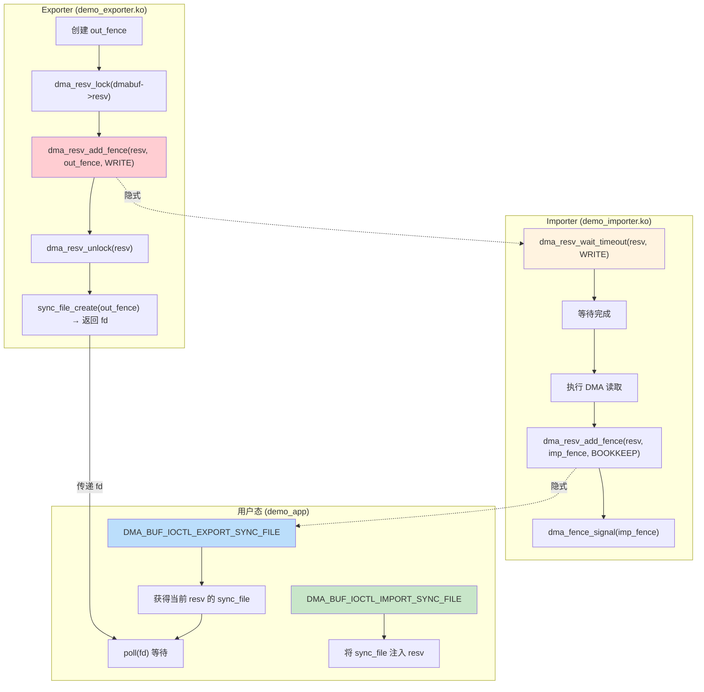
```mermaid
graph TD
    subgraph "Exporter (demo_exporter.ko)"
        E1["创建 out_fence"] --> E2["dma_resv_lock(dmabuf->resv)"]
        E2 --> E3["dma_resv_add_fence(resv, out_fence, WRITE)"]
        E3 --> E4["dma_resv_unlock(resv)"]
        E4 --> E5["sync_file_create(out_fence) → 返回 fd"]
    end

    subgraph "Importer (demo_importer.ko)"
        I1["dma_resv_wait_timeout(resv, WRITE)"] --> I2["等待完成"]
        I2 --> I3["执行 DMA 读取"]
        I3 --> I4["dma_resv_add_fence(resv, imp_fence, BOOKKEEP)"]
        I4 --> I5["dma_fence_signal(imp_fence)"]
    end

    subgraph "用户态 (demo_app)"
        U1["DMA_BUF_IOCTL_EXPORT_SYNC_FILE"] --> U2["获得当前 resv 的 sync_file"]
        U2 --> U3["poll(fd) 等待"]
        U4["DMA_BUF_IOCTL_IMPORT_SYNC_FILE"] --> U5["将 sync_file 注入 resv"]
    end

    E5 -->|"传递 fd"| U3
    E3 -.->|"隐式"| I1
    I4 -.->|"隐式"| U1

    style E3 fill:#ffcdd2
    style I1 fill:#fff3e0
    style U1 fill:#bbdefb
    style U4 fill:#c8e6c9
```

## 8. 用户态 Demo 程序

### 8.1 完整流程（含隐式+显式同步）


```mermaid
graph TD
    subgraph "Step 1: 分配"
        A1["open(/dev/dma_heap/demo)"] --> A2["ioctl(DMA_HEAP_IOCTL_ALLOC)<br/>size = 4096"]
        A2 --> A3["获得 dmabuf_fd"]
        A3 --> A4["mmap(dmabuf_fd)<br/>→ CPU 指针"]
    end

    subgraph "Step 2: CPU 写入 + 导入 fence 到 resv"
        B1["通过 mmap 指针<br/>写入测试数据"] --> B2["DMA_BUF_IOCTL_SYNC<br/>SYNC_END | WRITE"]
        B2 --> B3["DMA_BUF_IOCTL_IMPORT_SYNC_FILE<br/>将 CPU fence 注入 resv"]
        B3 --> B4["数据对设备可见<br/>resv 中有 WRITE fence"]
    end

    subgraph "Step 3: 导出者异步填充 (隐式同步)"
        C1["ioctl(DEMO_EXP_DMA_FILL)<br/>传入 dmabuf_fd"] --> C1a["驱动内部:<br/>dma_resv_wait(WRITE)<br/>等待 Step 2 完成"]
        C1a --> C2["驱动内部:<br/>dma_resv_add_fence(WRITE)"]
        C2 --> C3["获得 out_fence_fd<br/>(显式同步路径)"]
        C3 --> C4["poll(out_fence_fd, POLLIN)<br/>等待填充完成"]
        C4 --> C5["或: EXPORT_SYNC_FILE<br/>查询 resv 状态"]
        C5 --> C6["验证: mmap 读回数据"]
    end

    subgraph "Step 4: 导入者 DMA 处理 (隐式同步)"
        D1["ioctl(DEMO_IMP_IMPORT)<br/>传入 dmabuf_fd"] --> D2["ioctl(DEMO_IMP_PROCESS)"]
        D2 --> D2a["驱动内部:<br/>dma_resv_wait(WRITE)<br/>等待导出者完成"]
        D2a --> D3["驱动内部:<br/>dma_resv_add_fence(BOOKKEEP)"]
        D3 --> D4["获得 imp_out_fence_fd"]
        D4 --> D5["poll(imp_out_fence_fd, POLLIN)<br/>等待处理完成"]
        D5 --> D6["获取 checksum 验证"]
    end

    subgraph "Step 5: 清理"
        E1["close(dmabuf_fd)"] --> E2["close(导出者设备)"]
        E2 --> E3["close(导入者设备)"]
    end

    A4 --> B1
    B4 --> C1
    C6 --> D1
    D6 --> E1

    style B3 fill:#c8e6c9
    style C1a fill:#fff3e0
    style C2 fill:#ffcdd2
    style D2a fill:#bbdefb
    style D3 fill:#e8f5e9
```

### 8.2 Demo 程序完整代码（含隐式+显式同步）

```c
/* demo_app.c - DMA-BUF 全流程演示（集成 dma-resv 隐式同步） */

#include <stdio.h>
#include <stdlib.h>
#include <string.h>
#include <fcntl.h>
#include <unistd.h>
#include <sys/ioctl.h>
#include <sys/mman.h>
#include <sys/poll.h>
#include <linux/dma-buf.h>
#include <linux/dma-heap.h>

/* ---- 导出者 ioctl 定义 ---- */
#define DEMO_EXP_MAGIC    'E'
#define DEMO_EXP_ALLOC    _IOR(DEMO_EXP_MAGIC, 1, struct demo_exp_alloc_req)
#define DEMO_EXP_DMA_FILL _IOWR(DEMO_EXP_MAGIC, 2, struct demo_exp_fill_req)
#define DEMO_EXP_QUERY    _IOWR(DEMO_EXP_MAGIC, 3, struct demo_exp_query_req)

struct demo_exp_alloc_req {
    __u32 size;
    __s32 dmabuf_fd;
};

struct demo_exp_fill_req {
    __s32 dmabuf_fd;
    __u32 fill_pattern;
    __u32 delay_ms;
    __s32 out_fence_fd;
};

/* ---- 导入者 ioctl 定义 ---- */
#define DEMO_IMP_MAGIC    'I'
#define DEMO_IMP_IMPORT   _IOWR(DEMO_IMP_MAGIC, 1, struct demo_imp_import_req)
#define DEMO_IMP_PROCESS  _IOWR(DEMO_IMP_MAGIC, 2, struct demo_imp_process_req)
#define DEMO_IMP_UNIMPORT _IO(DEMO_IMP_MAGIC, 3)

struct demo_imp_import_req {
    __s32 dmabuf_fd;
    __u32 num_sg_entries;  /* 输出: sg 段数 */
};

struct demo_imp_process_req {
    __u32 mode;             /* 0=read, 1=write */
    __u32 checksum;         /* 输出: 数据校验和 */
    __s32 out_fence_fd;
};

/* ---- 辅助函数 ---- */
static int wait_fence(int fence_fd, const char *label)
{
    struct pollfd pfd = { .fd = fence_fd, .events = POLLIN };
    int ret = poll(&pfd, 1, 5000);  /* 5秒超时 */
    if (ret > 0 && (pfd.revents & POLLIN)) {
        printf("[OK]   %s fence signaled\n", label);
        close(fence_fd);
        return 0;
    }
    printf("[FAIL] %s fence timeout\n", label);
    close(fence_fd);
    return -1;
}

/*
 * 通过 dma-resv 隐式同步等待 dma-buf 就绪
 * 将 resv 中的 fence 导出为 sync_file，然后 poll 等待
 */
static int wait_dmabuf_resv(int dmabuf_fd, int write, const char *label)
{
    struct dma_buf_export_sync_file arg = {
        .flags = write ? DMA_BUF_SYNC_WRITE : DMA_BUF_SYNC_READ,
    };
    int ret;

    /* 将 resv 中的隐式 fence 导出为 sync_file fd */
    ret = ioctl(dmabuf_fd, DMA_BUF_IOCTL_EXPORT_SYNC_FILE, &arg);
    if (ret < 0) {
        perror("DMA_BUF_IOCTL_EXPORT_SYNC_FILE");
        return ret;
    }

    printf("[INFO] Exported resv %s fence as sync_file fd=%d\n",
           write ? "WRITE" : "READ", arg.fd);

    /* 通过 sync_file fd 等待（与显式同步使用相同的 poll 机制） */
    ret = wait_fence(arg.fd, label);
    return ret;
}

/*
 * 将外部 sync_file 导入到 dma-buf 的 resv 中（显式 → 隐式）
 * 用于告知 dma-buf 框架：有一个外部操作正在进行
 */
static int import_fence_to_resv(int dmabuf_fd, int fence_fd, int write)
{
    struct dma_buf_import_sync_file arg = {
        .flags = write ? DMA_BUF_SYNC_WRITE : DMA_BUF_SYNC_READ,
        .fd = fence_fd,
    };
    int ret;

    ret = ioctl(dmabuf_fd, DMA_BUF_IOCTL_IMPORT_SYNC_FILE, &arg);
    if (ret < 0)
        perror("DMA_BUF_IOCTL_IMPORT_SYNC_FILE");

    return ret;
}

/* ---- 主流程 ---- */
int main(int argc, char *argv[])
{
    int heap_fd, dmabuf_fd, exp_fd, imp_fd;
    void *cpu_ptr;
    struct dma_heap_allocation_data heap_alloc = { .len = 4096 };

    printf("===== DMA-BUF Demo (with dma-resv implicit sync) =====\n\n");

    /* ========== Step 1: 通过自定义 heap 分配 ========== */
    printf("--- Step 1: Allocate via demo_heap ---\n");
    heap_fd = open("/dev/dma_heap/demo", O_RDONLY);
    if (heap_fd < 0) {
        perror("open /dev/dma_heap/demo");
        return 1;
    }

    if (ioctl(heap_fd, DMA_HEAP_IOCTL_ALLOC, &heap_alloc) < 0) {
        perror("DMA_HEAP_IOCTL_ALLOC");
        return 1;
    }
    dmabuf_fd = heap_alloc.fd;
    printf("[OK]   Allocated dmabuf fd=%d, size=%u\n\n",
           dmabuf_fd, heap_alloc.len);
    close(heap_fd);

    /* ========== Step 2: mmap + CPU 写入 ========== */
    printf("--- Step 2: CPU write via mmap ---\n");
    cpu_ptr = mmap(NULL, heap_alloc.len, PROT_READ | PROT_WRITE,
                   MAP_SHARED, dmabuf_fd, 0);
    if (cpu_ptr == MAP_FAILED) {
        perror("mmap");
        return 1;
    }

    /* 写入测试模式 */
    memset(cpu_ptr, 0xAA, heap_alloc.len);
    printf("[OK]   Wrote 0xAA pattern via CPU\n");

    /* CPU 缓存刷回（确保对设备可见） */
    struct dma_buf_sync sync = {
        .flags = DMA_BUF_SYNC_END | DMA_BUF_SYNC_WRITE,
    };
    ioctl(dmabuf_fd, DMA_BUF_IOCTL_SYNC, &sync);
    printf("[OK]   CPU cache flushed\n\n");

    /* ========== Step 3: 导出者异步填充（隐式同步） ========== */
    printf("--- Step 3: Exporter async DMA fill (implicit sync) ---\n");
    exp_fd = open("/dev/demo_exp", O_RDWR);
    if (exp_fd < 0) {
        perror("open /dev/demo_exp");
        return 1;
    }

    struct demo_exp_fill_req fill_req = {
        .dmabuf_fd = dmabuf_fd,
        .fill_pattern = 0x55,
        .delay_ms = 10,
    };
    if (ioctl(exp_fd, DEMO_EXP_DMA_FILL, &fill_req) < 0) {
        perror("DEMO_EXP_DMA_FILL");
        return 1;
    }
    printf("[INFO] Async DMA fill started\n");
    printf("[INFO] Exporter added WRITE fence to dma-buf resv\n");

    /*
     * 方式 A: 通过 out_fence fd 等待（显式同步路径）
     */
    wait_fence(fill_req.out_fence_fd, "Exporter DMA fill (explicit)");

    /*
     * 方式 B: 通过 dma-resv 隐式同步等待
     * （不需要持有 out_fence fd，直接从 resv 导出）
     */
    wait_dmabuf_resv(dmabuf_fd, 1 /* write */, "Exporter DMA fill (implicit)");

    /* 验证: CPU 读回应该看到 0x55 */
    struct dma_buf_sync sync_start = {
        .flags = DMA_BUF_SYNC_START | DMA_BUF_SYNC_READ,
    };
    ioctl(dmabuf_fd, DMA_BUF_IOCTL_SYNC, &sync_start);
    u8 first_byte = *(u8 *)cpu_ptr;
    printf("[OK]   Read back first byte: 0x%02X (expected 0x55)\n\n", first_byte);

    /* ========== Step 4: 导入者 DMA 处理（隐式同步） ========== */
    printf("--- Step 4: Importer DMA process (implicit sync) ---\n");
    imp_fd = open("/dev/demo_imp", O_RDWR);
    if (imp_fd < 0) {
        perror("open /dev/demo_imp");
        return 1;
    }

    /* 导入 dma-buf */
    struct demo_imp_import_req imp_req = {
        .dmabuf_fd = dmabuf_fd,
    };
    if (ioctl(imp_fd, DEMO_IMP_IMPORT, &imp_req) < 0) {
        perror("DEMO_IMP_IMPORT");
        return 1;
    }
    printf("[OK]   Imported dmabuf, sg_entries=%u\n", imp_req.num_sg_entries);

    /*
     * 模拟设备 DMA 处理
     * 导入者驱动内部会自动:
     *   1. dma_resv_wait_timeout(resv, WRITE) → 等待导出者完成
     *   2. 执行 DMA 读取
     *   3. dma_resv_add_fence(resv, BOOKKEEP) → 添加完成追踪
     */
    struct demo_imp_process_req proc_req = {
        .mode = 0,  /* read */
    };
    if (ioctl(imp_fd, DEMO_IMP_PROCESS, &proc_req) < 0) {
        perror("DEMO_IMP_PROCESS");
        return 1;
    }
    printf("[INFO] DMA process started\n");
    printf("[INFO] Importer waited for WRITE fence (implicit)\n");
    printf("[INFO] Importer added BOOKKEEP fence to resv\n");

    wait_fence(proc_req.out_fence_fd, "Importer DMA process");
    printf("[OK]   Data checksum: 0x%08X\n\n", proc_req.checksum);

    /* ========== Step 5: 验证 resv 状态 ========== */
    printf("--- Step 5: Verify dma-resv state ---\n");

    /* 导出 resv 中所有 READ 级别的 fence */
    wait_dmabuf_resv(dmabuf_fd, 0 /* read */, "All READ fences (including BOOKKEEP)");

    printf("[OK]   All resv fences signaled - buffer is idle\n\n");

    /* ========== Step 6: 清理 ========== */
    printf("--- Step 6: Cleanup ---\n");
    munmap(cpu_ptr, heap_alloc.len);
    close(dmabuf_fd);
    close(exp_fd);
    ioctl(imp_fd, DEMO_IMP_UNIMPORT);
    close(imp_fd);

    printf("[OK]   All resources released\n");
    printf("\n===== Demo Complete =====\n");
    return 0;
}
```

## 9. 多消费者同步与 dma-resv 进阶场景

### 9.1 场景：单生产者 + 多消费者并行读

在实际多媒体 pipeline 中，一个 dma-buf 经常需要被多个设备同时读取（如 NPU 推理 + VPU 编码并行）。dma-resv 的 usage 机制为这种场景提供了精细控制：

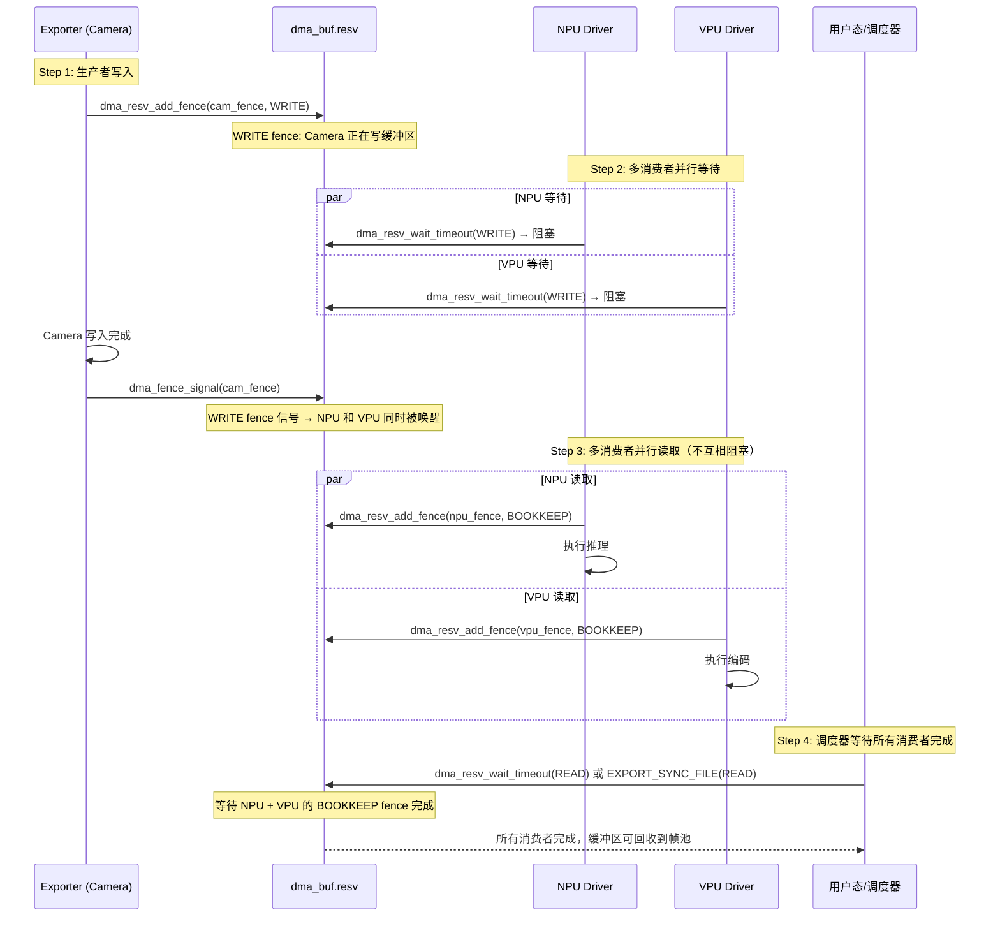
```mermaid
sequenceDiagram
    participant EXP as Exporter (Camera)
    participant RESV as dma_buf.resv
    participant NPU as NPU Driver
    participant VPU as VPU Driver
    participant APP as 用户态/调度器

    Note over EXP: Step 1: 生产者写入

    EXP->>RESV: dma_resv_add_fence(cam_fence, WRITE)
    Note over RESV: WRITE fence: Camera 正在写缓冲区

    Note over NPU,VPU: Step 2: 多消费者并行等待

    par NPU 等待
        NPU->>RESV: dma_resv_wait_timeout(WRITE) → 阻塞
    and VPU 等待
        VPU->>RESV: dma_resv_wait_timeout(WRITE) → 阻塞
    end

    EXP->>EXP: Camera 写入完成
    EXP->>RESV: dma_fence_signal(cam_fence)
    Note over RESV: WRITE fence 信号 → NPU 和 VPU 同时被唤醒

    Note over NPU,VPU: Step 3: 多消费者并行读取（不互相阻塞）

    par NPU 读取
        NPU->>RESV: dma_resv_add_fence(npu_fence, BOOKKEEP)
        NPU->>NPU: 执行推理
    and VPU 读取
        VPU->>RESV: dma_resv_add_fence(vpu_fence, BOOKKEEP)
        VPU->>VPU: 执行编码
    end

    Note over APP: Step 4: 调度器等待所有消费者完成

    APP->>RESV: dma_resv_wait_timeout(READ) 或 EXPORT_SYNC_FILE(READ)
    Note over RESV: 等待 NPU + VPU 的 BOOKKEEP fence 完成
    RESV-->>APP: 所有消费者完成，缓冲区可回收到帧池
```

### 9.2 Usage 选择策略

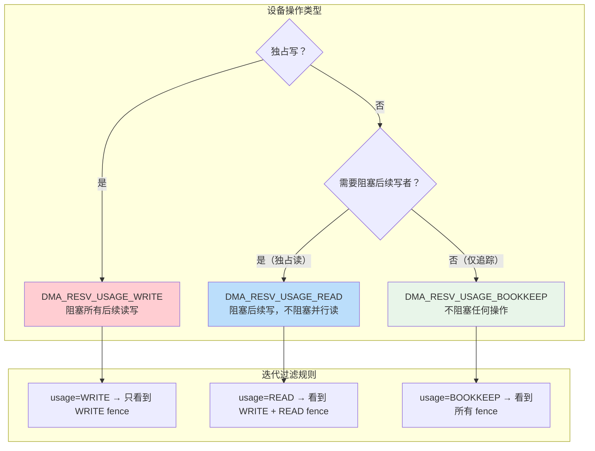
```mermaid
graph TD
    subgraph "设备操作类型"
        OP1{"独占写？"}
        OP1 -->|"是"| U1["DMA_RESV_USAGE_WRITE<br/>阻塞所有后续读写"]
        OP1 -->|"否"| OP2{"需要阻塞后续写者？"}
        OP2 -->|"是（独占读）"| U2["DMA_RESV_USAGE_READ<br/>阻塞后续写，不阻塞并行读"]
        OP2 -->|"否（仅追踪）"| U3["DMA_RESV_USAGE_BOOKKEEP<br/>不阻塞任何操作"]
    end

    subgraph "迭代过滤规则"
        F1["usage=WRITE → 只看到 WRITE fence"]
        F2["usage=READ → 看到 WRITE + READ fence"]
        F3["usage=BOOKKEEP → 看到所有 fence"]
    end

    U1 --> F1
    U2 --> F2
    U3 --> F3

    style U1 fill:#ffcdd2
    style U2 fill:#bbdefb
    style U3 fill:#e8f5e9
```

**典型使用模式：**

| 生产者操作 | 添加 usage | 消费者等待 usage | 消费者添加 usage | 说明 |
|-----------|-----------|----------------|----------------|------|
| Camera ISP 写帧 | WRITE | WRITE | BOOKKEEP | 消费者并行读，不阻塞后续 Camera 写下一帧 |
| GPU 渲染 | WRITE | READ | READ | 显示独占读，直到扫描完成 |
| NPU 推理（只读） | — | WRITE | BOOKKEEP | 推理是只读，完成后不阻塞其他操作 |
| CPU 预处理 | WRITE (via import) | WRITE | — | 用户态通过 IMPORT_SYNC_FILE 注入 |
| 帧池回收 | — | READ | — | 等待所有消费者完成后才回帧 |

### 9.3 dma_resv_replace_fences：上下文替换

当同一设备需要替换其之前的 fence 时（例如 GPU 提交了新的渲染任务，覆盖之前未完成的），使用 `dma_resv_replace_fences` 批量替换：

```c
/*
 * 场景: GPU 之前有一个渲染 fence 在 resv 中，
 *       现在提交了新的渲染任务，需要替换旧 fence。
 *
 * 旧 fence: gpu_fence_v1 (context=0x1000, seqno=100)
 * 新 fence: gpu_fence_v2 (context=0x1000, seqno=101)
 */
void gpu_submit_new_job(struct dma_buf *dmabuf,
                        struct dma_fence *new_fence)
{
    /* 替换同一 context 的所有 fence 为新 fence */
    dma_resv_lock(dmabuf->resv, NULL);
    dma_resv_replace_fences(dmabuf->resv,
                            new_fence->context,   /* 替换条件: 同一 context */
                            new_fence,             /* 新 fence */
                            DMA_RESV_USAGE_WRITE); /* 新 usage */
    dma_resv_unlock(dmabuf->resv);
}
```

**注意：** `dma_resv_add_fence` 已内置同 context 去重逻辑，通常不需要手动调用 `replace_fences`。`replace_fences` 主要用于场景变更（如页面表更新替换预占 fence）。

### 9.4 完整的多消费者 Demo 代码片段

```c
/* demo_multi_consumer.c - 多消费者并行读取演示 */

#include <linux/dma-buf.h>
#include <linux/dma-resv.h>

/*
 * 调度器函数：等待 dma-buf 上所有消费者完成
 * 用于帧池回收前的安全检查
 */
int wait_all_consumers(struct dma_buf *dmabuf)
{
    /*
     * 方式1: 内核态直接等待（推荐在驱动中使用）
     */
    long ret = dma_resv_wait_timeout(dmabuf->resv,
                                      DMA_RESV_USAGE_READ,
                                      true, MAX_SCHEDULE_TIMEOUT);
    if (ret < 0)
        return ret;

    /*
     * 方式2: 导出为 sync_file 供用户态 poll（推荐在用户态使用）
     * struct dma_buf_export_sync_file arg = { .flags = DMA_BUF_SYNC_READ };
     * ioctl(dmabuf_fd, DMA_BUF_IOCTL_EXPORT_SYNC_FILE, &arg);
     * poll(arg.fd, POLLIN, -1);
     */
    return 0;
}

/*
 * 设备驱动标准操作模式：
 * 1. 等待生产者完成
 * 2. 添加自己的 fence
 * 3. 执行操作
 * 4. 发信号
 */
int device_consume_buffer(struct dma_buf *dmabuf,
                          struct dma_fence *device_fence,
                          enum dma_resv_usage add_usage)
{
    int ret;

    /* 1. 隐式同步：等待所有 WRITE fence 完成 */
    ret = dma_resv_wait_timeout(dmabuf->resv, DMA_RESV_USAGE_WRITE,
                                 true, MAX_SCHEDULE_TIMEOUT);
    if (ret < 0)
        return ret;

    /* 2. 将设备 fence 添加到 resv */
    dma_resv_lock(dmabuf->resv, NULL);
    ret = dma_resv_reserve_fences(dmabuf->resv, 1);
    if (!ret)
        dma_resv_add_fence(dmabuf->resv, device_fence, add_usage);
    dma_resv_unlock(dmabuf->resv);

    if (ret)
        return ret;

    /* 3. 启动设备 DMA 操作 */
    /* device_start_dma(dmabuf, ...); */

    /* 4. 设备完成后发信号（通常在 ISR/workqueue 中） */
    /* dma_fence_signal(device_fence); */

    return 0;
}
```

### 9.5 dma-resv 与 dma-buf 生命周期的集成

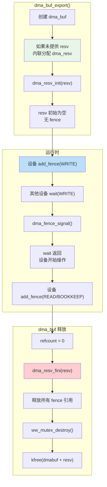
```mermaid
graph TD
    subgraph "dma_buf_export()"
        E1["创建 dma_buf"] --> E2["如果未提供 resv<br/>内联分配 dma_resv"]
        E2 --> E3["dma_resv_init(resv)"]
        E3 --> E4["resv 初始为空<br/>无 fence"]
    end

    subgraph "运行时"
        R1["设备 add_fence(WRITE)"] --> R2["其他设备 wait(WRITE)"]
        R2 --> R3["dma_fence_signal()"]
        R3 --> R4["wait 返回<br/>设备开始操作"]
        R4 --> R5["设备 add_fence(READ/BOOKKEEP)"]
    end

    subgraph "dma_buf 释放"
        D1["refcount = 0"] --> D2["dma_resv_fini(resv)"]
        D2 --> D3["释放所有 fence 引用"]
        D3 --> D4["ww_mutex_destroy()"]
        D4 --> D5["kfree(dmabuf + resv)"]
    end

    E4 --> R1
    R5 --> D1

    style E2 fill:#e8f5e9
    style R1 fill:#bbdefb
    style D2 fill:#ffcdd2
```

**关键集成点：**

| dma-buf 操作 | dma-resv 交互 |
|-------------|--------------|
| `dma_buf_export()` | 初始化 resv（或使用外部 resv） |
| `dma_buf_attach()` | 持 resv 锁将 attachment 加入链表 |
| `dma_buf_map_attachment()` | 要求调用者持 resv 锁；静态 attachment 等待 KERNEL fence |
| `dma_buf_begin_cpu_access()` | 内部调用 `dma_resv_wait_timeout(WRITE/READ)` |
| `dma_buf_poll()` | 通过 `dma_resv_iter` 遍历未信号 fence 注册回调 |
| `DMA_BUF_IOCTL_SYNC` | 内部等待 resv 中的隐式 fence |
| `DMA_BUF_IOCTL_EXPORT_SYNC_FILE` | `dma_resv_get_singleton()` 导出 resv fence |
| `DMA_BUF_IOCTL_IMPORT_SYNC_FILE` | `dma_resv_add_fence()` 将 sync_file 注入 resv |
| `dma_buf_release()` | `dma_resv_fini()` 清理所有 fence |

## 10. QEMU 环境配置

### 10.1 QEMU 启动配置

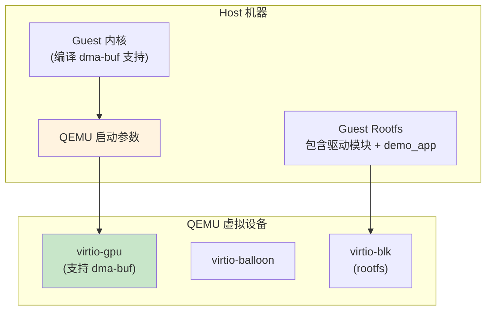
```mermaid
graph TB
    subgraph "Host 机器"
        QEMU["QEMU 启动参数"]
        KERNEL["Guest 内核<br/>(编译 dma-buf 支持)"]
        ROOTFS["Guest Rootfs<br/>包含驱动模块 + demo_app"]
    end

    subgraph "QEMU 虚拟设备"
        VIRTIO_GPU["virtio-gpu<br/>(支持 dma-buf)"]
        VIRTIO_BALLOON["virtio-balloon"]
        VIRTIO_BLK["virtio-blk<br/>(rootfs)"]
    end

    KERNEL --> QEMU
    ROOTFS --> VIRTIO_BLK
    QEMU --> VIRTIO_GPU

    style QEMU fill:#fff3e0
    style VIRTIO_GPU fill:#c8e6c9
```

**推荐 QEMU 启动命令：**

```bash
qemu-system-aarch64 \
    -M virt \
    -cpu cortex-a57 \
    -m 2G \
    -kernel Image \
    -initrd rootfs.cpio.gz \
    -append "console=ttyAMA0 rdinit=/sbin/init" \
    -nographic \
    \
    # 虚拟设备（可选，增强演示效果）
    -device virtio-gpu-pci \
    -device virtio-balloon \
    \
    # 传递内核模块和 demo 程序
    -virtfs local,path=./modules,mount_tag=host_modules,security_model=none \
    -virtfs local,path=./demo_app,mount_tag=host_demo,security_model=none
```

### 10.2 内核配置

```ini
# .config 中必须启用的 DMA-BUF 相关选项
CONFIG_DMA_SHARED_BUFFER=y

# dma-heap 框架
CONFIG_DMABUF_HEAPS=y
CONFIG_DMABUF_HEAPS_SYSTEM=y

# sync_file（显式同步）
CONFIG_SYNC_FILE=y

# DMA-BUF 调试（可选，方便学习）
CONFIG_DMABUF_DEBUG=y

# 自定义驱动所需
CONFIG_MODULES=y
CONFIG_DEBUG_FS=y      # sync_debug 调试接口
```

### 10.3 构建与部署

```mermaid
graph LR
    subgraph "Host 构建环境"
        KBUILD["make -C kernel_src M=demo_drivers/ modules"]
        GCC["aarch64-linux-gnu-gcc demo_app.c -o demo_app"]
        CPIO["cpio: 内核模块 + demo_app → rootfs"]
    end

    KBUILD --> KOS["demo_heap.ko<br/>demo_exporter.ko<br/>demo_importer.ko"]
    GCC --> APP["demo_app (ARM64 ELF)"]
    KOS --> CPIO
    APP --> CPIO
    CPIO --> QEMU["QEMU 启动"]
```

**Makefile：**

```makefile
# Host 交叉编译环境
KDIR   ?= /path/to/linux-kernel
ARCH   ?= arm64
CROSS  ?= aarch64-linux-gnu-

# 驱动模块
obj-m += demo_heap.o demo_exporter.o demo_importer.o

all: modules demo_app

modules:
	$(MAKE) -C $(KDIR) M=$(PWD) ARCH=$(ARCH) CROSS_COMPILE=$(CROSS)

demo_app: demo_app.c
	$(CROSS)gcc -static -o $@ $<

rootfs: modules demo_app
	mkdir -p rootfs/lib/modules
	cp *.ko rootfs/lib/modules/
	cp demo_app rootfs/
	cd rootfs && find . | cpio -o -H newc | gzip > ../rootfs.cpio.gz

clean:
	$(MAKE) -C $(KDIR) M=$(PWD) clean
	rm -f demo_app rootfs.cpio.gz
```

## 11. 调试方法

### 11.1 DebugFS 接口

```mermaid
graph TD
    subgraph "/sys/kernel/debug/"
        SYNC["sync/"]
        SYNC --> INFO["info<br/>列出所有 sync timeline"]
        SYNC --> SW["sw_sync<br/>软件 sync timeline"]
        DMABUF["dma_buf/"]
        DMABUF --> BUF_INFO["bufinfo<br/>所有 dma-buf 信息<br/>含 resv fence 列表"]
    end

    subgraph "/proc/<pid>/fdinfo/"
        FDINFO["每个 fd 的详细信息<br/>size, count, exp_name"]
    end

    subgraph "ioctl 查询"
        SF_INFO["sync_file fd:<br/>SYNC_IOC_FILE_INFO<br/>fence 状态/时间戳"]
        DBUF_NAME["dmabuf fd:<br/>DMA_BUF_SET_NAME<br/>命名缓冲区"]
        EXPORT_SF["dmabuf fd:<br/>DMA_BUF_IOCTL_EXPORT_SYNC_FILE<br/>导出 resv fence"]
        IMPORT_SF["dmabuf fd:<br/>DMA_BUF_IOCTL_IMPORT_SYNC_FILE<br/>注入 fence 到 resv"]
    end

    style SYNC fill:#e8f5e9
    style DMABUF fill:#e3f2fd
```

**常用调试命令：**

```bash
# 1. 查看 dma-buf 列表（含每个 buf 的 resv fence 信息）
cat /sys/kernel/debug/dma_buf/bufinfo

# 2. 查看 sync timeline
cat /sys/kernel/debug/sync/info

# 3. 查询 sync_file 状态
./sync_file_info <fence_fd>
# 或通过 ioctl:
# struct sync_file_info info = { .num_fences = 0 };
# ioctl(fence_fd, SYNC_IOC_FILE_INFO, &info);
# printf("status=%d, num_fences=%u\n", info.status, info.num_fences);

# 4. 查看 fd 关联的 dma-buf 信息
cat /proc/self/fdinfo/<dmabuf_fd>

# 5. 命名 dma-buf 方便追踪
char *name = "demo_frame_0";
ioctl(dmabuf_fd, DMA_BUF_SET_NAME_B, name);
```

### 11.2 dma-resv 调试方法

**查看 dma-buf 的 resv 中 fence 状态：**

`/sys/kernel/debug/dma_buf/bufinfo` 输出中包含每个 dma-buf 的 resv fence 信息：

```
size=4096  count=3  exp_name=demo_heap  name=demo_frame_0
    attached:
        demo_importer device
    resv fences:
        write fence 0: context=1234 seqno=5 status=active [demo_exporter]
        bookkeep fence 1: context=5678 seqno=3 status=active [demo_importer]
```

**通过 ioctl 诊断 resv fence：**

```c
/* 导出当前 resv 中所有 WRITE 级别的 fence */
struct dma_buf_export_sync_file arg = {
    .flags = DMA_BUF_SYNC_WRITE,
};
int ret = ioctl(dmabuf_fd, DMA_BUF_IOCTL_EXPORT_SYNC_FILE, &arg);
if (ret == 0) {
    /* arg.fd 是一个 sync_file，包含 resv 中所有 WRITE fence 的聚合 */
    /* 可以通过 SYNC_IOC_FILE_INFO 查看具体 fence 信息 */

    struct sync_file_info info = { .num_fences = 0 };
    ioctl(arg.fd, SYNC_IOC_FILE_INFO, &info);

    struct sync_fence_info *fences = calloc(info.num_fences, sizeof(*fences));
    info.fences = (uintptr_t)fences;
    ioctl(arg.fd, SYNC_IOC_FILE_INFO, &info);

    for (u32 i = 0; i < info.num_fences; i++) {
        printf("fence[%u]: driver=%s timeline=%s status=%s\n",
               i, fences[i].driver_name, fences[i].timeline_name,
               fences[i].status ? "signaled" : "active");
    }

    close(arg.fd);
    free(fences);
}
```

**内核态 dma-resv 调试：**

```c
/* 在驱动代码中打印 resv 的所有 fence（调试用） */
void debug_dump_resv(struct dma_resv *resv)
{
    struct dma_resv_iter cursor;
    struct dma_fence *fence;

    dma_resv_for_each_fence(&cursor, resv, DMA_RESV_USAGE_BOOKKEEP, fence) {
        pr_debug("resv fence: ctx=%llu seq=%u usage=%d signaled=%d\n",
                 fence->context, fence->seqno,
                 dma_resv_iter_usage(&cursor),
                 dma_fence_is_signaled(fence));
        dma_fence_put(fence);
    }
}
```

**CONFIG_DEBUG_MUTEXES 下的额外检查：**

启用 `CONFIG_DEBUG_MUTEXES` 后，dma-resv 框架会在 `dma_resv_unlock()` 时将 `max_fences` 重置为 `num_fences`，强制驱动在下次 `add_fence` 前正确调用 `reserve_fences`。如果驱动遗漏了 `reserve_fences`，会触发 `BUG_ON`。

### 11.3 常见问题排查

```mermaid
graph TD
    ERR1["open /dev/dma_heap/demo<br/>ENOENT"] --> FIX1["确认 demo_heap.ko 已加载<br/>ls /dev/dma_heap/"]
    ERR2["DMA_HEAP_IOCTL_ALLOC<br/>ENOMEM"] --> FIX2["检查可用内存<br/>dmesg | grep dma_heap"]
    ERR3["mmap 失败 EINVAL"] --> FIX3["检查 ops->mmap 是否实现<br/>大小是否页对齐"]
    ERR4["poll fence 超时"] --> FIX4["检查 exporter 是否调用了<br/>dma_fence_signal()"]
    ERR5["CPU 读写数据不一致"] --> FIX5["检查是否调用了<br/>DMA_BUF_IOCTL_SYNC"]
    ERR6["dma_buf_map_attachment<br/>失败"] --> FIX6["检查设备的 DMA mask<br/>和 IOMMU 配置"]
    ERR7["BUG_ON at<br/>dma_resv_add_fence"] --> FIX7["未调用 reserve_fences()<br/>或 num_fences >= max_fences"]
    ERR8["设备读取到旧数据"] --> FIX8["设备未等待 resv WRITE fence<br/>检查 dma_resv_wait_timeout 调用"]
    ERR9["EXPORT_SYNC_FILE<br/>返回已信号 fence"] --> FIX9["resv 中无未信号 fence<br/>或 usage 过滤后为空"]
    ERR10["ww_mutex 死锁"] --> FIX10["使用 dma_resv_lock_slow<br/>按地址顺序锁定多 resv"]

    style ERR1 fill:#ffcdd2
    style ERR2 fill:#ffcdd2
    style ERR3 fill:#ffcdd2
    style ERR4 fill:#ffcdd2
    style ERR5 fill:#ffcdd2
    style ERR6 fill:#ffcdd2
    style ERR7 fill:#ffe0b2
    style ERR8 fill:#ffe0b2
    style ERR9 fill:#ffe0b2
    style ERR10 fill:#ffe0b2
    style FIX1 fill:#c8e6c9
    style FIX2 fill:#c8e6c9
    style FIX3 fill:#c8e6c9
    style FIX4 fill:#c8e6c9
    style FIX5 fill:#c8e6c9
    style FIX6 fill:#c8e6c9
    style FIX7 fill:#c8e6c9
    style FIX8 fill:#c8e6c9
    style FIX9 fill:#c8e6c9
    style FIX10 fill:#c8e6c9
```

## 12. 扩展方向

### 12.1 集成 virtio-gpu（真实设备模拟）

```mermaid
graph LR
    subgraph "扩展方案"
        A["当前: 自定义字符设备"] --> B["进阶: virtio-gpu"]
        B --> C["高级: VFIO + 真实设备直通"]
    end

    subgraph "virtio-gpu 集成"
        VG["Guest virtio-gpu driver<br/>(内核内置)"]
        VG1["virtgpu_ioctl(DRM_IOCTL_PRIME_HANDLE_TO_FD)<br/>→ 导出 dmabuf fd"]
        VG2["virtgpu_ioctl(DRM_IOCTL_PRIME_FD_TO_HANDLE)<br/>→ 导入 dmabuf fd"]
        VG --> VG1
        VG --> VG2
    end

    style B fill:#fff3e0
    style C fill:#e3f2fd
```

### 12.2 文件清单

```
demo_dmabuf/
├── Kbuild
├── Makefile
├── demo_heap/
│   └── demo_heap.c              # 自定义 heap 驱动
├── demo_exporter/
│   ├── demo_exporter.c          # 导出驱动（模拟 DMA 设备，含 dma-resv 集成）
│   ├── demo_exporter.h          # ioctl 定义
│   └── demo_timer_fence.c       # 定时器 fence 实现
├── demo_importer/
│   ├── demo_importer.c          # 导入驱动（模拟 DMA 消费者，含 dma-resv 集成）
│   └── demo_importer.h          # ioctl 定义
├── demo_app/
│   ├── demo_app.c               # 用户态完整 demo（含隐式+显式同步）
│   ├── demo_multi_consumer.c    # 多消费者同步演示
│   └── sync_file_info.c         # sync_file 调试工具
├── configs/
│   └── guest_kernel.config      # 内核配置（含 SYNC_FILE, DMABUF_HEAPS）
├── scripts/
│   ├── build.sh                 # 交叉编译脚本
│   ├── create_rootfs.sh         # 构建根文件系统
│   └── run_qemu.sh              # QEMU 启动脚本
└── README.md
```

## 13. 单元测试设计

### 13.1 内核态单元测试

内核态测试基于 dma-buf 子系统自带的 selftest 框架（`selftest.h` / `selftest.c`），以内核模块方式运行，通过 `insmod` 或 `modprobe` 触发。

#### 13.1.1 测试框架

```c
/* ===== 测试注册 (selftests.h) ===== */
selftest(name, func)
//  func 签名: int func(void)
//  每个 selftest 可包含多个 SUBTEST

/* ===== 子测试定义 ===== */
struct subtest { int (*func)(void *data); const char *name; };
#define SUBTEST(x)  { x, #x }

/* ===== 子测试运行 ===== */
#define subtests(T, data)  __subtests(__func__, T, ARRAY_SIZE(T), data)
// 返回 0=全部通过, -EINTR=信号中断, 其他=失败

/* ===== 顶层测试函数模式 ===== */
int my_test(void)
{
    enum some_usage usage;
    int r;

    for (usage = MIN; usage <= MAX; ++usage) {
        r = subtests(my_subtests, (void *)(unsigned long)usage);
        if (r)
            return r;
    }
    return 0;
}
```

**执行流程：**

```mermaid
graph TD
    A["insmod dmabuf_selftest.ko"] --> B["st_init()"]
    B --> C["遍历 selftests[] 数组"]
    C --> D["每个 test 调用 func()"]
    D --> E["func() 内部调用 subtests()"]
    E --> F["遍历子测试数组"]
    F --> G["每个子测试调用 func(data)"]
    G --> H{"返回值?"}
    H -->|"0"| I["继续下一个"]
    H -->|"非 0"| J["打印失败信息<br/>终止"]
    I --> F
    J --> K["模块返回错误码"]

    style A fill:#e8f5e9
    style J fill:#ffcdd2
```

#### 13.1.2 dma-resv 进阶测试 (`st-dma-resv-advanced.c`)

在现有 `st-dma-resv.c`（5 个基础子测试）基础上，扩展 dma-resv 的高级场景覆盖：

```c
/* SPDX-License-Identifier: MIT */
/* st-dma-resv-advanced.c - dma-resv 进阶单元测试 */

#include <linux/slab.h>
#include <linux/spinlock.h>
#include <linux/dma-resv.h>
#include <linux/dma-fence.h>
#include <linux/workqueue.h>
#include <linux/kthread.h>

#include "selftest.h"

/* ===== Mock Fence 辅助 ===== */

static struct kmem_cache *slab_fences;

struct mock_fence {
    struct dma_fence base;
    struct spinlock lock;
    u64 context;
};

static const char *mock_name(struct dma_fence *f)
{
    return "mock";
}

static const struct dma_fence_ops mock_ops = {
    .get_driver_name = mock_name,
    .get_timeline_name = mock_name,
};

/* 创建带指定 context 的 mock fence（用于去重/替换测试） */
static struct dma_fence *mock_fence_alloc(u64 context, u64 seqno)
{
    struct mock_fence *f;

    f = kmem_cache_alloc(slab_fences, GFP_KERNEL);
    if (!f)
        return NULL;

    spin_lock_init(&f->lock);
    f->context = context;
    dma_fence_init(&f->base, &mock_ops, &f->lock, context, seqno);
    dma_fence_enable_sw_signaling(&f->base);
    return &f->base;
}

/* ===== 子测试 1: reserve_fences 扩容策略 ===== */

static int test_reserve_fences(void *arg)
{
    enum dma_resv_usage usage = (unsigned long)arg;
    struct dma_resv resv;
    struct dma_fence *f;
    int r, i;

    dma_resv_init(&resv);
    r = dma_resv_lock(&resv, NULL);
    if (r)
        goto err_fini;

    /* 测试1: 首次分配 — 应成功分配初始槽位 */
    r = dma_resv_reserve_fences(&resv, 1);
    if (r) {
        pr_err("First reserve failed\n");
        goto err_unlock;
    }

    /* 测试2: 连续添加多个 fence */
    for (i = 0; i < 8; i++) {
        f = mock_fence_alloc(1 + i, 1 + i);
        if (!f) { r = -ENOMEM; goto err_unlock; }
        r = dma_resv_reserve_fences(&resv, 1);
        if (r) {
            pr_err("Reserve at slot %d failed\n", i);
            dma_fence_put(f);
            goto err_unlock;
        }
        dma_resv_add_fence(&resv, f, usage);
        dma_fence_put(f);
    }

    /* 测试3: 空间充足时不重新分配 */
    r = dma_resv_reserve_fences(&resv, 0);
    if (r != -EINVAL) {  /* num_fences=0 应返回 -EINVAL */
        pr_err("Reserve with 0 should return -EINVAL\n");
        goto err_unlock;
    }

    pr_debug("reserve_fences: 8 fences added successfully\n");

err_unlock:
    dma_resv_unlock(&resv);
err_fini:
    dma_resv_fini(&resv);
    return r;
}

/* ===== 子测试 2: add_fence 同 context 去重 ===== */

static int test_add_fence_dedup(void *arg)
{
    enum dma_resv_usage usage = (unsigned long)arg;
    struct dma_resv resv;
    struct dma_fence *f1, *f2;
    struct dma_resv_iter cursor;
    struct dma_fence *f;
    int r, count = 0;

    dma_resv_init(&resv);
    r = dma_resv_lock(&resv, NULL);
    if (r) goto err_fini;

    /* 创建同一 context 的两个 fence（不同 seqno） */
    f1 = mock_fence_alloc(42, 100);
    f2 = mock_fence_alloc(42, 200);  /* 同 context, 更高 seqno */
    if (!f1 || !f2) { r = -ENOMEM; goto err_unlock; }

    r = dma_resv_reserve_fences(&resv, 1);
    if (r) goto err_put;
    dma_resv_add_fence(&resv, f1, usage);
    dma_fence_put(f1);

    /* 添加同 context 的更高 seqno fence → 应替换 f1 */
    r = dma_resv_reserve_fences(&resv, 1);
    if (r) goto err_put;
    dma_resv_add_fence(&resv, f2, usage);
    dma_fence_put(f2);

    /* 验证: resv 中只有 1 个 fence（f2） */
    dma_resv_for_each_fence(&cursor, &resv, usage, f) {
        count++;
        if (f != f2) {
            pr_err("Expected f2, got different fence\n");
            r = -EINVAL;
        }
        dma_fence_put(f);
    }

    if (count != 1) {
        pr_err("Expected 1 fence after dedup, got %d\n", count);
        r = -EINVAL;
    }

    dma_fence_signal(f2);  /* 清理 */
err_put:
    if (!f1 || !f2) {
        dma_fence_put(f1);
        dma_fence_put(f2);
    }
err_unlock:
    dma_resv_unlock(&resv);
err_fini:
    dma_resv_fini(&resv);
    return r;
}

/* ===== 子测试 3: 已信号 fence 替换 ===== */

static int test_add_fence_signaled_replacement(void *arg)
{
    enum dma_resv_usage usage = (unsigned long)arg;
    struct dma_resv resv;
    struct dma_fence *f_old, *f_new;
    int r;

    dma_resv_init(&resv);
    r = dma_resv_lock(&resv, NULL);
    if (r) goto err_fini;

    f_old = mock_fence_alloc(1, 1);
    f_new = mock_fence_alloc(2, 1);
    if (!f_old || !f_new) { r = -ENOMEM; goto err_put; }

    /* 添加 f_old，然后立即信号它 */
    r = dma_resv_reserve_fences(&resv, 1);
    if (r) goto err_put;
    dma_resv_add_fence(&resv, f_old, usage);
    dma_fence_signal(f_old);
    dma_fence_put(f_old);

    /* 添加 f_new → 应替换已信号的 f_old */
    r = dma_resv_reserve_fences(&resv, 1);
    if (r) goto err_put;
    dma_resv_add_fence(&resv, f_new, usage);

    /* 验证: 遍历应只有 f_new（已信号的 f_old 被替换） */
    if (dma_resv_test_signaled(&resv, usage)) {
        pr_err("Expected unsignaled (f_new not yet signaled)\n");
        r = -EINVAL;
    }

    dma_fence_signal(f_new);
err_put:
    if (!f_old || !f_new) {
        dma_fence_put(f_old);
        dma_fence_put(f_new);
    }
    dma_resv_unlock(&resv);
err_fini:
    dma_resv_fini(&resv);
    return r;
}

/* ===== 子测试 4: wait_timeout 零超时 ===== */

static int test_wait_timeout_zero(void *arg)
{
    enum dma_resv_usage usage = (unsigned long)arg;
    struct dma_resv resv;
    struct dma_fence *f;
    long ret;

    dma_resv_init(&resv);

    /* 测试: 无 fence → wait 应立即返回成功 */
    ret = dma_resv_wait_timeout(&resv, usage, false, 0);
    if (ret <= 0) {
        pr_err("Wait on empty resv should succeed, got %ld\n", ret);
        dma_resv_fini(&resv);
        return -EINVAL;
    }

    /* 测试: 未信号 fence + timeout=0 → 应返回 0（未完成） */
    f = mock_fence_alloc(1, 1);
    if (!f) { dma_resv_fini(&resv); return -ENOMEM; }

    dma_resv_lock(&resv, NULL);
    dma_resv_reserve_fences(&resv, 1);
    dma_resv_add_fence(&resv, f, usage);
    dma_resv_unlock(&resv);

    ret = dma_resv_wait_timeout(&resv, usage, false, 0);
    if (ret != 1) {  /* 零超时返回 1 表示 "无 pending" 或立即检查结果 */
        pr_err("Zero timeout on unsignaled returned %ld\n", ret);
        ret = -EINVAL;
    }

    /* 测试: 已信号 fence + timeout=0 → 应返回成功 */
    dma_fence_signal(f);
    dma_fence_put(f);

    ret = dma_resv_wait_timeout(&resv, usage, false, 0);
    if (ret <= 0) {
        pr_err("Wait on signaled should succeed, got %ld\n", ret);
        ret = -EINVAL;
    }

    dma_resv_fini(&resv);
    return ret;
}

/* ===== 子测试 5: wait_timeout 阻塞等待 + workqueue 信号 ===== */

struct wait_test_data {
    struct dma_fence *fence;
    struct completion done;
    struct work_struct work;
};

static void signal_work(struct work_struct *work)
{
    struct wait_test_data *d = container_of(work, typeof(*d), work);
    /* 模拟异步操作延迟后信号 */
    dma_fence_signal(d->fence);
    complete(&d->done);
}

static int test_wait_timeout_blocking(void *arg)
{
    enum dma_resv_usage usage = (unsigned long)arg;
    struct wait_test_data data;
    struct dma_resv resv;
    long ret;

    dma_resv_init(&resv);
    init_completion(&data.done);

    data.fence = mock_fence_alloc(1, 1);
    if (!data.fence) { dma_resv_fini(&resv); return -ENOMEM; }

    INIT_WORK(&data.work, signal_work);

    dma_resv_lock(&resv, NULL);
    dma_resv_reserve_fences(&resv, 1);
    dma_resv_add_fence(&resv, data.fence, usage);
    dma_resv_unlock(&resv);

    /* 在另一个 CPU 上延迟信号 fence */
    schedule_work(&data.work);

    /* 阻塞等待（应被 workqueue 唤醒） */
    ret = dma_resv_wait_timeout(&resv, usage, true, MAX_SCHEDULE_TIMEOUT);

    flush_work(&data.work);
    dma_fence_put(data.fence);
    dma_resv_fini(&resv);

    if (ret <= 0) {
        pr_err("Blocking wait failed: %ld\n", ret);
        return -EINVAL;
    }

    return 0;
}

/* ===== 子测试 6: replace_fences 上下文替换 ===== */

static int test_replace_fences(void *arg)
{
    enum dma_resv_usage usage = (unsigned long)arg;
    struct dma_resv resv;
    struct dma_fence *f1, *f2, *f_new;
    struct dma_resv_iter cursor;
    struct dma_fence *f;
    int r, count = 0;
    u64 target_ctx = 99;

    dma_resv_init(&resv);
    r = dma_resv_lock(&resv, NULL);
    if (r) goto err_fini;

    /* 添加两个不同 context 的 fence */
    f1 = mock_fence_alloc(target_ctx, 1);
    f2 = mock_fence_alloc(200, 1);
    f_new = mock_fence_alloc(target_ctx, 99);
    if (!f1 || !f2 || !f_new) { r = -ENOMEM; goto err_put; }

    dma_resv_reserve_fences(&resv, 1);
    dma_resv_add_fence(&resv, f1, usage);
    dma_resv_reserve_fences(&resv, 1);
    dma_resv_add_fence(&resv, f2, usage);
    dma_fence_put(f1);
    dma_fence_put(f2);

    /* 替换 target_ctx 的所有 fence 为 f_new */
    dma_resv_replace_fences(&resv, target_ctx, f_new, usage);
    dma_fence_put(f_new);

    /* 验证: 遍历应只有 2 个 fence (f_new + f2) */
    dma_resv_for_each_fence(&cursor, &resv, usage, f) {
        count++;
        dma_fence_put(f);
    }
    if (count != 2) {
        pr_err("Expected 2 fences after replace, got %d\n", count);
        r = -EINVAL;
    }

    /* 清理 */
    dma_fence_signal(f_new);
    dma_fence_signal(f2);
err_put:
    if (!f1 || !f2 || !f_new) {
        dma_fence_put(f1);
        dma_fence_put(f2);
        dma_fence_put(f_new);
    }
    dma_resv_unlock(&resv);
err_fini:
    dma_resv_fini(&resv);
    return r;
}

/* ===== 子测试 7: copy_fences 源到目标拷贝 ===== */

static int test_copy_fences(void *arg)
{
    enum dma_resv_usage usage = (unsigned long)arg;
    struct dma_resv src, dst;
    struct dma_fence *f;
    int r;

    dma_resv_init(&src);
    dma_resv_init(&dst);

    /* 向 src 添加 2 个 fence */
    r = dma_resv_lock(&src, NULL);
    if (r) goto err_fini;

    f = mock_fence_alloc(1, 1);
    if (!f) { r = -ENOMEM; goto err_src_unlock; }
    dma_resv_reserve_fences(&src, 1);
    dma_resv_add_fence(&src, f, usage);
    dma_fence_put(f);

    f = mock_fence_alloc(2, 1);
    if (!f) { r = -ENOMEM; goto err_src_unlock; }
    dma_resv_reserve_fences(&src, 1);
    dma_resv_add_fence(&src, f, usage);
    dma_fence_put(f);
    dma_resv_unlock(&src);

    /* 拷贝 src → dst（dst 必须持锁） */
    r = dma_resv_lock(&dst, NULL);
    if (r) goto err_fini;
    r = dma_resv_copy_fences(&dst, &src);
    dma_resv_unlock(&dst);

    /* 验证: dst 应该也是未信号状态 */
    if (r == 0 && dma_resv_test_signaled(&dst, usage)) {
        pr_err("dst should not be signaled after copy\n");
        r = -EINVAL;
    }

    pr_debug("copy_fences: src -> dst OK\n");
    goto err_fini;

err_src_unlock:
    dma_resv_unlock(&src);
err_fini:
    dma_resv_fini(&src);
    dma_resv_fini(&dst);
    return r;
}

/* ===== 子测试 8: get_singleton 聚合测试 ===== */

static int test_get_singleton(void *arg)
{
    enum dma_resv_usage usage = (unsigned long)arg;
    struct dma_resv resv;
    struct dma_fence *result, *f;
    int r;

    dma_resv_init(&resv);
    r = dma_resv_lock(&resv, NULL);
    if (r) goto err_fini;

    /* 测试 0 fence → 应返回 NULL */
    r = dma_resv_get_singleton(&resv, usage, &result);
    if (r || result) {
        pr_err("Empty resv should return NULL\n");
        goto err_unlock;
    }

    /* 测试 1 fence → 应返回原 fence（不包装 array） */
    f = mock_fence_alloc(1, 1);
    if (!f) { r = -ENOMEM; goto err_unlock; }
    dma_resv_reserve_fences(&resv, 1);
    dma_resv_add_fence(&resv, f, usage);
    dma_fence_put(f);

    r = dma_resv_get_singleton(&resv, usage, &result);
    if (r || result != f) {
        pr_err("Single fence should return the fence itself\n");
        goto err_unlock;
    }
    dma_fence_put(result);

    /* 测试 2+ fence → 应返回 dma_fence_array */
    f = mock_fence_alloc(2, 1);
    if (!f) { r = -ENOMEM; goto err_unlock; }
    dma_resv_reserve_fences(&resv, 1);
    dma_resv_add_fence(&resv, f, usage);
    dma_fence_put(f);

    r = dma_resv_get_singleton(&resv, usage, &result);
    if (r) {
        pr_err("get_singleton with 2 fences failed\n");
        goto err_unlock;
    }
    /* result 应该是 dma_fence_array 类型 */
    if (!dma_fence_is_array(result)) {
        pr_err("Expected dma_fence_array for 2+ fences\n");
        r = -EINVAL;
    }
    dma_fence_put(result);

    pr_debug("get_singleton: 0/1/2 fences OK\n");

err_unlock:
    dma_resv_unlock(&resv);
err_fini:
    dma_resv_fini(&resv);
    return r;
}

/* ===== 子测试 9: iter usage 过滤 ===== */

static int test_iter_usage_filtering(void *arg)
{
    struct dma_resv resv;
    struct dma_fence *f;
    struct dma_resv_iter cursor;
    int r, count;

    dma_resv_init(&resv);
    r = dma_resv_lock(&resv, NULL);
    if (r) goto err_fini;

    /* 添加 WRITE + READ + BOOKKEEP 三个 fence */
    f = mock_fence_alloc(1, 1);
    dma_resv_reserve_fences(&resv, 1);
    dma_resv_add_fence(&resv, f, DMA_RESV_USAGE_WRITE);
    dma_fence_put(f);

    f = mock_fence_alloc(2, 1);
    dma_resv_reserve_fences(&resv, 1);
    dma_resv_add_fence(&resv, f, DMA_RESV_USAGE_READ);
    dma_fence_put(f);

    f = mock_fence_alloc(3, 1);
    dma_resv_reserve_fences(&resv, 1);
    dma_resv_add_fence(&resv, f, DMA_RESV_USAGE_BOOKKEEP);
    dma_fence_put(f);

    /* 用 usage=WRITE 迭代 → 应只看到 1 个 WRITE fence */
    count = 0;
    dma_resv_for_each_fence(&cursor, &resv, DMA_RESV_USAGE_WRITE, f) {
        count++;
        if (dma_resv_iter_usage(&cursor) != DMA_RESV_USAGE_WRITE) {
            pr_err("Expected WRITE usage\n");
            r = -EINVAL;
        }
        dma_fence_put(f);
    }
    if (count != 1) {
        pr_err("WRITE filter: expected 1 fence, got %d\n", count);
        r = -EINVAL;
    }

    /* 用 usage=READ 迭代 → 应看到 WRITE + READ (2 个) */
    count = 0;
    dma_resv_for_each_fence(&cursor, &resv, DMA_RESV_USAGE_READ, f) {
        count++;
        dma_fence_put(f);
    }
    if (count != 2) {
        pr_err("READ filter: expected 2 fences, got %d\n", count);
        r = -EINVAL;
    }

    /* 用 usage=BOOKKEEP 迭代 → 应看到全部 3 个 */
    count = 0;
    dma_resv_for_each_fence(&cursor, &resv, DMA_RESV_USAGE_BOOKKEEP, f) {
        count++;
        dma_fence_put(f);
    }
    if (count != 3) {
        pr_err("BOOKKEEP filter: expected 3 fences, got %d\n", count);
        r = -EINVAL;
    }

    pr_debug("iter_usage_filtering: WRITE=1 READ=2 BOOKKEEP=3 OK\n");

    dma_resv_unlock(&resv);
err_fini:
    dma_resv_fini(&resv);
    return r;
}

/* ===== 子测试 10: 多消费者 BOOKKEEP 场景 ===== */

static int test_multi_consumer_bookkeep(void *arg)
{
    struct dma_resv resv;
    struct dma_fence *prod_fence, *cons1_fence, *cons2_fence;
    int r;

    dma_resv_init(&resv);

    /* 场景: 生产者 WRITE + 2 个消费者 BOOKKEEP */
    r = dma_resv_lock(&resv, NULL);
    if (r) goto err_fini;

    /* 生产者 */
    prod_fence = mock_fence_alloc(1, 1);
    dma_resv_reserve_fences(&resv, 1);
    dma_resv_add_fence(&resv, prod_fence, DMA_RESV_USAGE_WRITE);

    /* 消费者 1 */
    cons1_fence = mock_fence_alloc(2, 1);
    dma_resv_reserve_fences(&resv, 1);
    dma_resv_add_fence(&resv, cons1_fence, DMA_RESV_USAGE_BOOKKEEP);

    /* 消费者 2 */
    cons2_fence = mock_fence_alloc(3, 1);
    dma_resv_reserve_fences(&resv, 1);
    dma_resv_add_fence(&resv, cons2_fence, DMA_RESV_USAGE_BOOKKEEP);

    dma_resv_unlock(&resv);

    /* 验证: WRITE wait 被阻塞（生产者未完成） */
    r = dma_resv_wait_timeout(&resv, DMA_RESV_USAGE_WRITE, false, 0);
    if (r <= 0 && !dma_fence_is_signaled(prod_fence)) {
        /* timeout=0 返回值取决于实现，关键是未完成 */
        pr_debug("WRITE wait correctly blocked\n");
    }

    /* 生产者完成 */
    dma_fence_signal(prod_fence);

    /* 验证: WRITE wait 现在应成功 */
    r = dma_resv_wait_timeout(&resv, DMA_RESV_USAGE_WRITE, false, 0);
    if (r <= 0 && !dma_fence_is_signaled(prod_fence)) {
        pr_err("WRITE wait should succeed after signal\n");
        r = -EINVAL;
        goto err_put;
    }

    /* 消费者完成 */
    dma_fence_signal(cons1_fence);
    dma_fence_signal(cons2_fence);

    /* 验证: BOOKKEEP wait 现在应成功（所有消费者完成） */
    r = dma_resv_wait_timeout(&resv, DMA_RESV_USAGE_BOOKKEEP, false, 0);
    if (!dma_resv_test_signaled(&resv, DMA_RESV_USAGE_BOOKKEEP)) {
        pr_err("All consumers done but resv not signaled\n");
        r = -EINVAL;
    }

    pr_debug("multi_consumer_bookkeep: producer + 2 consumers OK\n");
    r = 0;

err_put:
    dma_fence_put(prod_fence);
    dma_fence_put(cons1_fence);
    dma_fence_put(cons2_fence);
    goto err_fini_cleanup;

err_fini:
    dma_fence_put(prod_fence);
    dma_fence_put(cons1_fence);
    dma_fence_put(cons2_fence);
err_fini_cleanup:
    dma_resv_fini(&resv);
    return r;
}

/* ===== 测试入口 ===== */

static int __init slab_init(void)
{
    slab_fences = kmem_cache_create("dma_resv_adv_test",
                                     sizeof(struct mock_fence),
                                     0, SLAB_HWCACHE_ALIGN, NULL);
    return slab_fences ? 0 : -ENOMEM;
}

int dma_resv_advanced(void)
{
    static const struct subtest tests[] = {
        SUBTEST(test_reserve_fences),
        SUBTEST(test_add_fence_dedup),
        SUBTEST(test_add_fence_signaled_replacement),
        SUBTEST(test_wait_timeout_zero),
        SUBTEST(test_wait_timeout_blocking),
        SUBTEST(test_replace_fences),
        SUBTEST(test_copy_fences),
        SUBTEST(test_get_singleton),
        SUBTEST(test_iter_usage_filtering),
        SUBTEST(test_multi_consumer_bookkeep),
    };
    enum dma_resv_usage usage;
    int r;

    r = slab_init();
    if (r)
        return r;

    for (usage = DMA_RESV_USAGE_KERNEL; usage <= DMA_RESV_USAGE_BOOKKEEP;
         ++usage) {
        r = subtests(tests, (void *)(unsigned long)usage);
        if (r)
            break;
    }

    kmem_cache_destroy(slab_fences);
    return r;
}
```

#### 13.1.3 dma-buf 生命周期测试 (`st-dma-buf-lifecycle.c`)

测试 dma-buf 核心 API 的完整路径（export → fd → get → attach → map → unmap → detach → put）：

```c
/* SPDX-License-Identifier: MIT */
/* st-dma-buf-lifecycle.c - dma-buf API 生命周期单元测试 */

#include <linux/dma-buf.h>
#include <linux/dma-mapping.h>
#include <linux/slab.h>
#include <linux/mm.h>

#include "selftest.h"

/* ===== Mock 导出者: 最小实现 ===== */

struct mock_buf {
    void *vaddr;
    size_t size;
    struct page **pages;
    unsigned int num_pages;
    struct sg_table sgt;
};

static int mock_attach(struct dma_buf *dmabuf, struct dma_buf_attachment *attach)
{
    return 0;
}

static void mock_detach(struct dma_buf *dmabuf, struct dma_buf_attachment *attach)
{
}

static struct sg_table *mock_map(struct dma_buf_attachment *attach,
                                  enum dma_data_direction dir)
{
    struct mock_buf *buf = attach->dmabuf->priv;
    struct sg_table *sgt;
    int ret;

    sgt = kzalloc(sizeof(*sgt), GFP_KERNEL);
    if (!sgt)
        return ERR_PTR(-ENOMEM);

    ret = sg_alloc_table_from_pages(sgt, buf->pages, buf->num_pages,
                                     0, buf->size, GFP_KERNEL);
    if (ret) {
        kfree(sgt);
        return ERR_PTR(ret);
    }

    ret = dma_map_sgtable(attach->dev, sgt, dir, 0);
    if (ret) {
        sg_free_table(sgt);
        kfree(sgt);
        return ERR_PTR(ret);
    }

    return sgt;
}

static void mock_unmap(struct dma_buf_attachment *attach,
                        struct sg_table *sgt, enum dma_data_direction dir)
{
    dma_unmap_sgtable(attach->dev, sgt, dir, 0);
    sg_free_table(sgt);
    kfree(sgt);
}

static void mock_release(struct dma_buf *dmabuf)
{
    struct mock_buf *buf = dmabuf->priv;
    kvfree(buf->pages);
    vfree(buf->vaddr);
    kfree(buf);
}

static int mock_mmap(struct dma_buf *dmabuf, struct vm_area_struct *vma)
{
    struct mock_buf *buf = dmabuf->priv;
    unsigned long addr;

    for (addr = vma->vm_start; addr < vma->vm_end;) {
        unsigned long pfn = vmalloc_to_pfn(buf->vaddr + (addr - vma->vm_start));
        int ret = remap_pfn_range(vma, addr, pfn, PAGE_SIZE, vma->vm_page_prot);
        if (ret)
            return ret;
        addr += PAGE_SIZE;
    }
    return 0;
}

static const struct dma_buf_ops mock_ops = {
    .attach = mock_attach,
    .detach = mock_detach,
    .map_dma_buf = mock_map,
    .unmap_dma_buf = mock_unmap,
    .release = mock_release,
    .mmap = mock_mmap,
};

/* 辅助：创建 mock dma-buf */
static struct dma_buf *create_mock_dmabuf(size_t size, struct device *dev)
{
    DEFINE_DMA_BUF_EXPORT_INFO(exp_info);
    struct mock_buf *buf;
    struct dma_buf *dmabuf;
    unsigned int num_pages;
    int i;

    size = PAGE_ALIGN(size);
    num_pages = size >> PAGE_SHIFT;

    buf = kzalloc(sizeof(*buf), GFP_KERNEL);
    if (!buf)
        return ERR_PTR(-ENOMEM);

    buf->size = size;
    buf->vaddr = vmalloc_user(size);
    if (!buf->vaddr)
        goto free_buf;

    buf->pages = kvmalloc_array(num_pages, sizeof(*buf->pages), GFP_KERNEL);
    if (!buf->pages)
        goto free_vaddr;

    for (i = 0; i < num_pages; i++)
        buf->pages[i] = vmalloc_to_page(buf->vaddr + i * PAGE_SIZE);
    buf->num_pages = num_pages;

    if (sg_alloc_table_from_pages(&buf->sgt, buf->pages, num_pages,
                                   0, size, GFP_KERNEL))
        goto free_pages;

    exp_info.ops = &mock_ops;
    exp_info.size = size;
    exp_info.flags = O_RDWR | O_CLOEXEC;
    exp_info.priv = buf;

    dmabuf = dma_buf_export(&exp_info);
    if (IS_ERR(dmabuf))
        goto free_sgt;

    memset(buf->vaddr, 0, size);
    return dmabuf;

free_sgt:
    sg_free_table(&buf->sgt);
free_pages:
    kvfree(buf->pages);
free_vaddr:
    vfree(buf->vaddr);
free_buf:
    kfree(buf);
    return ERR_PTR(-ENOMEM);
}

/* ===== 子测试 1: export + fd + get 往返 ===== */

static int test_export_import_fd(void *arg)
{
    struct dma_buf *dmabuf1, *dmabuf2;
    int fd, r = 0;

    dmabuf1 = create_mock_dmabuf(PAGE_SIZE, NULL);
    if (IS_ERR(dmabuf1))
        return PTR_ERR(dmabuf1);

    /* fd 往返 */
    fd = dma_buf_fd(dmabuf1, O_CLOEXEC);
    if (fd < 0) {
        pr_err("dma_buf_fd failed: %d\n", fd);
        r = fd;
        goto put1;
    }

    dmabuf2 = dma_buf_get(fd);
    if (IS_ERR(dmabuf2)) {
        pr_err("dma_buf_get failed\n");
        r = PTR_ERR(dmabuf2);
        goto close_fd;
    }

    /* 验证: 同一个 dma_buf */
    if (dmabuf1 != dmabuf2) {
        pr_err("dma_buf_get returned different object\n");
        r = -EINVAL;
    }

    dma_buf_put(dmabuf2);
close_fd:
    ksys_close(fd);
put1:
    dma_buf_put(dmabuf1);
    return r;
}

/* ===== 子测试 2: attach + detach ===== */

static int test_attach_detach(void *arg)
{
    struct dma_buf *dmabuf;
    struct dma_buf_attachment *attach;
    int r = 0;

    dmabuf = create_mock_dmabuf(PAGE_SIZE, NULL);
    if (IS_ERR(dmabuf))
        return PTR_ERR(dmabuf);

    attach = dma_buf_attach(dmabuf, NULL);
    if (IS_ERR(attach)) {
        pr_err("dma_buf_attach failed\n");
        r = PTR_ERR(attach);
        goto put;
    }

    /* 验证: attachment 链表非空 */
    if (list_empty(&dmabuf->attachments)) {
        pr_err("Attachment list should not be empty\n");
        r = -EINVAL;
    }

    dma_buf_detach(dmabuf, attach);

    /* 验证: detach 后链表为空 */
    if (!list_empty(&dmabuf->attachments)) {
        pr_err("Attachment list should be empty after detach\n");
        r = -EINVAL;
    }

put:
    dma_buf_put(dmabuf);
    return r;
}

/* ===== 子测试 3: map + unmap ===== */

static int test_map_unmap(void *arg)
{
    struct dma_buf *dmabuf;
    struct dma_buf_attachment *attach;
    struct sg_table *sgt;
    int r = 0;

    dmabuf = create_mock_dmabuf(PAGE_SIZE, NULL);
    if (IS_ERR(dmabuf))
        return PTR_ERR(dmabuf);

    attach = dma_buf_attach(dmabuf, NULL);
    if (IS_ERR(attach)) {
        r = PTR_ERR(attach);
        goto put;
    }

    dma_resv_lock(dmabuf->resv, NULL);
    sgt = dma_buf_map_attachment(attach, DMA_BIDIRECTIONAL);
    dma_resv_unlock(dmabuf->resv);

    if (IS_ERR(sgt)) {
        pr_err("dma_buf_map_attachment failed\n");
        r = PTR_ERR(sgt);
        goto detach;
    }

    /* 验证: sg_table 有效 */
    if (sgt->nents == 0) {
        pr_err("sg_table should have entries\n");
        r = -EINVAL;
    }

    dma_resv_lock(dmabuf->resv, NULL);
    dma_buf_unmap_attachment(attach, sgt, DMA_BIDIRECTIONAL);
    dma_resv_unlock(dmabuf->resv);

detach:
    dma_buf_detach(dmabuf, attach);
put:
    dma_buf_put(dmabuf);
    return r;
}

/* ===== 子测试 4: begin/end_cpu_access ===== */

static int test_begin_end_cpu_access(void *arg)
{
    struct dma_buf *dmabuf;
    int r;

    dmabuf = create_mock_dmabuf(PAGE_SIZE, NULL);
    if (IS_ERR(dmabuf))
        return PTR_ERR(dmabuf);

    r = dma_buf_begin_cpu_access(dmabuf, DMA_BIDIRECTIONAL);
    if (r) {
        pr_err("begin_cpu_access failed: %d\n", r);
        goto put;
    }

    r = dma_buf_end_cpu_access(dmabuf, DMA_BIDIRECTIONAL);
    if (r) {
        pr_err("end_cpu_access failed: %d\n", r);
    }

put:
    dma_buf_put(dmabuf);
    return r;
}

/* ===== 子测试 5: mmap 数据读写验证 ===== */

static int test_mmap_read_write(void *arg)
{
    struct dma_buf *dmabuf;
    struct vm_area_struct vma = { .vm_start = 0, .vm_end = PAGE_SIZE };
    struct mock_buf *buf;
    int r = 0;

    dmabuf = create_mock_dmabuf(PAGE_SIZE, NULL);
    if (IS_ERR(dmabuf))
        return PTR_ERR(dmabuf);

    buf = dmabuf->priv;

    /* 直接通过 vaddr 验证（mock_mmap 已实现） */
    memset(buf->vaddr, 0xAB, PAGE_SIZE);

    /* 验证写回数据 */
    if (*(u8 *)buf->vaddr != 0xAB) {
        pr_err("vaddr write failed\n");
        r = -EINVAL;
    }

    /* CPU 缓存同步 */
    r = dma_buf_begin_cpu_access(dmabuf, DMA_FROM_DEVICE);
    if (r)
        goto put;

    if (*(u8 *)buf->vaddr != 0xAB) {
        pr_err("Data corrupted after begin_cpu_access\n");
        r = -EINVAL;
    }

    r = dma_buf_end_cpu_access(dmabuf, DMA_FROM_DEVICE);

put:
    dma_buf_put(dmabuf);
    return r;
}

/* ===== 测试入口 ===== */

int dma_buf_lifecycle(void)
{
    static const struct subtest tests[] = {
        SUBTEST(test_export_import_fd),
        SUBTEST(test_attach_detach),
        SUBTEST(test_map_unmap),
        SUBTEST(test_begin_end_cpu_access),
        SUBTEST(test_mmap_read_write),
    };

    return subtests(tests, NULL);
}
```

#### 13.1.4 测试注册与执行

**在 `selftests.h` 中注册新测试：**

```c
/* selftests.h — 追加条目 */
selftest(dma_resv_advanced, dma_resv_advanced)
selftest(dma_buf_lifecycle, dma_buf_lifecycle)
```

**完整测试列表：**

```mermaid
graph TD
    subgraph "selftests 注册表"
        S0["sanitycheck<br/>基础连通性"]
        S1["dma_fence<br/>12 子测试"]
        S2["dma_fence_chain<br/>11 子测试"]
        S3["dma_fence_unwrap<br/>10 子测试"]
        S4["dma_resv<br/>5×4 usage 子测试"]
        S5["dma_resv_advanced<br/>10×4 usage 子测试 (新增)"]
        S6["dma_buf_lifecycle<br/>5 子测试 (新增)"]
    end

    S0 --> S1 --> S2 --> S3 --> S4 --> S5 --> S6

    style S5 fill:#fff3e0
    style S6 fill:#e8f5e9
```

**执行命令：**

```bash
# 加载所有测试
modprobe dmabuf_selftest

# 仅运行 dma_resv_advanced
insmod dmabuf_selftest.ko st_filter=dma_resv_advanced

# 仅运行特定子测试
insmod dmabuf_selftest.ko st_filter=dma_resv_advanced/test_add_fence_dedup

# 排除特定子测试
insmod dmabuf_selftest.ko st_filter=!dma_resv_advanced/test_wait_timeout_blocking
```

### 13.2 用户态单元测试

#### 13.2.1 测试框架

用户态测试使用轻量级自定义宏框架，无需外部依赖：

```c
/* test_dmabuf.h - 用户态测试框架 */

#include <stdio.h>
#include <stdlib.h>
#include <string.h>

/* 测试结果统计 */
static int tests_run = 0;
static int tests_passed = 0;
static int tests_failed = 0;

#define ASSERT_EQ(a, b) do { \
    if ((a) != (b)) { \
        fprintf(stderr, "  FAIL [%s:%d] %s != %s (%d vs %d)\n", \
                __FILE__, __LINE__, #a, #b, (int)(a), (int)(b)); \
        return -1; \
    } \
} while(0)

#define ASSERT_NE(a, b) do { \
    if ((a) == (b)) { \
        fprintf(stderr, "  FAIL [%s:%d] %s == %s (%d)\n", \
                __FILE__, __LINE__, #a, #b, (int)(a)); \
        return -1; \
    } \
} while(0)

#define ASSERT_GE(a, b) do { \
    if ((a) < (b)) { \
        fprintf(stderr, "  FAIL [%s:%d] %s < %s (%d vs %d)\n", \
                __FILE__, __LINE__, #a, #b, (int)(a), (int)(b)); \
        return -1; \
    } \
} while(0)

#define ASSERT_TRUE(cond) do { \
    if (!(cond)) { \
        fprintf(stderr, "  FAIL [%s:%d] %s is false\n", \
                __FILE__, __LINE__, #cond); \
        return -1; \
    } \
} while(0)

/* 测试用例定义 */
typedef int (*test_func_t)(void);

struct test_case {
    const char *name;
    test_func_t func;
};

#define TEST_CASE(name) { #name, name }

/* 测试运行器 */
static int run_test(const struct test_case *tc)
{
    int ret;
    tests_run++;
    printf("  [RUN ] %s\n", tc->name);
    ret = tc->func();
    if (ret == 0) {
        tests_passed++;
        printf("  [ OK ] %s\n", tc->name);
    } else {
        tests_failed++;
        printf("  [FAIL] %s (ret=%d)\n", tc->name, ret);
    }
    return ret;
}

#define RUN_ALL_TESTS(tests) do { \
    int i, r = 0; \
    for (i = 0; i < (int)ARRAY_SIZE(tests); i++) { \
        if (run_test(&tests[i]) && !r) r = 1; \
    } \
    printf("\n--- Results: %d/%d passed", tests_passed, tests_run); \
    if (tests_failed) printf(", %d FAILED", tests_failed); \
    printf(" ---\n"); \
    return r; \
} while(0)
```

#### 13.2.2 测试用例 (`test_dmabuf.c`)

```c
/* test_dmabuf.c - DMA-BUF QEMU Demo 用户态单元测试 */

#include <stdio.h>
#include <stdlib.h>
#include <string.h>
#include <fcntl.h>
#include <unistd.h>
#include <errno.h>
#include <sys/ioctl.h>
#include <sys/mman.h>
#include <sys/poll.h>
#include <linux/dma-buf.h>
#include <linux/dma-heap.h>
#include "test_dmabuf.h"

/* ---- ioctl 定义（与 demo_app 相同） ---- */
#define DEMO_EXP_MAGIC    'E'
#define DEMO_EXP_ALLOC    _IOR(DEMO_EXP_MAGIC, 1, struct demo_exp_alloc_req)
#define DEMO_EXP_DMA_FILL _IOWR(DEMO_EXP_MAGIC, 2, struct demo_exp_fill_req)

#define DEMO_IMP_MAGIC    'I'
#define DEMO_IMP_IMPORT   _IOWR(DEMO_IMP_MAGIC, 1, struct demo_imp_import_req)
#define DEMO_IMP_PROCESS  _IOWR(DEMO_IMP_MAGIC, 2, struct demo_imp_process_req)
#define DEMO_IMP_UNIMPORT _IO(DEMO_IMP_MAGIC, 3)

struct demo_exp_alloc_req { __u32 size; __s32 dmabuf_fd; };
struct demo_exp_fill_req { __s32 dmabuf_fd; __u32 fill_pattern; __u32 delay_ms; __s32 out_fence_fd; };
struct demo_imp_import_req { __s32 dmabuf_fd; __u32 num_sg_entries; };
struct demo_imp_process_req { __u32 mode; __u32 checksum; __s32 out_fence_fd; };

/* 常量 */
#define TEST_BUF_SIZE     4096
#define TEST_PATTERN      0x55
#define TEST_STRESS_CYCLES 100

/* ---- 辅助函数 ---- */
static int open_heap(void)
{
    int fd = open("/dev/dma_heap/demo", O_RDONLY | O_CLOEXEC);
    ASSERT_GE(fd, 0);
    return fd;
}

static int alloc_dmabuf(int heap_fd, size_t size)
{
    struct dma_heap_allocation_data alloc = { .len = size, .fd_flags = O_RDWR | O_CLOEXEC };
    int ret = ioctl(heap_fd, DMA_HEAP_IOCTL_ALLOC, &alloc);
    ASSERT_EQ(ret, 0);
    return alloc.fd;
}

static void *mmap_dmabuf(int dmabuf_fd, size_t size)
{
    void *ptr = mmap(NULL, size, PROT_READ | PROT_WRITE, MAP_SHARED, dmabuf_fd, 0);
    ASSERT_NE(ptr, MAP_FAILED);
    return ptr;
}

static int wait_fence(int fence_fd, int timeout_ms)
{
    struct pollfd pfd = { .fd = fence_fd, .events = POLLIN };
    return poll(&pfd, 1, timeout_ms);
}

/* ===== 测试用例 ===== */

/* T1: 通过 heap 分配并释放 dma-buf */
static int test_heap_alloc_free(void)
{
    int heap_fd, dmabuf_fd;

    heap_fd = open_heap();
    dmabuf_fd = alloc_dmabuf(heap_fd, TEST_BUF_SIZE);

    close(dmabuf_fd);
    close(heap_fd);
    return 0;
}

/* T2: mmap 读写数据 */
static int test_mmap_read_write(void)
{
    int heap_fd = open_heap();
    int dmabuf_fd = alloc_dmabuf(heap_fd, TEST_BUF_SIZE);
    void *ptr = mmap_dmabuf(dmabuf_fd, TEST_BUF_SIZE);

    memset(ptr, 0xAA, TEST_BUF_SIZE);
    ASSERT_EQ(*(u8 *)ptr, 0xAA);

    munmap(ptr, TEST_BUF_SIZE);
    close(dmabuf_fd);
    close(heap_fd);
    return 0;
}

/* T3: CPU 缓存同步 */
static int test_cpu_sync_cache(void)
{
    int heap_fd = open_heap();
    int dmabuf_fd = alloc_dmabuf(heap_fd, TEST_BUF_SIZE);
    void *ptr = mmap_dmabuf(dmabuf_fd, TEST_BUF_SIZE);

    memset(ptr, 0xBB, TEST_BUF_SIZE);

    struct dma_buf_sync sync = { .flags = DMA_BUF_SYNC_END | DMA_BUF_SYNC_WRITE };
    int ret = ioctl(dmabuf_fd, DMA_BUF_IOCTL_SYNC, &sync);
    ASSERT_EQ(ret, 0);

    sync.flags = DMA_BUF_SYNC_START | DMA_BUF_SYNC_READ;
    ret = ioctl(dmabuf_fd, DMA_BUF_IOCTL_SYNC, &sync);
    ASSERT_EQ(ret, 0);
    ASSERT_EQ(*(u8 *)ptr, 0xBB);

    munmap(ptr, TEST_BUF_SIZE);
    close(dmabuf_fd);
    close(heap_fd);
    return 0;
}

/* T4: 导出者分配 */
static int test_exporter_alloc(void)
{
    int exp_fd = open("/dev/demo_exp", O_RDWR | O_CLOEXEC);
    ASSERT_GE(exp_fd, 0);

    struct demo_exp_alloc_req req = { .size = TEST_BUF_SIZE };
    int ret = ioctl(exp_fd, DEMO_EXP_ALLOC, &req);
    ASSERT_EQ(ret, 0);
    ASSERT_GE(req.dmabuf_fd, 0);

    close(req.dmabuf_fd);
    close(exp_fd);
    return 0;
}

/* T5: 导出者异步填充 + fence 等待 */
static int test_exporter_sync_fill(void)
{
    int heap_fd = open_heap();
    int dmabuf_fd = alloc_dmabuf(heap_fd, TEST_BUF_SIZE);
    void *ptr = mmap_dmabuf(dmabuf_fd, TEST_BUF_SIZE);

    int exp_fd = open("/dev/demo_exp", O_RDWR | O_CLOEXEC);
    ASSERT_GE(exp_fd, 0);

    struct demo_exp_fill_req fill = {
        .dmabuf_fd = dmabuf_fd,
        .fill_pattern = TEST_PATTERN,
        .delay_ms = 10,
    };
    int ret = ioctl(exp_fd, DEMO_EXP_DMA_FILL, &fill);
    ASSERT_EQ(ret, 0);
    ASSERT_GE(fill.out_fence_fd, 0);

    /* 等待 fence */
    ret = wait_fence(fill.out_fence_fd, 5000);
    ASSERT_TRUE(ret > 0);

    /* 验证数据 */
    struct dma_buf_sync sync = { .flags = DMA_BUF_SYNC_START | DMA_BUF_SYNC_READ };
    ioctl(dmabuf_fd, DMA_BUF_IOCTL_SYNC, &sync);
    ASSERT_EQ(*(u8 *)ptr, TEST_PATTERN);

    close(fill.out_fence_fd);
    close(exp_fd);
    munmap(ptr, TEST_BUF_SIZE);
    close(dmabuf_fd);
    close(heap_fd);
    return 0;
}

/* T6: 导入者 DMA 处理 */
static int test_importer_process(void)
{
    int heap_fd = open_heap();
    int dmabuf_fd = alloc_dmabuf(heap_fd, TEST_BUF_SIZE);
    void *ptr = mmap_dmabuf(dmabuf_fd, TEST_BUF_SIZE);

    /* 先填充数据 */
    memset(ptr, 0xCC, TEST_BUF_SIZE);
    struct dma_buf_sync sync = { .flags = DMA_BUF_SYNC_END | DMA_BUF_SYNC_WRITE };
    ioctl(dmabuf_fd, DMA_BUF_IOCTL_SYNC, &sync);

    int imp_fd = open("/dev/demo_imp", O_RDWR | O_CLOEXEC);
    ASSERT_GE(imp_fd, 0);

    struct demo_imp_import_req imp_req = { .dmabuf_fd = dmabuf_fd };
    int ret = ioctl(imp_fd, DEMO_IMP_IMPORT, &imp_req);
    ASSERT_EQ(ret, 0);

    struct demo_imp_process_req proc = { .mode = 0 };
    ret = ioctl(imp_fd, DEMO_IMP_PROCESS, &proc);
    ASSERT_EQ(ret, 0);

    ret = wait_fence(proc.out_fence_fd, 5000);
    ASSERT_TRUE(ret > 0);
    ASSERT_TRUE(proc.checksum != 0);

    close(proc.out_fence_fd);
    ioctl(imp_fd, DEMO_IMP_UNIMPORT);
    close(imp_fd);
    munmap(ptr, TEST_BUF_SIZE);
    close(dmabuf_fd);
    close(heap_fd);
    return 0;
}

/* T7: EXPORT_SYNC_FILE */
static int test_export_sync_file(void)
{
    int heap_fd = open_heap();
    int dmabuf_fd = alloc_dmabuf(heap_fd, TEST_BUF_SIZE);

    /* 导出者填充以产生 WRITE fence */
    int exp_fd = open("/dev/demo_exp", O_RDWR | O_CLOEXEC);
    struct demo_exp_fill_req fill = {
        .dmabuf_fd = dmabuf_fd, .fill_pattern = 0x33, .delay_ms = 1,
    };
    ioctl(exp_fd, DEMO_EXP_DMA_FILL, &fill);

    /* 从 resv 导出 fence */
    struct dma_buf_export_sync_file arg = { .flags = DMA_BUF_SYNC_WRITE };
    int ret = ioctl(dmabuf_fd, DMA_BUF_IOCTL_EXPORT_SYNC_FILE, &arg);
    ASSERT_EQ(ret, 0);
    ASSERT_GE(arg.fd, 0);

    /* 等待导出的 sync_file */
    ret = wait_fence(arg.fd, 5000);
    ASSERT_TRUE(ret > 0);

    close(arg.fd);
    wait_fence(fill.out_fence_fd, 5000);
    close(fill.out_fence_fd);
    close(exp_fd);
    close(dmabuf_fd);
    close(heap_fd);
    return 0;
}

/* T8: IMPORT_SYNC_FILE 隐式同步注入 */
static int test_import_sync_file(void)
{
    int heap_fd = open_heap();
    int dmabuf_fd = alloc_dmabuf(heap_fd, TEST_BUF_SIZE);

    /* 创建一个外部 sync_file（通过导出者） */
    int exp_fd = open("/dev/demo_exp", O_RDWR | O_CLOEXEC);
    struct demo_exp_fill_req fill = {
        .dmabuf_fd = dmabuf_fd, .fill_pattern = 0x77, .delay_ms = 5,
    };
    int ret = ioctl(exp_fd, DEMO_EXP_DMA_FILL, &fill);
    ASSERT_EQ(ret, 0);

    /* 将 out_fence 导入回 resv（显式 → 隐式） */
    struct dma_buf_import_sync_file imp = {
        .flags = DMA_BUF_SYNC_WRITE,
        .fd = fill.out_fence_fd,
    };
    ret = ioctl(dmabuf_fd, DMA_BUF_IOCTL_IMPORT_SYNC_FILE, &imp);
    ASSERT_EQ(ret, 0);

    /* 通过 EXPORT_SYNC_FILE 验证 resv 中有未信号 fence */
    struct dma_buf_export_sync_file exp = { .flags = DMA_BUF_SYNC_WRITE };
    ret = ioctl(dmabuf_fd, DMA_BUF_IOCTL_EXPORT_SYNC_FILE, &exp);
    ASSERT_EQ(ret, 0);

    /* 等待完成 */
    ret = wait_fence(exp.fd, 5000);
    ASSERT_TRUE(ret > 0);

    close(exp.fd);
    close(fill.out_fence_fd);
    close(exp_fd);
    close(dmabuf_fd);
    close(heap_fd);
    return 0;
}

/* T9: 隐式同步（不传递 out_fence fd） */
static int test_implicit_sync_wait(void)
{
    int heap_fd = open_heap();
    int dmabuf_fd = alloc_dmabuf(heap_fd, TEST_BUF_SIZE);
    void *ptr = mmap_dmabuf(dmabuf_fd, TEST_BUF_SIZE);

    /* 导出者填充（内部 add_fence 到 resv） */
    int exp_fd = open("/dev/demo_exp", O_RDWR | O_CLOEXEC);
    struct demo_exp_fill_req fill = {
        .dmabuf_fd = dmabuf_fd, .fill_pattern = 0x44, .delay_ms = 5,
    };
    int ret = ioctl(exp_fd, DEMO_EXP_DMA_FILL, &fill);
    ASSERT_EQ(ret, 0);

    /* 不通过 out_fence fd 等待，而是通过 resv 导出等待 */
    struct dma_buf_export_sync_file exp_arg = { .flags = DMA_BUF_SYNC_WRITE };
    ret = ioctl(dmabuf_fd, DMA_BUF_IOCTL_EXPORT_SYNC_FILE, &exp_arg);
    ASSERT_EQ(ret, 0);

    ret = wait_fence(exp_arg.fd, 5000);
    ASSERT_TRUE(ret > 0);

    /* 验证数据 */
    struct dma_buf_sync sync = { .flags = DMA_BUF_SYNC_START | DMA_BUF_SYNC_READ };
    ioctl(dmabuf_fd, DMA_BUF_IOCTL_SYNC, &sync);
    ASSERT_EQ(*(u8 *)ptr, 0x44);

    close(exp_arg.fd);
    close(fill.out_fence_fd);
    close(exp_fd);
    munmap(ptr, TEST_BUF_SIZE);
    close(dmabuf_fd);
    close(heap_fd);
    return 0;
}

/* T10: 多消费者并行处理 */
static int test_multi_consumer_parallel(void)
{
    int heap_fd = open_heap();
    int dmabuf_fd = alloc_dmabuf(heap_fd, TEST_BUF_SIZE);

    /* 导出者填充 */
    int exp_fd = open("/dev/demo_exp", O_RDWR | O_CLOEXEC);
    struct demo_exp_fill_req fill = {
        .dmabuf_fd = dmabuf_fd, .fill_pattern = 0x88, .delay_ms = 5,
    };
    ioctl(exp_fd, DEMO_EXP_DMA_FILL, &fill);
    wait_fence(fill.out_fence_fd, 5000);
    close(fill.out_fence_fd);
    close(exp_fd);

    /* 导入到 2 个 importer 实例 */
    int imp1 = open("/dev/demo_imp", O_RDWR | O_CLOEXEC);
    int imp2 = open("/dev/demo_imp", O_RDWR | O_CLOEXEC);
    ASSERT_GE(imp1, 0);
    ASSERT_GE(imp2, 0);

    struct demo_imp_import_req req1 = { .dmabuf_fd = dmabuf_fd };
    struct demo_imp_import_req req2 = { .dmabuf_fd = dmabuf_fd };
    ASSERT_EQ(ioctl(imp1, DEMO_IMP_IMPORT, &req1), 0);
    ASSERT_EQ(ioctl(imp2, DEMO_IMP_IMPORT, &req2), 0);

    /* 两个 importer 并行处理 */
    struct demo_imp_process_req proc1 = { .mode = 0 };
    struct demo_imp_process_req proc2 = { .mode = 0 };
    ASSERT_EQ(ioctl(imp1, DEMO_IMP_PROCESS, &proc1), 0);
    ASSERT_EQ(ioctl(imp2, DEMO_IMP_PROCESS, &proc2), 0);

    /* 两个都应完成 */
    ASSERT_TRUE(wait_fence(proc1.out_fence_fd, 5000) > 0);
    ASSERT_TRUE(wait_fence(proc2.out_fence_fd, 5000) > 0);

    close(proc1.out_fence_fd);
    close(proc2.out_fence_fd);
    ioctl(imp1, DEMO_IMP_UNIMPORT);
    ioctl(imp2, DEMO_IMP_UNIMPORT);
    close(imp1);
    close(imp2);
    close(dmabuf_fd);
    close(heap_fd);
    return 0;
}

/* T11: Fence 超时 */
static int test_fence_timeout(void)
{
    int heap_fd = open_heap();
    int dmabuf_fd = alloc_dmabuf(heap_fd, TEST_BUF_SIZE);

    /* 创建一个很长延迟的异步操作 */
    int exp_fd = open("/dev/demo_exp", O_RDWR | O_CLOEXEC);
    struct demo_exp_fill_req fill = {
        .dmabuf_fd = dmabuf_fd, .fill_pattern = 0x11, .delay_ms = 10000,
    };
    int ret = ioctl(exp_fd, DEMO_EXP_DMA_FILL, &fill);
    ASSERT_EQ(ret, 0);

    /* 用极短超时 poll → 应超时 */
    ret = wait_fence(fill.out_fence_fd, 50);
    ASSERT_EQ(ret, 0);  /* 超时返回 0 */

    /* 等待实际完成 */
    ret = wait_fence(fill.out_fence_fd, 15000);
    ASSERT_TRUE(ret > 0);

    close(fill.out_fence_fd);
    close(exp_fd);
    close(dmabuf_fd);
    close(heap_fd);
    return 0;
}

/* T12: 完整 Pipeline 端到端 */
static int test_full_pipeline(void)
{
    int heap_fd = open_heap();
    int dmabuf_fd = alloc_dmabuf(heap_fd, TEST_BUF_SIZE);
    void *ptr = mmap_dmabuf(dmabuf_fd, TEST_BUF_SIZE);

    /* Step 1: CPU 写入 */
    memset(ptr, 0xDD, TEST_BUF_SIZE);
    struct dma_buf_sync sync = { .flags = DMA_BUF_SYNC_END | DMA_BUF_SYNC_WRITE };
    ioctl(dmabuf_fd, DMA_BUF_IOCTL_SYNC, &sync);
    printf("    [STEP1] CPU wrote 0xDD\n");

    /* Step 2: 导出者异步覆盖 */
    int exp_fd = open("/dev/demo_exp", O_RDWR | O_CLOEXEC);
    struct demo_exp_fill_req fill = {
        .dmabuf_fd = dmabuf_fd, .fill_pattern = TEST_PATTERN, .delay_ms = 5,
    };
    int ret = ioctl(exp_fd, DEMO_EXP_DMA_FILL, &fill);
    ASSERT_EQ(ret, 0);
    ASSERT_TRUE(wait_fence(fill.out_fence_fd, 5000) > 0);
    printf("    [STEP2] Exporter filled 0x%02X\n", TEST_PATTERN);

    /* Step 3: 验证 CPU 读回 */
    sync.flags = DMA_BUF_SYNC_START | DMA_BUF_SYNC_READ;
    ioctl(dmabuf_fd, DMA_BUF_IOCTL_SYNC, &sync);
    ASSERT_EQ(*(u8 *)ptr, TEST_PATTERN);
    printf("    [STEP3] CPU readback OK\n");

    /* Step 4: 导入者 DMA 处理 */
    int imp_fd = open("/dev/demo_imp", O_RDWR | O_CLOEXEC);
    struct demo_imp_import_req imp_req = { .dmabuf_fd = dmabuf_fd };
    ASSERT_EQ(ioctl(imp_fd, DEMO_IMP_IMPORT, &imp_req), 0);

    struct demo_imp_process_req proc = { .mode = 0 };
    ASSERT_EQ(ioctl(imp_fd, DEMO_IMP_PROCESS, &proc), 0);
    ASSERT_TRUE(wait_fence(proc.out_fence_fd, 5000) > 0);
    printf("    [STEP4] Importer checksum=0x%08X\n", proc.checksum);

    /* Step 5: 验证 resv 全部完成 */
    struct dma_buf_export_sync_file exp_arg = { .flags = DMA_BUF_SYNC_READ };
    ret = ioctl(dmabuf_fd, DMA_BUF_IOCTL_EXPORT_SYNC_FILE, &exp_arg);
    ASSERT_EQ(ret, 0);
    ret = wait_fence(exp_arg.fd, 5000);
    ASSERT_TRUE(ret > 0);
    printf("    [STEP5] All resv fences cleared\n");

    close(exp_arg.fd);
    close(proc.out_fence_fd);
    ioctl(imp_fd, DEMO_IMP_UNIMPORT);
    close(imp_fd);
    close(fill.out_fence_fd);
    close(exp_fd);
    munmap(ptr, TEST_BUF_SIZE);
    close(dmabuf_fd);
    close(heap_fd);
    return 0;
}

/* T13: 压力测试 - 重复循环 */
static int test_stress_repeated_cycles(void)
{
    int i;

    for (i = 0; i < TEST_STRESS_CYCLES; i++) {
        int r = test_full_pipeline();
        if (r) {
            fprintf(stderr, "  Stress failed at cycle %d/%d\n",
                    i + 1, TEST_STRESS_CYCLES);
            return r;
        }
        if ((i + 1) % 10 == 0)
            printf("    [STRESS] %d/%d cycles passed\n",
                   i + 1, TEST_STRESS_CYCLES);
    }
    printf("    [STRESS] All %d cycles passed\n", TEST_STRESS_CYCLES);
    return 0;
}

/* ===== 主函数 ===== */

int main(int argc, char *argv[])
{
    static const struct test_case tests[] = {
        TEST_CASE(test_heap_alloc_free),
        TEST_CASE(test_mmap_read_write),
        TEST_CASE(test_cpu_sync_cache),
        TEST_CASE(test_exporter_alloc),
        TEST_CASE(test_exporter_sync_fill),
        TEST_CASE(test_importer_process),
        TEST_CASE(test_export_sync_file),
        TEST_CASE(test_import_sync_file),
        TEST_CASE(test_implicit_sync_wait),
        TEST_CASE(test_multi_consumer_parallel),
        TEST_CASE(test_fence_timeout),
        TEST_CASE(test_full_pipeline),
        TEST_CASE(test_stress_repeated_cycles),
    };

    printf("===== DMA-BUF Unit Tests =====\n\n");
    int r = RUN_ALL_TESTS(tests);
    return r;
}
```

#### 13.2.3 测试矩阵

```mermaid
graph TB
    subgraph "用户态测试覆盖"
        T1["T1: heap alloc/free<br/>基础分配"]
        T2["T2: mmap R/W<br/>内存映射"]
        T3["T3: CPU sync cache<br/>缓存一致性"]
        T4["T4: exporter alloc<br/>导出者分配"]
        T5["T5: exporter fill + fence<br/>异步填充"]
        T6["T6: importer process<br/>导入者处理"]
        T7["T7: EXPORT_SYNC_FILE<br/>resv → sync_file"]
        T8["T8: IMPORT_SYNC_FILE<br/>sync_file → resv"]
        T9["T9: implicit sync<br/>隐式同步"]
        T10["T10: multi-consumer<br/>多消费者"]
        T11["T11: fence timeout<br/>超时处理"]
        T12["T12: full pipeline<br/>端到端"]
        T13["T13: stress 100x<br/>压力测试"]
    end

    T1 --> T4 --> T5
    T2 --> T3
    T5 --> T6
    T5 --> T7 --> T8
    T5 --> T9
    T6 --> T10
    T12 --> T13

    style T7 fill:#fff3e0
    style T8 fill:#fff3e0
    style T9 fill:#e8f5e9
    style T10 fill:#e8f5e9
    style T13 fill:#ffcdd2
```

### 13.3 测试执行方法

```mermaid
graph LR
    subgraph "内核态测试"
        K1["make modules<br/>编译 dmabuf_selftest.ko"]
        K2["insmod dmabuf_selftest.ko<br/>或 modprobe dmabuf_selftest"]
        K3["dmesg | grep dma-buf<br/>查看测试结果"]
        K1 --> K2 --> K3
    end

    subgraph "用户态测试"
        U1["aarch64-linux-gnu-gcc<br/>-static -o test_dmabuf test_dmabuf.c"]
        U2["./test_dmabuf<br/>QEMU guest 内执行"]
        U3["echo $? → 0=PASS<br/>1=FAIL"]
        U1 --> U2 --> U3
    end

    subgraph "CI 集成"
        C1["scripts/run_qemu.sh"]
        C2["insmod demo_heap.ko<br/>insmod demo_exporter.ko<br/>insmod demo_importer.ko"]
        C3["./test_dmabuf"]
        C4["insmod dmabuf_selftest.ko"]
        C1 --> C2 --> C3 --> C4
    end

    style C1 fill:#e8f5e9
    style C4 fill:#e8f5e9
```

**Makefile 集成：**

```makefile
# 追加到现有 Makefile

# 用户态测试
test_dmabuf: test_dmabuf.c test_dmabuf.h
	$(CROSS)gcc -static -o $@ test_dmabuf.c

test: test_dmabuf
	@echo "Running user-space tests..."
	qemu-system-aarch64 ... -append "..." && \
	  ./test_dmabuf

# 内核态测试（已内置在 dmabuf selftest 模块中）
kernel_test:
	sudo modprobe dmabuf_selftest
	dmesg | grep "dma-buf"
```

### 13.4 更新文件清单

测试相关文件追加到项目结构：

```
demo_dmabuf/
├── ...
├── dma-buf/
│   ├── st-dma-resv-advanced.c   # dma-resv 进阶内核测试 (新增)
│   ├── st-dma-buf-lifecycle.c   # dma-buf 生命周期内核测试 (新增)
│   └── selftests.h              # 追加 2 条 selftest 注册
├── demo_app/
│   ├── test_dmabuf.c            # 用户态单元测试 (新增)
│   ├── test_dmabuf.h            # 用户态测试框架宏 (新增)
│   └── ...
└── ...
```
