# MPAM Linux 软件方案设计文档

> 场景：嵌入式/边缘计算，实时与非实时任务共存
> 需求：缓存分区、带宽分区、实时监控、动态策略、KVM 虚拟化支持
> 约束：基于 Arm IHI 0099B.a 规范，所有硬件交互必须通过规范定义的 MMIO/系统寄存器

---

## 目录

1. [整体架构](#1-整体架构)
2. [内核驱动层 (mpam.ko)](#2-内核驱动层)
3. [守护进程层 (mpamd)](#3-守护进程层)
4. [动态库层 (libmpam.so)](#4-动态库层)
5. [用户态应用](#5-用户态应用)
6. [虚拟化支持](#6-虚拟化支持)
7. [模块交互与关键数据流](#7-模块交互与关键数据流)
8. [可扩展性与解耦设计](#8-可扩展性与解耦设计)

---

## 1. 整体架构

### 1.1 四层架构

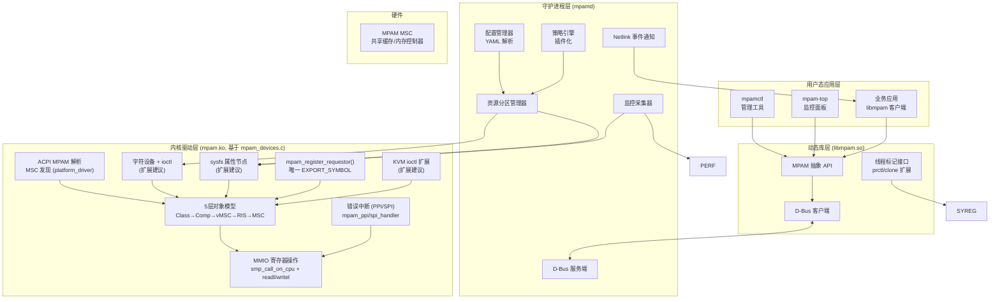

### 1.2 设计原则

| 原则 | 实现方式 |
|------|---------|
| **解耦** | 各层通过明确定义的接口通信，不直接访问其他层内部数据 |
| **可扩展** | 策略引擎插件化，资源类型抽象为统一接口 |
| **安全** | 驱动层做权限校验，PARTID 分配需通过守护进程 |
| **兼容** | sysfs/ioctl/D-Bus 多通道，支持不同集成场景 |
| **实时友好** | 驱动路径零拷贝，关键操作不走守护进程 |

---

## 2. 内核驱动层

> 本节基于 linux_mpam_drivers/mpam_devices.c (Arm Ltd., 2025, GPL-2.0) 源码分析，描述真实的上游 Linux MPAM 驱动架构。

### 2.1 五层对象模型

驱动的核心设计是 **5 层对象层级**，将物理硬件映射为可编程的逻辑抽象：

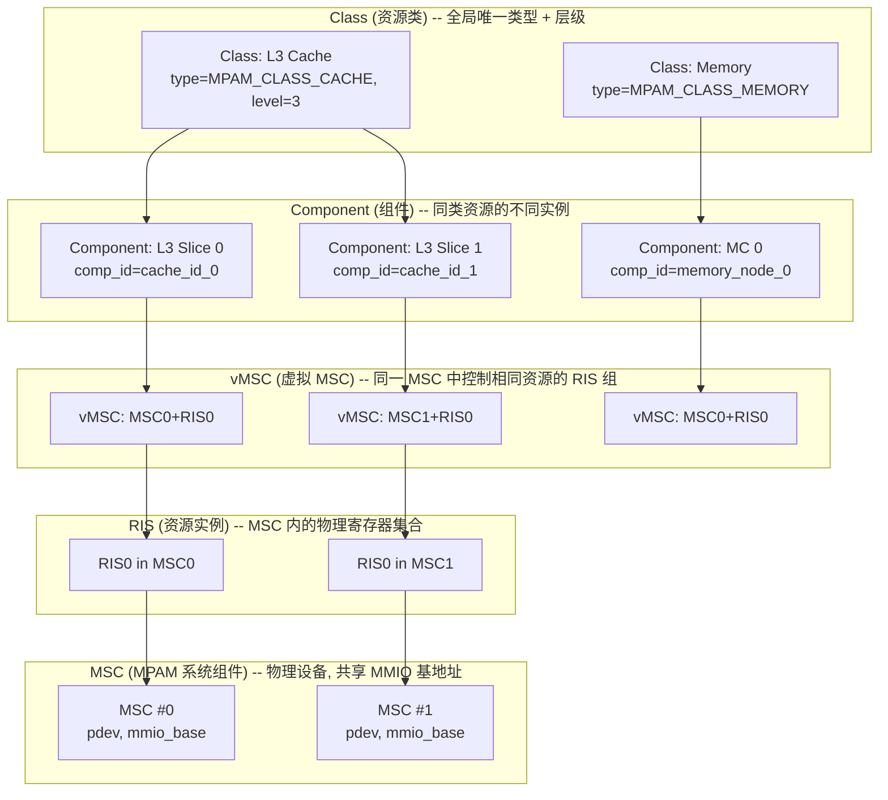

**层级关系说明 (源码注释 mpam_devices.c:79-111)：**

| 层级 | 结构体 | 含义 | 示例 |
|------|--------|------|------|
| **Class** | `struct mpam_class` | 全局同一类型+层级的资源集合 | 所有 L3 缓存 |
| **Component** | `struct mpam_component` | 同类资源的不同物理实例 | L3 Slice 0, L3 Slice 1 |
| **vMSC** | `struct mpam_vmsc` | 同一 MSC 内控制相同资源的 RIS 分组 | MSC0 中控制缓存的 RIS 集合 |
| **RIS** | `struct mpam_msc_ris` | MSC 内的一个资源实例 (寄存器集合) | MSC0 RIS0 |
| **MSC** | `struct mpam_msc` | 物理设备, 共享 MMIO 基地址和中断 | 一个 L3 MSC 芯片 |

**关键规则：** vMSC 的特性是其所包含 RIS 的**并集**；Class 和 Component 的特性是所包含 vMSC 的**交集**（不匹配的特性被清除）。

### 2.2 驱动模块结构

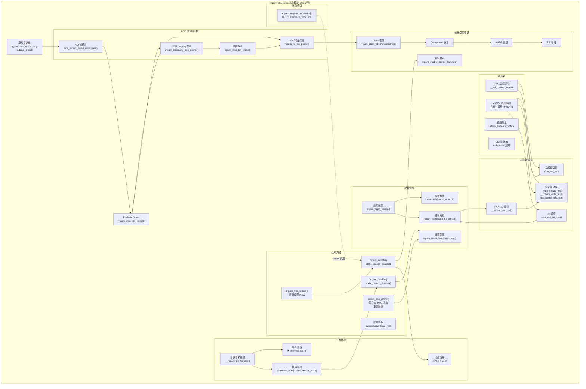

### 2.3 核心数据结构

```c
/* MSC (物理设备) -- 一个 platform_device 对应一个 */
struct mpam_msc {
    uint32_t            id;
    struct platform_device *pdev;
    void __iomem        *mapped_hwpage;       /* MMIO 基地址 (ioremap) */
    size_t              mapped_hwpage_sz;
    enum mpam_iface     iface;               /* MMIO / PCC */

    uint16_t            ris_max;             /* 最大 RIS 索引 */
    uint16_t            partid_max;          /* 此 MSC 支持的 PARTID 最大值 */
    uint8_t             pmg_max;             /* 此 MSC 支持的 PMG 最大值 */
    bool                has_extd_esr;        /* 64 位扩展 ESR */
    bool                probed;              /* 硬件探测完成标志 */

    cpumask_t           accessibility;       /* 可访问此 MSC 的 CPU 掩码 */
    atomic_t            online_refs;         /* 在线 CPU 引用计数 */
    uint32_t            nrdy_usec;           /* 固件提供的 NRDY 超时 (us) */

    /* 锁: 严格顺序 cfg_lock > part_sel_lock > mon_sel_lock > error_irq_lock */
    struct mutex        probe_lock;
    struct mutex        part_sel_lock;       /* 保护 PARTID_SEL 寄存器 */
    struct mutex        cfg_lock;            /* 保护配置写入序列 */
    struct mutex        error_irq_lock;
    struct lockdep_map  mon_sel_lock_dep_map;
    bool                in_reset_state;

    struct list_head_rcu ris;                /* 此 MSC 的所有 RIS */
    struct list_head_rcu all_msc_list;       /* 全局 MSC 链表 */
    struct mpam_garbage  garbage;
};

/* RIS (资源实例) -- MSC 内的物理寄存器集合 */
struct mpam_msc_ris {
    uint8_t             ris_idx;
    uint64_t            idr;                 /* MPAMF_IDR 缓存值 */
    struct mpam_props   props;               /* 此 RIS 的特性标志 */
    struct msmon_mbwu_state *mbwu_state;     /* MBWU 监控器状态数组 */
    cpumask_t           affinity;            /* 关联的 CPU 集合 */
    struct mpam_vmsc    *vmsc;
    struct list_head_rcu msc_list;
    struct list_head_rcu vmsc_list;
    struct mpam_garbage  garbage;
};

/* Component (组件) -- 同类资源的不同物理实例 */
struct mpam_component {
    int                 comp_id;             /* 缓存 ID 或内存节点 ID */
    cpumask_t           affinity;
    struct mpam_config  *cfg;                /* cfg[partid_max+1] 配置数组 */
    struct mpam_class   *class;
    struct list_head_rcu vmsc;
    struct list_head_rcu class_list;
    struct mpam_garbage  garbage;
};

/* Class (资源类) -- 全局类型+层级 */
struct mpam_class {
    uint8_t             level;               /* 缓存层级 */
    enum mpam_class_types type;              /* CACHE / MEMORY / UNKNOWN */
    struct mpam_props   props;               /* 合并后的特性 (交集) */
    uint32_t            nrdy_usec;           /* 所有 vMSC 中最大值 */
    struct ida          ida_csu_mon;
    struct ida          ida_mbwu_mon;
    struct list_head_rcu components;
    struct list_head_rcu classes_list;
    struct mpam_garbage  garbage;
};

/* 每分区的配置 (shadow copy) */
struct mpam_config {
    DECLARE_BITMAP(features, MPAM_FEATURE_LAST);
    uint32_t            cpbm;                /* CPOR 位图 (最大 32 位) */
    uint32_t            mbw_pbm;             /* MBWPBM 位图 (最大 32 位) */
    uint32_t            mbw_max;             /* MBWMAX */
    struct mpam_garbage  garbage;
};

/* 特性标志 (bitmap 操作) */
struct mpam_props {
    DECLARE_BITMAP(features, MPAM_FEATURE_LAST);
    uint16_t            cpbm_wd;             /* CPOR 位图宽度 */
    uint16_t            mbw_pbm_bits;        /* MBWPBM 位图宽度 */
    uint8_t             cmax_wd;             /* CCAP CMAX 定点小数位数 */
    uint8_t             cassoc_wd;           /* CASSOC 定点小数位数 */
    uint8_t             bwa_wd;              /* MBW A 位宽 */
    uint8_t             intpri_wd, dspri_wd; /* 优先级位宽 */
    uint16_t            num_csu_mon;         /* CSU 监控器数量 */
    uint16_t            num_mbwu_mon;        /* MBWU 监控器数量 */
};
```

### 2.4 驱动生命周期

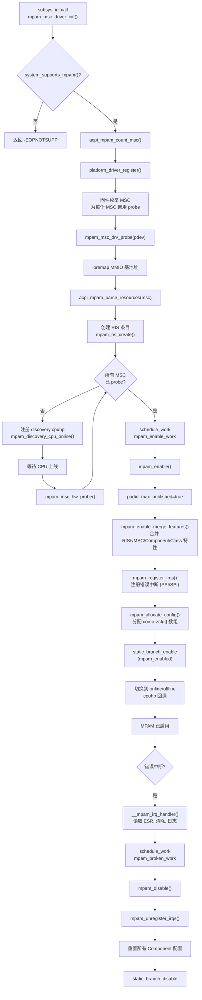

### 2.5 寄存器访问机制

驱动不直接使用 `ioremap` 后的裸指针，而是通过 **IPI 调度** 到可访问 MSC 的 CPU 上执行：

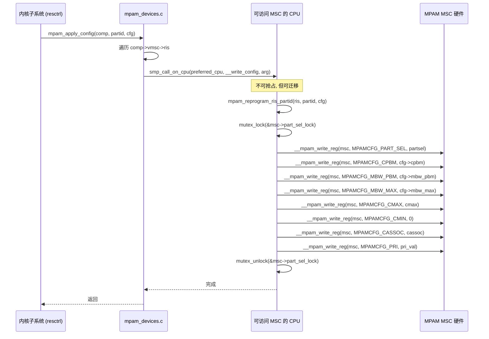

**设计原因 (源码注释 1766-1771)：** MSC 可能控制某组 CPU 的流量，但只能从更广泛的 CPU 集合访问。如果该组所有 CPU 都处于 PSCI:CPU_SUSPEND，对应缓存也可能被关闭。因此必须在可访问的 CPU 上执行 MMIO 操作。

### 2.6 锁策略

驱动使用严格的锁顺序和 SRCU 保护：

```
锁顺序 (必须按此顺序获取):
  cfg_lock > part_sel_lock > mon_sel_lock > error_irq_lock

全局锁:
  mpam_list_lock   -- 保护 SRCU 链表的写操作
  partid_max_lock  -- spinlock, 保护 mpam_partid_max/pmg_max

SRCU:
  mpam_srcu        -- 保护所有 RCU 链表的读操作

快速路径:
  static_branch    -- mpam_enabled, 零开销检查
```

### 2.7 监控器设计

驱动实现了完整的 CSU 和 MBWU 监控器支持：

```mermaid
flowchart TD
    subgraph "CSU 监控读取流程"
        CSU_CALL["mpam_msmon_read(comp, ctx, mpam_feat_msmon_csu, &val)"]
        CSU_CALL --> CSU_IPI["smp_call_function_any(&msc->accessibility)"]
        CSU_IPI --> CSU_SEL["写 MON_SEL = ris_idx | mon_idx"]
        CSU_SEL --> CSU_CMP{"配置匹配?"}
        CSU_CMP -->|"否"| CSU_W["重写 FLT/CTL, 清零计数器, 使能"]
        CSU_CMP -->|"是"| CSU_R["读 MSMON_CSU"]
        CSU_W --> CSU_R
        CSU_R --> CSU_NR{"NRDY?"}
        CSU_NR -->|"是"| CSU_WAIT["等待 nrdy_usec<br/>重试读取"]
        CSU_NR -->|"否"| CSU_RET["返回 VALUE"]
        CSU_WAIT --> CSU_R
    end

    subgraph "MBWU 长计数器读取 (44/63位)"
        MBWU_CALL["mpam_msmon_read(comp, ctx, mpam_feat_msmon_mbwu, &val)"]
        MBWU_CALL --> MBWU_IPI["smp_call_function_any()"]
        MBWU_IPI --> MBWU_SEL["写 MON_SEL"]
        MBWU_SEL --> MBWU_CMP{"配置匹配?"}
        MBWU_CMP -->|"否"| MBWU_W["重写 FLT/CTL, 使能"]
        MBWU_CMP -->|"是"| MBWU_R["读 MSMON_MBWU_L<br/>64位原子读取"]
        MBWU_W --> MBWU_R
        MBWU_R --> MBWU_OVF{"溢出?"}
        MBWU_OVF -->|"是"| MBWU_COR["correction += 溢出值<br/>硬件清零 OFLOW_STATUS"]
        MBWU_OVF -->|"否"| MBWU_ADD["val += correction"]
        MBWU_COR --> MBWU_ADD
        MBWU_ADD --> MBWU_RET["返回 val"]
    end
```

**关键设计点：**

- **配置缓存：** 驱动缓存 FLT/CTL 的当前值，仅在配置变化时重写，避免不必要的 NRDY 等待
- **溢出修正：** MBWU 31/44/63 位计数器溢出时，驱动累加 `correction` 值实现软件扩展
- **NRDY 处理：** CSU 计数器依赖固件提供 `arm,not-ready-us` 属性；MBWU 支持硬件管理 NRDY (通过 hw probe 检测)
- **PMG 过滤：** CSU 支持 XCL (Exclude Clean) 过滤脏行；MBWU 支持 RWBW (Read/Write Bandwidth) 过滤

### 2.8 中断处理

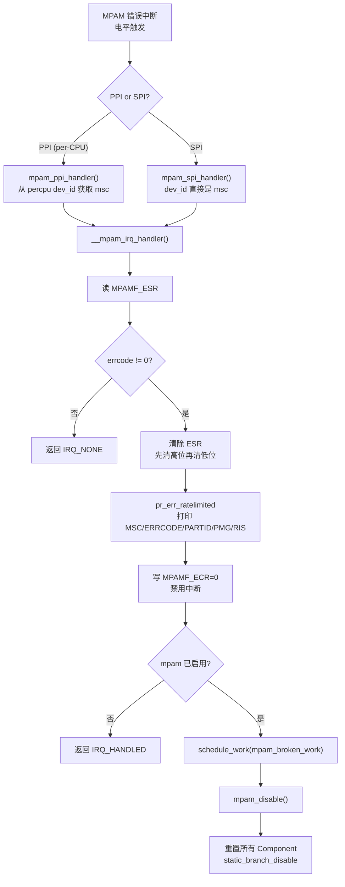

**设计原则 (源码注释 70-76)：** 所有 MPAM 错误中断都表示软件 bug。收到中断后直接禁用驱动。

### 2.9 特性合并机制

当多个 RIS 组成 vMSC/Component/Class 时，驱动需要合并特性：

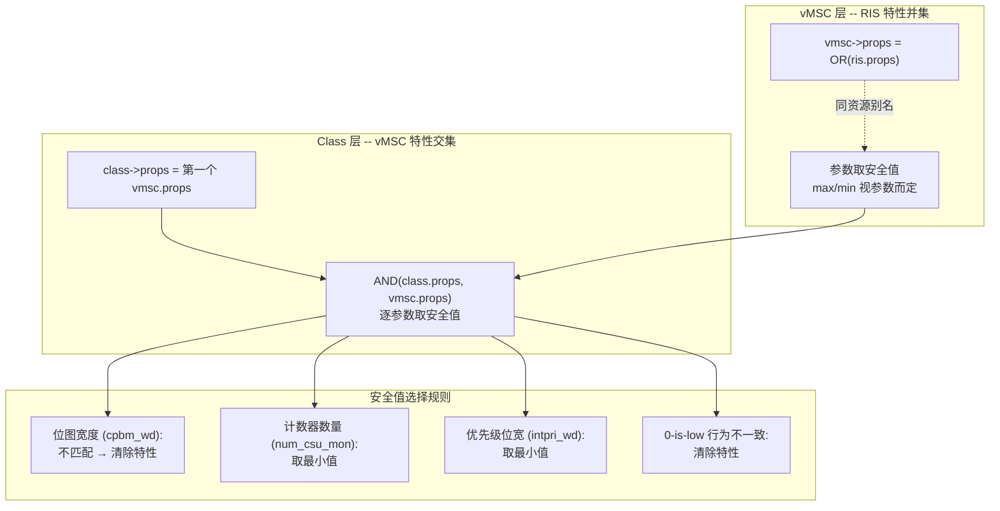

### 2.10 外部接口

驱动目前仅导出一个符号：

```c
/* 外部子系统 (如 resctrl) 注册为 Requestor, 参与 PARTID 范围协商 */
int mpam_register_requestor(u16 partid_max, u8 pmg_max);
EXPORT_SYMBOL(mpam_register_requestor);
```

**PARTID 范围协商规则：**
- 第一个 requestor 设定 `mpam_partid_max` 和 `mpam_pmg_max`
- 后续 requestor 只能进一步**缩小**范围 (`min()`)
- `partid_max_published=true` 后 (MPAM 启用)，新 requestor 不能再缩小

### 2.11 与软件方案其他层的接口扩展建议

由于现有驱动是内部子系统，需要扩展接口以支持用户态守护进程和应用：

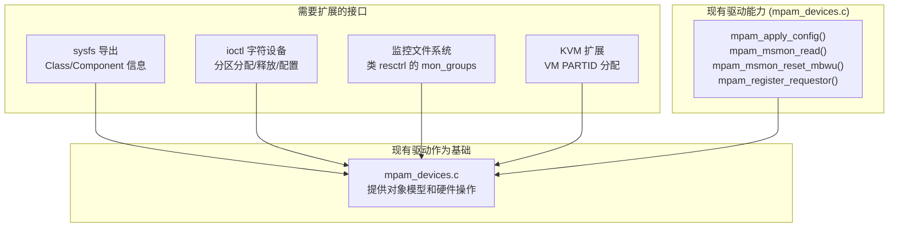

---

## 3. 守护进程层

### 3.1 守护进程模块结构

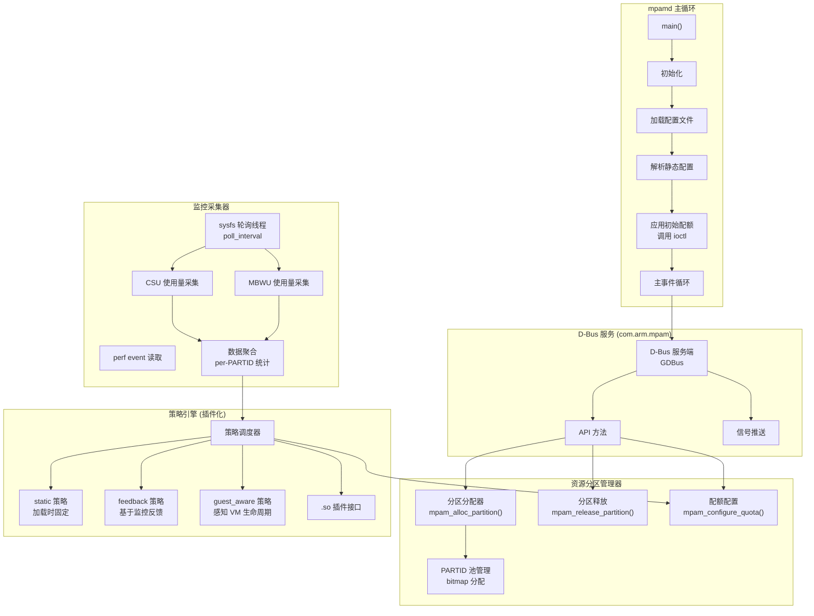

### 3.2 配置文件格式 (YAML)

```yaml
# /etc/mpam/mpam.conf
global:
  default_policy: feedback
  poll_interval_ms: 100
  log_level: info

# 静态分区定义
partitions:
  - name: rt_critical
    partid: 1
    owner: pid:1000          # 或 cgroup:/rt_critical
    resources:
      cache_llc:
        ccap_cmax: 0xC000    # 75%
        ccap_cmin: 0x8000    # 50%
        cpor_cpbm: 0xC0      # 高6路
      memory:
        mbw_min: 0x4000      # 25% 保证
        mbw_max: 0xFFFF      # 无上限

  - name: be_normal
    partid: 2
    owner: cgroup:/be
    resources:
      cache_llc:
        ccap_cmax: 0x4000    # 25%
        ccap_cmin: 0x0000    # 无保证
        cpor_cpbm: 0x3C      # 低6路
      memory:
        mbw_min: 0x0000      # 无保证
        mbw_max: 0x8000      # 50% 上限

  - name: vm_default
    partid: 3
    owner: vm_uuid:*
    resources:
      cache_llc:
        ccap_cmax: 0x2000
        cpor_cpbm: 0x03
      memory:
        mbw_pbm: 0x02

# 策略插件
policies:
  feedback:
    module: libmpam_policy_feedback.so
    params:
      scale_up_threshold: 80
      scale_down_threshold: 20
      adjust_step: 0x0800
      min_quota: 0x1000
      max_quota: 0xC000

  guest_aware:
    module: libmpam_policy_guest.so
    params:
      vm_boot_boost: 0x4000
      vm_idle_shrink: 0x1000
```

### 3.3 策略引擎接口

```c
/* 策略插件接口 -- 所有策略 .so 必须实现 */
struct mpam_policy_ops {
    const char *name;

    /* 初始化 */
    int (*init)(const struct mpam_policy_params *params);

    /* 监控数据输入 */
    int (*feed_monitor_data)(uint16_t partid,
                              const struct mpam_usage_stats *stats);

    /* 策略决策 -- 返回需要调整的配额 */
    int (*decide)(uint16_t partid,
                  struct mpam_quota_adjustment *adjust);

    /* VM 生命周期事件 */
    int (*on_vm_start)(uint16_t vm_partid);
    int (*on_vm_stop)(uint16_t vm_partid);
    int (*on_vm_pause)(uint16_t vm_partid);

    /* 销毁 */
    void (*destroy)(void);
};

struct mpam_usage_stats {
    uint64_t cache_usage_bytes;   /* CSU 监控值 */
    uint64_t bw_usage_bytes;      /* MBWU 监控值 */
    uint64_t cache_hit_rate;      /* perf cache-misses 参考值 */
    uint64_t timestamp_ms;
};

struct mpam_quota_adjustment {
    uint32_t new_ccap_cmax;
    uint32_t new_mbw_max;
};
```

### 3.4 D-Bus 接口定义

```
服务名: com.arm.mpam
对象路径: /com/arm/mpam
接口: com.arm.mpam.Manager

方法:
  AllocatePartition(in s name, in a resources, out u partid)
  ReleasePartition(in u partid)
  ConfigureQuota(in u partid, in a resources)
  GetUsage(in u partid, out a stats)

信号:
  PartitionAllocated(u partid, s name)
  PartitionReleased(u partid)
  QuotaAdjusted(u partid, a new_quota)
  MonitorOverflow(u msc_index, u mon_index)
```

---

## 4. 动态库层

### 4.1 API 类图

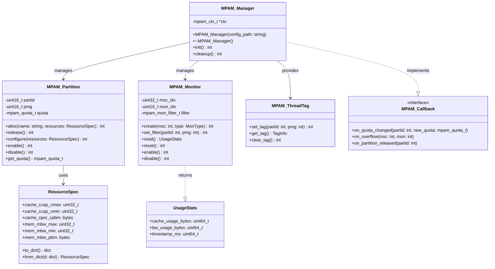

### 4.2 用户态 API (libmpam.h)

```c
#ifndef LIBMPAM_H
#define LIBMPAM_H

#include <stdint.h>
#include <stddef.h>

/* ========== 基础类型 ========== */

typedef struct {
    uint32_t ccap_cmax;       /* 缓存最大容量 (定点小数) */
    uint32_t ccap_cmin;       /* 缓存最小容量 (定点小数) */
    uint32_t cpor_cpbm_len;   /* CPOR 位图字节长度 */
    uint8_t  *cpor_cpbm;      /* CPOR 位图数据 */
    uint32_t mbw_max;         /* 带宽最大限制 (定点小数) */
    uint32_t mbw_min;         /* 带宽最小保证 (定点小数) */
    uint32_t mbw_pbm_len;     /* MBWPBM 位图字节长度 */
    uint8_t  *mbw_pbm;        /* MBWPBM 位图数据 */
} mpam_resource_spec_t;

typedef struct {
    uint64_t cache_usage_bytes;
    uint64_t bw_usage_bytes;
    uint64_t timestamp_ms;
} mpam_usage_stats_t;

typedef struct {
    uint16_t partid;
    uint16_t pmg;
} mpam_tag_t;

/* ========== 管理器 ========== */

typedef struct mpam_ctx mpam_ctx_t;

mpam_ctx_t *mpam_create(const char *config_path);
void         mpam_destroy(mpam_ctx_t *ctx);

/* ========== 分区管理 ========== */

int mpam_partition_alloc(mpam_ctx_t *ctx, const char *name,
                         const mpam_resource_spec_t *spec,
                         uint16_t *out_partid);

int mpam_partition_release(mpam_ctx_t *ctx, uint16_t partid);

int mpam_partition_configure(mpam_ctx_t *ctx, uint16_t partid,
                              const mpam_resource_spec_t *spec);

int mpam_partition_enable(mpam_ctx_t *ctx, uint16_t partid);
int mpam_partition_disable(mpam_ctx_t *ctx, uint16_t partid);

/* ========== 监控 ========== */

int mpam_monitor_create(mpam_ctx_t *ctx, uint32_t msc_index,
                        const char *type, uint16_t *out_mon_idx);

int mpam_monitor_set_filter(mpam_ctx_t *ctx, uint32_t msc_index,
                             uint16_t mon_idx, uint16_t partid, uint8_t pmg);

int mpam_monitor_read(mpam_ctx_t *ctx, uint32_t msc_index,
                      uint16_t mon_idx, mpam_usage_stats_t *stats);

int mpam_monitor_reset(mpam_ctx_t *ctx, uint32_t msc_index,
                       uint16_t mon_idx);

int mpam_monitor_enable(mpam_ctx_t *ctx, uint32_t msc_index,
                        uint16_t mon_idx);

int mpam_monitor_disable(mpam_ctx_t *ctx, uint32_t msc_index,
                         uint16_t mon_idx);

/* ========== 线程标记 ========== */

int mpam_thread_set_tag(uint16_t partid, uint16_t pmg);
int mpam_thread_get_tag(mpam_tag_t *tag);
int mpam_thread_clear_tag(void);

/* ========== 回调 ========== */

typedef void (*mpam_quota_changed_cb)(uint16_t partid,
                                        const mpam_resource_spec_t *new_spec);

typedef void (*mpam_overflow_cb)(uint32_t msc_index, uint16_t mon_index);

int mpam_register_callback(mpam_ctx_t *ctx, int event_mask,
                           void (*cb)(void *data), void *data);

#endif /* LIBMPAM_H */
```

### 4.3 传输层抽象

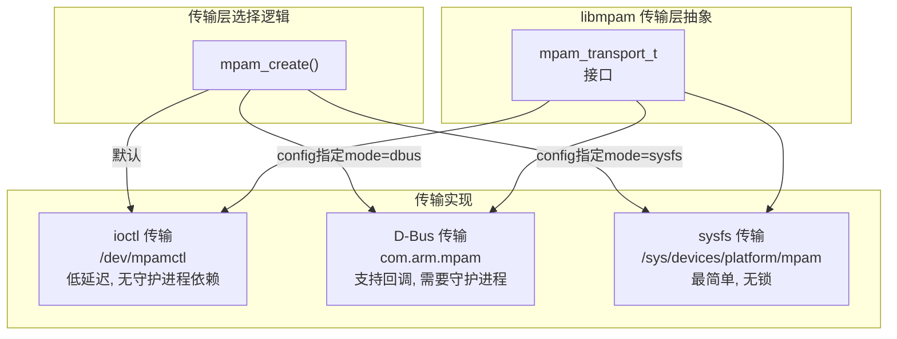

```c
typedef struct mpam_transport {
    const char *name;
    int (*open)(void);
    int (*close)(void);
    int (*alloc_partition)(const mpam_resource_spec_t *spec, uint16_t *partid);
    int (*release_partition)(uint16_t partid);
    int (*configure)(uint16_t partid, const mpam_resource_spec_t *spec);
    int (*monitor_read)(uint32_t msc, uint16_t mon, mpam_usage_stats_t *stats);
    int (*monitor_config)(uint32_t msc, uint16_t mon, uint16_t partid, uint8_t pmg);
} mpam_transport_t;

/* 传输层注册 -- 可通过环境变量覆盖 */
extern mpam_transport_t mpam_transport_ioctl;
extern mpam_transport_t mpam_transport_dbus;
extern mpam_transport_t mpam_transport_sysfs;
```

---

## 5. 用户态应用

### 5.1 mpamctl -- 命令行管理工具

```
用法: mpamctl [命令] [参数]

命令:
  info                          显示系统 MPAM 信息
  list                          列出所有分区
  alloc -n NAME [-c CCAP] [-w CPOR] [-b BW] [-m MBWMIN]
                                分配新分区
  release PARTID                释放分区
  config PARTID [-c CCAP] [-w CPOR] [-b BW]
                                修改分区配额
  mon read MSC MON               读取监控值
  mon reset MSC MON              重置监控器
  mon enable MSC MON             使能监控器
  vm assign -p VM_PID [-c CCAP]  为 VM 分配 PARTID
  vm release VM_PID              释放 VM 的 PARTID

示例:
  # 查看系统信息
  mpamctl info

  # 为实时任务分配 75% 缓存 + 25% 带宽保证
  mpamctl alloc -n rt_task -c 0xC000 -w 0xC0 -m 0x4000

  # 查看所有分区配额
  mpamctl list

  # 读取 MSC0 的 CSU 监控器 0
  mpamctl mon read 0 0
```

### 5.2 mpam-top -- 实时监控工具

类似 `htop` 的终端 UI，实时显示各 PARTID 的资源使用情况：

```
MPAM Monitor - Refresh: 100ms | MSCs: 2 | Partitions: 4

PARTID  NAME          Cache Usage    Cache %   BW Usage       BW %
    0    (default)     12.5 MB       9.8%     256 MB/s       10.2%
    1    rt_critical  75.0 MB      58.6%     512 MB/s       20.5%
    2    be_normal     25.0 MB      19.5%     102 MB/s        4.1%
    3    vm_default   15.0 MB      11.7%     128 MB/s        5.1%
    4    (free)         0.5 MB       0.4%       2 MB/s        0.1%
    ─────────────────────────────────────────────────────────────────
    Total              128.0 MB     100.0%    1000 MB/s       40.0%
```

### 5.3 应用集成示例

```c
#include "libmpam.h"

int main(int argc, char *argv[])
{
    mpam_ctx_t *ctx = mpam_create(NULL);  /* 使用默认配置 */

    /* 1. 分配分区 -- 75% 缓存 */
    uint16_t partid;
    mpam_resource_spec_t spec = {
        .ccap_cmax = 0xC000,     /* 75% 缓存最大容量 */
        .ccap_cmin = 0x8000,     /* 50% 缓存最小保证 */
        .mbw_min   = 0x4000,     /* 25% 带宽最小保证 */
    };
    mpam_partition_alloc(ctx, "my_rt_task", &spec, &partid);

    /* 2. 创建监控器 */
    uint16_t mon;
    mpam_monitor_create(ctx, 0, "csu", &mon);
    mpam_monitor_set_filter(ctx, 0, mon, partid, 0);

    /* 3. 设置工作线程的 PARTID 标记 */
    mpam_thread_set_tag(partid, 0);

    /* 4. 执行实际工作负载 */
    do_realtime_work();

    /* 5. 读取监控数据 */
    mpam_usage_stats_t stats;
    mpam_monitor_read(ctx, 0, mon, &stats);
    printf("Cache usage: %lu bytes\n", stats.cache_usage_bytes);

    /* 6. 清理 */
    mpam_thread_clear_tag();
    mpam_partition_release(ctx, partid);
    mpam_destroy(ctx);
    return 0;
}
```

---

## 6. 虚拟化支持

### 6.1 KVM/QEMU 集成架构

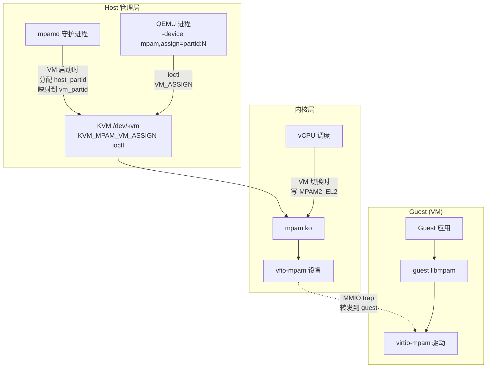

### 6.2 VM 启动时 PARTID 分配流程

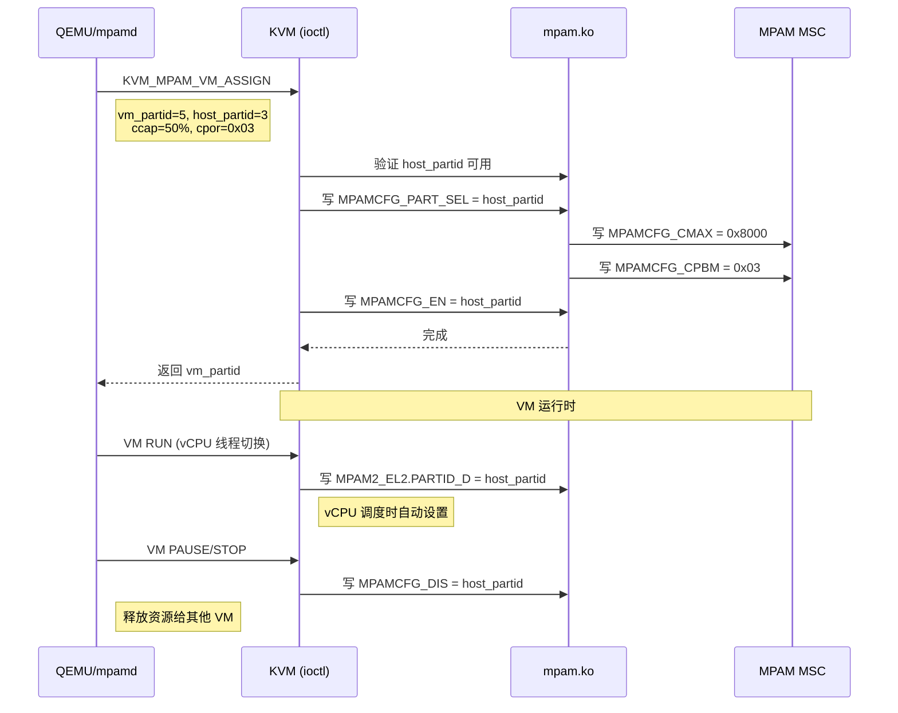

### 6.3 Guest MPAM 设备模型

Guest 中通过 virtio-mpam 设备暴露有限的 MPAM 操作：

```c
/*
 * virtio-mpam: Guest 可见的 MPAM 寄存器子集
 * 通过 virtio MMIO region 暴露
 *
 * Guest 读写的寄存器会被 QEMU trap,
 * QEMU 将 vm_partid 映射到 host_partid 后转发给 mpam.ko
 */

/* Guest 可见的寄存器 (只读, 由 host 配置) */
#define VIRTIO_MPAM_IDR        0x00  /* 特性位 (host 配置的子集) */
#define VIRTIO_MPAM_CMAX_WD    0x04  /* CMAX 位宽 */
#define VIRTIO_MPAM_CPBM_WD    0x08  /* CPBM 位宽 */

/* Guest 可写的寄存器 (trap 到 host) */
#define VIRTIO_MPAM_MON_SEL    0x80  /* 监控器选择 */
#define VIRTIO_MPAM_CSU_FLT    0x90  /* CSU 过滤 */
#define VIRTIO_MPAM_CSU_CTL    0x98  /* CSU 控制 */
#define VIRTIO_MPAM_CSU_VALUE  0xA0  /* CSU 计数器 (只读) */
```

---

## 7. 模块交互与关键数据流

### 7.1 分区分配数据流

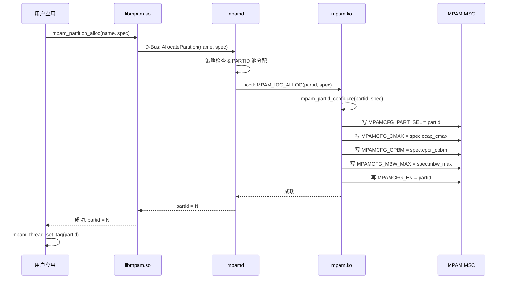

### 7.2 监控与动态调整数据流

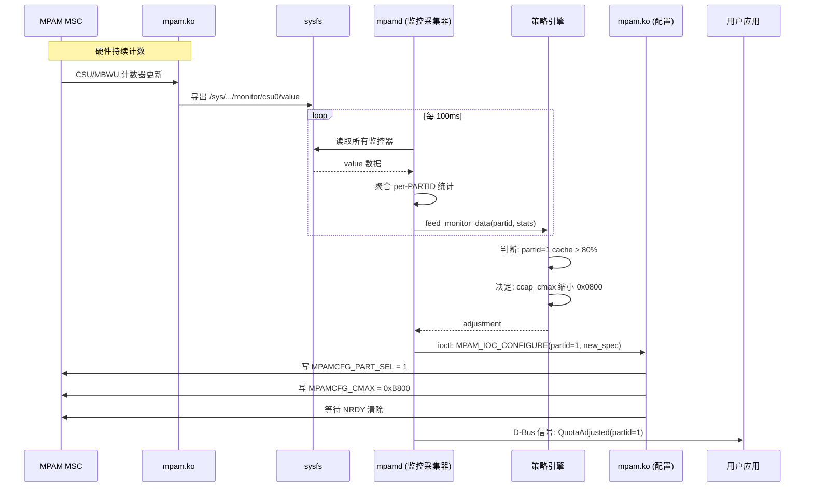

### 7.3 VM 生命周期数据流

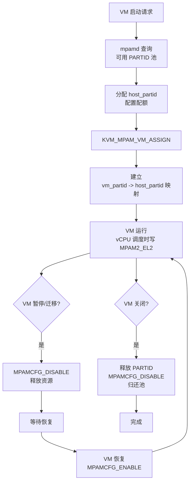

---

## 8. 可扩展性与解耦设计

### 8.1 分层解耦关系

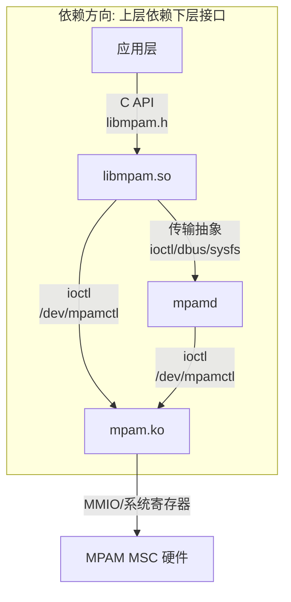

**解耦关键点：**

| 层间 | 解耦方式 | 替换可行性 |
|------|---------|-----------|
| App ↔ libmpam | C API 接口 | 应用可自由切换 libmpam 版本 |
| libmpam ↔ 驱动 | 传输层抽象 (ioctl/dbus/sysfs) | 可切换传输实现 |
| libmpam ↔ mpamd | D-Bus 协议 | 可替换守护进程实现 |
| mpamd ↔ 驱动 | ioctl 接口 | 驱动升级不影响守护进程 |
| 策略引擎 ↔ mpamd | .so 插件接口 | 可加载自定义策略 |

### 8.2 资源类型抽象

```c
/* 统一资源类型接口 -- 新增资源类型只需实现此接口 */
struct mpam_rsrc_ops {
    const char *name;          /* "cache_llc", "memory_ctrl" */
    enum mpam_rsrc_type type;

    /* 配置接口 */
    int (*configure)(struct mpam_msc *msc, uint16_t rsrc_idx,
                     uint16_t partid, const mpam_resource_spec_t *spec);

    /* 监控接口 */
    int (*monitor_create)(struct mpam_msc *msc, uint16_t rsrc_idx);
    int (*monitor_read)(struct mpam_msc *msc, uint16_t rsrc_idx,
                        uint16_t mon_idx, mpam_usage_stats_t *stats);

    /* 能力查询 */
    int (*get_capabilities)(struct mpam_msc *msc, uint16_t rsrc_idx,
                            mpam_rsrc_caps_t *caps);
};

/* 注册表 */
int mpam_rsrc_register(const struct mpam_rsrc_ops *ops);
const struct mpam_rsrc_ops *mpam_rsrc_lookup(enum mpam_rsrc_type type);
```

### 8.3 策略插件加载

```c
/* 策略插件加载 */
#define MPAM_POLICY_PATH "/usr/lib/mpam/policy/"

static int load_policy_plugins(const char *policy_name)
{
    char path[256];
    void *handle;
    struct mpam_policy_ops *ops;

    snprintf(path, sizeof(path), "%s/libmpam_policy_%s.so",
             MPAM_POLICY_PATH, policy_name);
    handle = dlopen(path, RTLD_NOW);
    ops = dlsym(handle, "mpam_policy_ops");

    /* 校验接口版本 */
    if (ops->version != MPAM_POLICY_VERSION)
        return -EINVAL;

    ops->init(&global_params);
    register_policy(ops);
    return 0;
}
```

### 8.4 未来扩展点

| 扩展方向 | 扩展方式 | 接口预留 |
|---------|---------|---------|
| 新资源类型 (如 NPU 缓存) | 实现 `mpam_rsrc_ops` | 注册表已预留 |
| 自定义策略 | 编写 .so 插件 | `mpam_policy_ops` 接口 |
| 容器集成 | cgroup driver | sysfs 属性兼容 cgroup |
| 远程管理 | gRPC/WebSocket | D-Bus 可扩展为网络传输 |
| 热升级 | 驱动接口版本化 | ioctl 命令号分配预留空间 |

---

## 附录：文件布局

```
mpam-linux/
├── kernel/
│   └── mpam/
│       ├── Kconfig
│       ├── Makefile
│       ├── mpam_devices.c        ★ 核心驱动 (Arm upstream, 2726行)
│       │   # 5层对象模型: Class→Component→vMSC→RIS→MSC
│       │   # Platform driver, ACPI 发现, IPI 寄存器访问
│       │   # SRCU 保护的 RCU 链表, 延迟垃圾回收
│       │   # CPU hotplug: discovery→enable→online/offline
│       │   # CSU/MBWU 监控器, NRDY 等待, 溢出修正
│       │   # 错误中断 (PPI/SPI), ESR 清除, 驱动禁用
│       │   # 特性合并: RIS(并集)→vMSC(并集)→Class(交集)
│       │   # 唯一导出: mpam_register_requestor()
│       ├── mpam_internal.h        # 内部头文件 (struct 定义)
│       ├── <linux/arm_mpam.h>     # 公共头文件 (resctrl 接口)
│       ├── <acpi mpam.c>          # ACPI MPAM 表解析 (内核树)
│       ├── <arm64 mpam.c>         # arch MPAM: MPAM2_EL2, FEAT_MPAM
│       ├── mpam_sysfs.c           # sysfs 导出 (扩展建议)
│       ├── mpam_ioctl.c           # ioctl 接口 (扩展建议)
│       ├── mpam_kvm.c             # KVM 扩展 (扩展建议)
│       └── test_mpam_devices.c    # KUnit 测试 (CONFIG_MPAM_KUNIT_TEST)
├── daemon/
│   ├── mpamd.c                /* 主循环 */
│   ├── config.c                /* 配置文件解析 */
│   ├── manager.c               /* 分区管理器 */
│   ├── monitor.c               /* 监控采集器 */
│   ├── policy.c                /* 策略引擎 */
│   ├── dbus.c                  /* D-Bus 服务端 */
│   └── mpam.conf               /* 默认配置 */
├── lib/
│   ├── libmpam.h              /* 公开 API 头文件 */
│   ├── mpam_ctx.c             /* 上下文管理 */
│   ├── mpam_partition.c        /* 分区操作 */
│   ├── mpam_monitor.c         /* 监控操作 */
│   ├── mpam_thread.c          /* 线程标记 (prctl) */
│   ├── transport/
│   │   ├── transport.h         /* 传输层抽象接口 */
│   │   ├── transport_ioctl.c   /* ioctl 实现 */
│   │   ├── transport_dbus.c    /* D-Bus 实现 */
│   │   └── transport_sysfs.c  /* sysfs 实现 */
│   └── CMakeLists.txt
├── tools/
│   ├── mpamctl.c              /* 命令行管理工具 */
│   └── mpam_top.c              /* 实时监控工具 */
└── policy/
    ├── libmpam_policy_static.c      /* 静态策略 */
    ├── libmpam_policy_feedback.c    /* 反馈策略 */
    └── libmpam_policy_guest.c      /* VM 感知策略 */
```

---

*文档基于 Arm IHI 0099B.a MPAM MSC 规范及 MPAM ACS v0.5.0 代码设计生成。*
