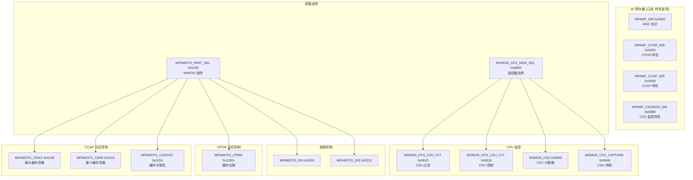
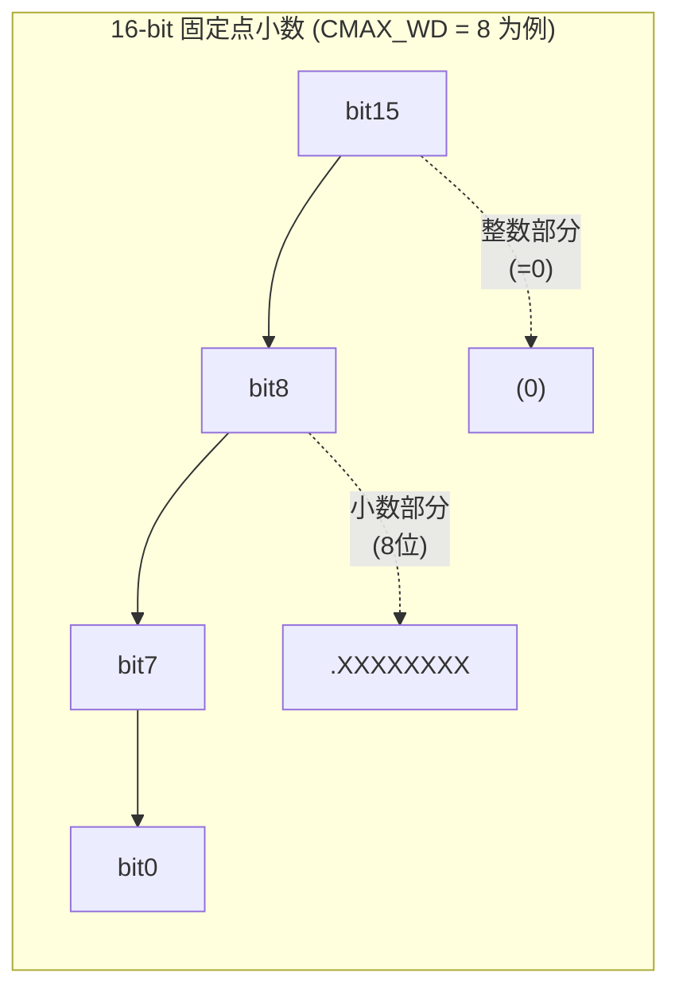
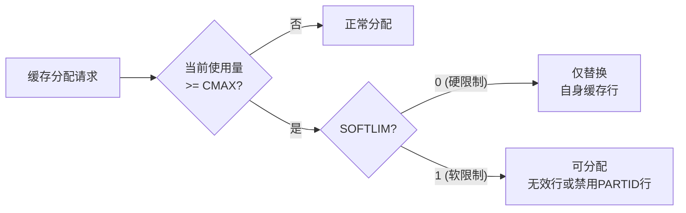
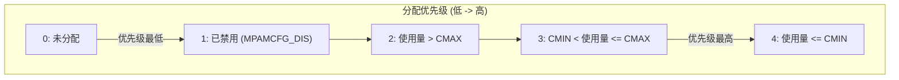
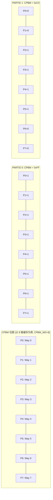
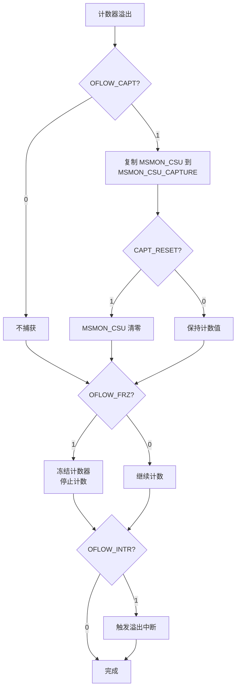
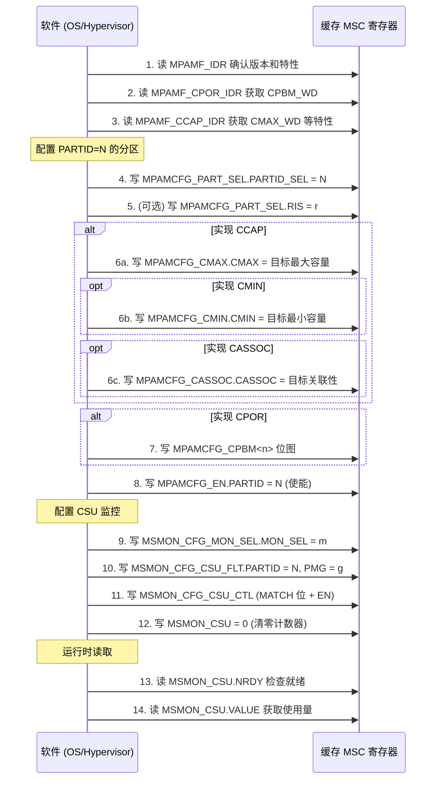

# 共享缓存 IP 的 MPAM 寄存器设计细节

> 基于 Arm IHI 0099B.a MPAM MSC Specification Chapter 9

---

## 目录

1. [共享缓存 MSC 寄存器总览](#1-共享缓存-msc-寄存器总览)
2. [特性发现寄存器 (ID Registers)](#2-特性发现寄存器)
3. [配置访问寄存器](#3-配置访问寄存器)
4. [缓存容量分区寄存器 (CCAP)](#4-缓存容量分区寄存器-ccap)
5. [缓存位图分区寄存器 (CPOR)](#5-缓存位图分区寄存器-cpor)
6. [CSU 监控寄存器](#6-csu-监控寄存器)
7. [使能/禁用寄存器](#7-使能禁用寄存器)
8. [寄存器使用编程模型](#8-寄存器使用编程模型)

---

## 1. 共享缓存 MSC 寄存器总览

共享缓存作为 MPAM MSC，其内存映射寄存器空间按偏移地址组织。以下仅列出与共享缓存相关的寄存器：

---

## 2. 特性发现寄存器

### 2.1 MPAMF_CPOR_IDR -- Cache Portion Partitioning ID Register

**偏移:** `0x0030` | **宽度:** 32-bit | **访问:** 只读

**存在条件:** `(FEAT_MPAMv0p1 || FEAT_MPAMv1p0)` 且 `MPAMF_IDR.HAS_CPOR_PART == 1`

| 字段 | 位 | 宽度 | 访问 | 复位值 | 描述 |
|------|-----|------|------|--------|------|
| RES0 | [31:16] | 16 | RO | 0 | 保留 |
| CPBM_WD | [15:0] | 16 | RO | IMPDEF | 缓存位图宽度 (1 ~ 32768) |

**CPBM_WD 详细说明：**

- 指示 `MPAMCFG_CPBM<n>` 中有效位的数量
- 范围 1 ~ 32768，值 > 32 时需要多个 32 位寄存器（最多 1024 个）
- 若实现 RIS，此字段反映当前 `MPAMCFG_PART_SEL.RIS` 选中的资源实例的位图宽度

---

### 2.2 MPAMF_CCAP_IDR -- Cache Capacity Partitioning ID Register

**偏移:** `0x0038` | **宽度:** 32-bit | **访问:** 只读

**存在条件:** `(FEAT_MPAMv0p1 || FEAT_MPAMv1p0)` 且 `MPAMF_IDR.HAS_CCAP_PART == 1`

| 字段 | 位 | 宽度 | 访问 | 复位值 | 描述 |
|------|-----|------|------|--------|------|
| HAS_CMAX_SOFTLIM | [31] | 1 | RO | IMPDEF | 0=无 SOFTLIM 字段, 1=CMAX 有 SOFTLIM 字段 |
| NO_CMAX | [30] | 1 | RO | IMPDEF | 0=CMAX 已实现, 1=CMAX 未实现 |
| HAS_CMIN | [29] | 1 | RO | IMPDEF | 0=CMIN 未实现, 1=CMIN 已实现 |
| HAS_CASSOC | [28] | 1 | RO | IMPDEF | 0=CASSOC 未实现, 1=CASSOC 已实现 |
| RES0 | [27:13] | 15 | RO | 0 | 保留 |
| CASSOC_WD | [12:8] | 5 | RO | IMPDEF | CASSOC 定点小数位数 |
| RES0 | [7:6] | 2 | RO | 0 | 保留 |
| CMAX_WD | [5:0] | 6 | RO | IMPDEF | CMAX/CMIN 定点小数位数 (1~16) |

**版本要求：**

| 特性 | v1.0 | v0.1 | v1.1 |
|------|------|------|------|
| HAS_CMAX_SOFTLIM | 禁止 | 可选 | 可选 |
| NO_CMAX | 禁止 | 可选 | 可选 |
| HAS_CMIN | 禁止 | 可选 | 可选 |
| HAS_CASSOC | 禁止 | 可选 | 可选 |

---

### 2.3 MPAMF_CSUMON_IDR -- Cache Storage Usage Monitoring ID Register

**偏移:** `0x0088` | **宽度:** 32-bit | **访问:** 只读

**存在条件:** `HAS_MSMON == 1` 且 `MPAMF_MSMON_IDR.MSMON_CSU == 1`

| 字段 | 位 | 宽度 | 访问 | 复位值 | 描述 |
|------|-----|------|------|--------|------|
| HAS_CAPTURE | [31] | 1 | RO | IMPDEF | 0=无 CAPTURE 寄存器, 1=支持快照 |
| CSU_RO | [30] | 1 | RO | IMPDEF | 0=MSMON_CSU 可读写, 1=只读 |
| HAS_XCL | [29] | 1 | RO | IMPDEF | 0=无 XCL 过滤, 1=仅统计脏行 |
| RES0 | [28] | 1 | RO | 0 | 保留 |
| HAS_OFLOW_LNKG | [27] | 1 | RO | IMPDEF | 溢出关联控制 |
| HAS_OFSR | [26] | 1 | RO | IMPDEF | 0=无 OFSR 寄存器, 1=已实现 |
| HAS_CEVNT_OFLW | [25] | 1 | RO | IMPDEF | CTL 中 CEVNT_OFLW 字段 |
| HAS_OFLOW_CAPT | [24] | 1 | RO | IMPDEF | CTL 中 OFLOW_CAPT 字段 |
| NO_MATCH_PARTID | [23] | 1 | RO | IMPDEF | 0=支持 PARTID 过滤, 1=不支持 |
| NO_MATCH_PMG | [22] | 1 | RO | IMPDEF | 0=支持 PMG 过滤, 1=不支持 |
| RES0 | [21:16] | 6 | RO | 0 | 保留 |
| NUM_MON | [15:0] | 16 | RO | IMPDEF | CSU 监控器实例数量 |

**NUM_MON 说明：** 最大 MON_SEL 值为 `NUM_MON - 1`。

---

## 3. 配置访问寄存器

### 3.1 MPAMCFG_PART_SEL -- PARTID 选择寄存器

**偏移:** `0x0100` | **宽度:** 32-bit | **访问:** 读写

**存在条件:** 至少一个分区特性已实现

| 字段 | 位 | 宽度 | 访问 | 复位值 | 描述 |
|------|-----|------|------|--------|------|
| RES0 | [31:28] | 4 | - | 0 | 保留 |
| RIS | [27:24] | 4 | RW | IMPDEF | 资源实例选择器 (v0.1/v1.1, EXT=1, HAS_RIS=1) |
| RES0 | [23:19] | 5 | - | 0 | 保留 |
| DEFAULT_PARTID | [18] | 1 | RW | 0 | 默认 PARTID 配置 (FEAT_MPAM_MSC_DCTRL) |
| INGRESS_TL | [17] | 1 | RW | 0 | 入站翻译 PARTID (FEAT_MPAM_MSC_DOMAINS) |
| INTERNAL | [16] | 1 | RW | 0 | 0=reqPARTID, 1=intPARTID |
| PARTID_SEL | [15:0] | 16 | RW | IMPDEF | 选中要配置的 PARTID |

**关键规则：**

- 软件必须**先写 PARTID_SEL**，再访问其他 `MPAMCFG_*` 寄存器
- 写超范围 PARTID_SEL 可能产生 `MPAMF_ESR.ERRCODE = 0b0001` (PARTID_SEL_Range)
- 若 RIS 未实现，RIS 字段为 RES0
- 仅单资源实例时，所有控制使用 `RIS = 0`

### 3.2 MSMON_CFG_MON_SEL -- 监控器选择寄存器

**偏移:** `0x0800` | **宽度:** 32-bit | **访问:** 读写

**存在条件:** `HAS_MSMON == 1` 或存在实现定义的监控器

| 字段 | 位 | 宽度 | 访问 | 复位值 | 描述 |
|------|-----|------|------|--------|------|
| RES0 | [31:28] | 4 | - | 0 | 保留 |
| RIS | [27:24] | 4 | RW | 0 | 资源实例选择器 |
| RES0 | [23:16] | 8 | - | 0 | 保留 |
| MON_SEL | [15:0] | 16 | RW | IMPDEF | 监控器实例选择器 |

**关键规则：**

- 写超范围 MON_SEL 可能产生 `MPAMF_ESR.ERRCODE = 0b0101` (Monitor_Range)
- 不同监控器类型 (CSU/MBWU) 的最大 MON_SEL 不同，由各自 IDR 中 NUM_MON 决定

---

## 4. 缓存容量分区寄存器 (CCAP)

CCAP 使用 **16 位无符号定点小数格式**控制缓存容量。二进制小数点位于 bits [15] 和 [16] 之间。

### 4.1 定点小数格式说明

- **有效值范围:** `[v, v + 2^(-w)]`，其中 `v` 为编程值，`w` 为 `CMAX_WD`
- **编程 `0xFFFF`:** 强制为 100%
- **实际最大值:** `1 - 2^(-w)`

**8 位小数宽度 (CMAX_WD=8) 编程示例：**

| 目标百分比 | 编程值 | 实际值 | 下界 | 上界 |
|-----------|--------|--------|------|------|
| 25% | 0x3F | 0x40 | 25% | 25.39% |
| 50% | 0x7F | 0x80 | 50% | 50.39% |
| 75% | 0xBF | 0xC0 | 75% | 75.39% |
| 100% | 0xFF | 强制 100% | 100% | - |

### 4.2 MPAMCFG_CMAX -- 缓存最大容量

**偏移:** `0x0108` | **宽度:** 32-bit | **访问:** 读写

**存在条件:** `HAS_CCAP_PART == 1` 且 `MPAMF_CCAP_IDR.NO_CMAX == 0`

| 字段 | 位 | 宽度 | 访问 | 复位值 | 描述 |
|------|-----|------|------|--------|------|
| SOFTLIM | [31] | 1 | RW | 0 | 0=硬限制, 1=软限制 (需 HAS_CMAX_SOFTLIM) |
| RES0 | [30:16] | 15 | - | 0 | 保留 |
| CMAX | [15:0] | 16 | RW | 0xFFFF | 最大缓存容量比例 (定点小数) |

**行为规则：**

- **硬限制 (SOFTLIM=0, 复位默认):** 当 PARTID 已使用 >= CMAX 容量时，仅能替换自身已占用的缓存行，不能增加
- **软限制 (SOFTLIM=1):** 当 PARTID 已使用 >= CMAX 容量时，仍可分配无效行或已禁用 PARTID 的行
- 已实现位宽由 `CMAX_WD` 决定 (bits [15 : 16-CMAX_WD])，未实现位为 RAZ/WI
- 复位值 `0xFFFF` = 所有位使能 = 最大可能容量

### 4.3 MPAMCFG_CMIN -- 缓存最小容量

**偏移:** `0x0110` | **宽度:** 32-bit | **访问:** 读写

**存在条件:** `HAS_CCAP_PART == 1` 且 `MPAMF_CCAP_IDR.HAS_CMIN == 1` (v0.1 或 v1.1)

| 字段 | 位 | 宽度 | 访问 | 复位值 | 描述 |
|------|-----|------|------|--------|------|
| RES0 | [31:16] | 16 | - | 0 | 保留 |
| CMIN | [15:0] | 16 | RW | 0xFFFF | 最小缓存容量比例 (定点小数) |

**行为规则：**

- 与 CMAX 共享相同的定点格式和位宽 (`CMAX_WD`)
- 当 PARTID 的使用量 **低于 CMIN** 时，在缓存行替换决策中享有**提升的分配优先级**
- 复位值 `0xFFFF` = 最大值

### 4.4 MPAMCFG_CASSOC -- 缓存关联性

**偏移:** `0x0118` | **宽度:** 32-bit | **访问:** 读写

**存在条件:** `HAS_CCAP_PART == 1` 且 `MPAMF_CCAP_IDR.HAS_CASSOC == 1` (v0.1 或 v1.1)

| 字段 | 位 | 宽度 | 访问 | 复位值 | 描述 |
|------|-----|------|------|--------|------|
| RES0 | [31:16] | 16 | - | 0 | 保留 |
| CASSOC | [15:0] | 16 | RW | 0xFFFF | 最大关联性比例 (定点小数) |

**行为规则：**

- 控制每个关联组 (如 set-associative cache 中每个 set) 中 PARTID 可分配的最大路数比例
- 定点位宽由 `CASSOC_WD` 决定，已实现位为 MSB
- 复位值 `0xFFFF`

### 4.5 缓存分配优先级模型

CMAX 和 CMIN 共同决定 PARTID 的缓存分配优先级：

- 优先级 0 的缓存行可被优先级 1-4 的请求驱逐
- 优先级 2: 替换决策受 SOFTLIM 影响
- 优先级 4: 保护最严格，缓存行最难被驱逐

---

## 5. 缓存位图分区寄存器 (CPOR)

### 5.1 MPAMCFG_CPBM\<n\> -- 缓存位图寄存器

**偏移:** `0x1000 + 4*n` | **宽度:** 每个 32-bit | **访问:** 读写

**存在条件:** `HAS_CPOR_PART == 1`

| 字段 | 位 | 宽度 | 访问 | 复位值 | 描述 |
|------|-----|------|------|--------|------|
| P31 | [31] | 1 | RW | 1 | 第 n*32+31 路分配权限 |
| P30 | [30] | 1 | RW | 1 | 第 n*32+30 路分配权限 |
| ... | ... | ... | ... | ... | ... |
| P1 | [1] | 1 | RW | 1 | 第 n*32+1 路分配权限 |
| P0 | [0] | 1 | RW | 1 | 第 n*32+0 路分配权限 |

**位图寻址方式：**

- 总位宽由 `MPAMF_CPOR_IDR.CPBM_WD` 决定 (最大 32768)
- 对于缓存 portion `p`：寄存器索引 `n = p[15:5]`，字段位 `x = p[4:0]`
- 超出 CPBM_WD 的位为 RES0
- 复位值全部为 1（所有路可分配）

**行为规则：**

- `P<x> = 1`: PARTID 允许分配到对应缓存路
- `P<x> = 0`: PARTID 不允许分配到对应缓存路
- 仅当选中候选路中 CPBM 位已设置时，该路才参与分配决策

---

## 6. CSU 监控寄存器

### 6.1 MSMON_CFG_CSU_FLT -- CSU 监控过滤寄存器

**偏移:** `0x0810` | **宽度:** 32-bit | **访问:** 读写

**存在条件:** `HAS_MSMON == 1` 且 `MPAMF_MSMON_IDR.MSMON_CSU == 1`

| 字段 | 位 | 宽度 | 访问 | 复位值 | 描述 |
|------|-----|------|------|--------|------|
| XCL | [31] | 1 | RW | 0 | 0=统计所有行, 1=仅统计脏行 (需 HAS_XCL) |
| RES0 | [30:24] | 7 | - | 0 | 保留 |
| PMG | [23:16] | 8 | RW | 0 | PMG 过滤值 |
| PARTID | [15:0] | 16 | RW | 0 | PARTID 过滤值 |

**过滤行为 (与 CTL 中 MATCH 位配合)：**

| MATCH_PARTID | MATCH_PMG | 统计范围 |
|-------------|-----------|---------|
| 0 | 0 | 所有已分配缓存存储 |
| 1 | 0 | 匹配 PARTID 的缓存存储 |
| 1 | 1 | 匹配 PARTID **且** PMG 的缓存存储 |
| 0 | 1 | CONSTRAINED UNPREDICTABLE (必须设 MATCH_PARTID=1) |

### 6.2 MSMON_CFG_CSU_CTL -- CSU 监控控制寄存器

**偏移:** `0x0818` | **宽度:** 32-bit | **访问:** 读写

**存在条件:** `HAS_MSMON == 1` 且 `MPAMF_MSMON_IDR.MSMON_CSU == 1`

| 字段 | 位 | 宽度 | 访问 | 复位值 | 描述 |
|------|-----|------|------|--------|------|
| EN | [31] | 1 | RW | 0 | 0=禁用, 1=使能 |
| CAPT_EVNT | [30:28] | 3 | RW | 0 | 捕获事件选择 (0=无, 1-6=外部, 7=本地) |
| CAPT_RESET | [27] | 1 | RW | 0 | 捕获后重置: 0=否, 1=是 |
| OFLOW_STATUS | [26] | 1 | RW | 0 | 溢出状态 (粘滞位, 写 1 清除) |
| OFLOW_INTR | [25] | 1 | RW | 0 | 溢出中断使能 |
| OFLOW_FRZ | [24] | 1 | RW | 0 | 溢出时冻结计数器 |
| OFLOW_CAPT | [23] | 1 | RW | 0 | 溢出时触发捕获 (需 HAS_OFLOW_CAPT) |
| RES0 | [22:19] | 4 | - | 0 | 保留 |
| CEVNT_OFLW | [18] | 1 | RW | 0 | 捕获事件触发溢出行为 (需 HAS_CEVNT_OFLW) |
| MATCH_PMG | [17] | 1 | RW | 0 | 0=任意 PMG, 1=匹配 FLT.PMG |
| MATCH_PARTID | [16] | 1 | RW | 0 | 0=任意 PARTID, 1=匹配 FLT.PARTID |
| RES0 | [15:11] | 5 | - | 0 | 保留 |
| OFLOW_LNKG | [10:8] | 3 | RW | 0 | 溢出关联 (0=无, 1-6=信号捕获事件) |
| TYPE | [7:0] | 8 | RO | 0x43 | 监控器类型码 (CSU = 0x43, 只读) |

**溢出处理流程：**

### 6.3 MSMON_CSU -- CSU 计数器寄存器

**偏移:** `0x0840` | **宽度:** 32-bit | **访问:** RW 或 RO (取决于 CSU_RO)

**存在条件:** `HAS_MSMON == 1` 且 `MPAMF_MSMON_IDR.MSMON_CSU == 1`

| 字段 | 位 | 宽度 | 访问 | 复位值 | 描述 |
|------|-----|------|------|--------|------|
| NRDY | [31] | 1 | RO | IMPDEF | 0=值准确, 1=值可能不准确 |
| VALUE | [30:0] | 31 | RW 或 RO | 0 | 缓存存储使用量 (字节) |

**行为规则：**

- VALUE 报告当前缓存存储使用量（字节），满足 FLT 和 CTL 中的过滤条件
- `NRDY = 1` 时软件应避免使用 VALUE
- `CSU_RO = 0`: 可写，写操作清除计数器（用于重置）
- `CSU_RO = 1`: 只读
- 冻结时 (`OFLOW_FRZ = 1`)，VALUE 不会改变直到写 MSMON_CSU 解冻
- 规范建议：设计时应防止 CSU 监控器溢出（因为最大值在设计时可预知）

### 6.4 MSMON_CSU_CAPTURE -- CSU 快照寄存器

**偏移:** `0x0848` | **宽度:** 32-bit | **访问:** 读写

**存在条件:** `HAS_CAPTURE == 1`

| 字段 | 位 | 宽度 | 访问 | 复位值 | 描述 |
|------|-----|------|------|--------|------|
| NRDY | [31] | 1 | RO | IMPDEF | 快照时的就绪状态 |
| VALUE | [30:0] | 31 | RW | 0 | 捕获的缓存存储使用量 (字节) |

**行为规则：**

- 捕获事件触发时，`MSMON_CSU.{NRDY, VALUE}` 被复制到此寄存器
- 软件可随时读取此寄存器获取上次快照，不影响实时计数器

---

## 7. 使能/禁用寄存器

### 7.1 MPAMCFG_EN -- 使能寄存器

**偏移:** `0x0300` | **宽度:** 32-bit | **访问:** 只写 (WO/RAZ)

**存在条件:** `(FEAT_MPAMv0p1 || FEAT_MPAMv1p1)` 且 `MPAMF_IDR.HAS_ENDIS == 1`

| 字段 | 位 | 宽度 | 访问 | 复位值 | 描述 |
|------|-----|------|------|--------|------|
| RES0 | [31:16] | 16 | - | 0 | 保留 |
| PARTID | [15:0] | 16 | WO | - | 写入要使能的 PARTID 值 |

- 写入 PARTID 值即激活该 PARTID 的配置
- 读取返回 0

### 7.2 MPAMCFG_DIS -- 禁用寄存器

**偏移:** `0x0310` | **宽度:** 32-bit | **访问:** 只写 (WO/RAZ)

**存在条件:** `HAS_ENDIS == 1`

| 字段 | 位 | 宽度 | 访问 | 复位值 | 描述 |
|------|-----|------|------|--------|------|
| NFU | [31] | 1 | WO | - | 0=保留控制设置, 1=设置可能变为 UNKNOWN |
| RES0 | [30:16] | 15 | - | 0 | 保留 |
| PARTID | [15:0] | 16 | WO | - | 写入要禁用的 PARTID 值 |

**NFU (No Future Use) 行为：**

- `NFU = 0`: 禁用 PARTID，但保留控制设置（后续可重新使能）
- `NFU = 1`: 禁用 PARTID，控制设置可能变为 UNKNOWN，承诺后续会重新配置后再使用
- 禁用的 PARTID 优先级为 1 (仅高于未分配的 0)

---

## 8. 寄存器使用编程模型

### 8.1 配置缓存分区的标准流程

### 8.2 安全域隔离

每个寄存器在 Secure (`_s`)、Non-secure (`_ns`)、Root (`_rt`)、Realm (`_rl`) 特性页中有独立的实例，且**永不别名**。软件只能通过对应 PARTID 空间的特性页访问该空间的配置。

### 8.3 寄存器复位默认值汇总

| 寄存器 | 复位值 | 含义 |
|--------|--------|------|
| MPAMCFG_CMAX.CMAX | 0xFFFF | 最大容量 (无限制) |
| MPAMCFG_CMAX.SOFTLIM | 0 | 硬限制 (最严格) |
| MPAMCFG_CMIN.CMIN | 0xFFFF | 最大容量 (无限制) |
| MPAMCFG_CASSOC.CASSOC | 0xFFFF | 最大关联性 (无限制) |
| MPAMCFG_CPBM\<n\> | All 1s | 所有路可分配 |
| MSMON_CSU.VALUE | 0 | 计数器清零 |
| MSMON_CFG_CSU_CTL.EN | 0 | 监控器禁用 |

> 复位后仅默认 PARTID (0) 有控制配置，系统表现为无 MPAM 分区。

---

*基于 Arm IHI 0099B.a MPAM MSC Specification Chapter 9 寄存器描述分析生成。*
