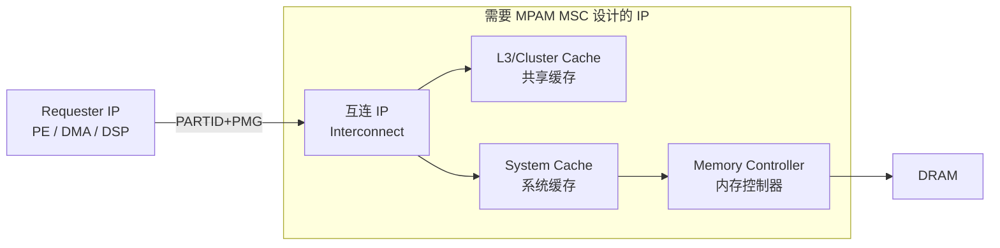
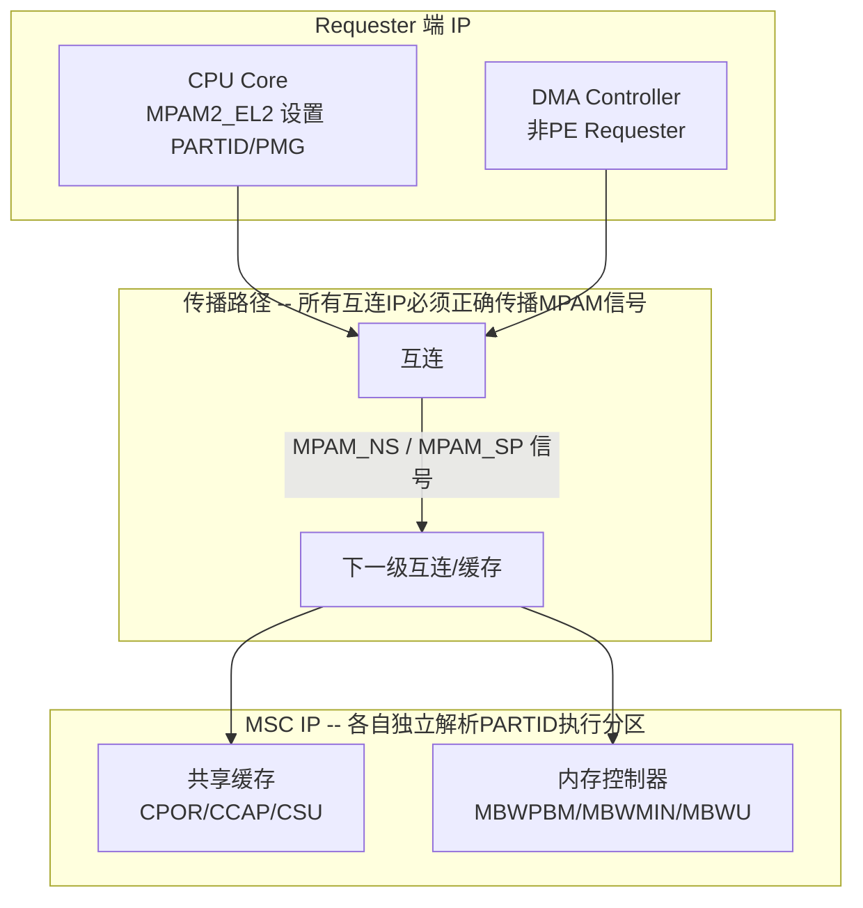

# SoC 支持 MPAM 功能的 IP 设计要求

> 基于 Arm IHI 0099B.a MPAM MSC 规范分析

---

## 一、MPAM Requester IP（生成 MPAM 信息束）

这些 IP 需要为发出的每个内存请求附加 **PARTID + PMG + PARTID Space** 信息：

| IP 类型 | 具体说明 | MPAM 机制 |
|---------|---------|-----------|
| **PE (CPU Core)** | Arm Cortex/AEM 等 A-profile 处理核 | 通过系统寄存器 `MPAMn_ELx` 设置 PARTID/PMG，FEAT_MPAM 控制 |
| **DMA Controller** | 如 Arm DMA-330/DMAC-620 等 | Non-PE Requester，需实现 MPAM 标记逻辑 |
| **DSP** | 如 Ethos NPUs 等 AI 加速器 | Non-PE Requester，需实现 MPAM 标记逻辑 |
| **SMMU** | 系统内存管理单元 | 在转换/旁路时传递或生成 MPAM 信息束 |
| **GPU** | 如 Mali GPU | Non-PE Requester，需实现 MPAM 标记逻辑 |
| **Network Controller** | 网络加速器/智能网卡 | Non-PE Requester，需实现 MPAM 标记逻辑 |

规范原文提到的 Requester 类型（IHI 0099B.a, Section 1.1）：

> *PEs, DSPs, and DMA controllers*

---

## 二、MPAM MSC IP（提供可分区的共享资源）

这些 IP 需要实现 MPAM 内存映射寄存器接口，接受 PARTID 并执行资源分区/监控：

### 2.1 共享缓存 IP

| IP | 需实现的 MPAM 特性 | 说明 |
|----|-------------------|------|
| **L3 / 集群缓存** | CPOR, CCAP, CMIN, CMAX, CASSOC, CSU Monitor | 最常见的 MSC，ACS 中 `partition001-003`/`monitor001-004` 重点测试 |
| **系统缓存** (System Cache / SLC) | CPOR, CCAP, CSU Monitor | SoC 级别的最后一级缓存 |

规范中的系统模型路径：

> `PE -> Interconnect -> Cache (L1/L2/Cluster) -> SoC Interconnect -> System Cache -> Memory Channel Controller -> Memory`

### 2.2 互连 IP

| IP | 需实现的 MPAM 特性 | 说明 |
|----|-------------------|------|
| **网络互连** (NI) | Priority (PRI), Bandwidth Partitioning (MBW) | 传播 MPAM 信息束，执行带宽/优先级控制 |
| **SoC 总线** | Priority, Bandwidth | QoS 带宽分区 |

### 2.3 内存控制器 IP

| IP | 需实现的 MPAM 特性 | 说明 |
|----|-------------------|------|
| **内存通道控制器** (DMC/CMN) | MBWPBM, MBWMIN, MBWMAX, MBWU Monitor | ACS 中 `mem001-003` 重点测试 |
| **内存带宽监控** | MBWU Monitor | 计数下游写/上游读 payload 字节 |

### 2.4 MMU/SMMU IP

| IP | 需实现的 MPAM 特性 | 说明 |
|----|-------------------|------|
| **SMMU** | MPAM 信息束传播 + 可选分区 | 既是 Requester 也可以是 MSC |

---

## 三、SoC 级支撑设计

除了各 IP 本身，SoC 集成层面还需要：

### 3.1 ACPI 表描述

| ACPI 表 | 用途 | MSC 代码中的使用 |
|----------|------|-----------------|
| **MPAM Table** | 描述每个 MSC 的基地址、资源数量、中断号、特性标志 | `val_mpam_create_info_table()` |
| **PPTT** | 处理器缓存拓扑（LLC ID、大小） | `val_cache_get_llc_index()` |
| **SRAT** | 内存近邻域、地址范围、大小 | `val_mpam_memory_get_base/size()` |
| **HMAT** | 内存带宽信息 | `val_mpam_msc_get_mscbw()` |
| **PCC** | 平台通信通道 | `val_pcc_create_info_table()` |

### 3.2 MPAM 信息传播路径

### 3.3 GIC 中断路由

MSC 产生的错误中断和溢出中断需要通过 GIC 路由到 PE，ACS 中 `intr001-003` 测试了这一路径：

- **MPAMF_ECR.INTEN** 控制错误中断使能
- 中断号在 MPAM ACPI 表中描述
- GIC ISR 安装：`val_gic_install_isr()`

---

## 四、总结 -- IP 设计清单

按必要性排序：

| 优先级 | IP | 设计要求 |
|--------|-----|---------|
| **必须** | CPU Core (PE) | 实现 FEAT_MPAM，MPAMn_ELx 系统寄存器 |
| **必须** | 共享缓存 (L3/System Cache) | 实现 MSC MMIO 寄存器、CPOR 或 CCAP、CSU Monitor |
| **必须** | 互连 (Interconnect) | 正确传播 MPAM 信号（MPAM_NS/MPAM_SP） |
| **强烈建议** | 内存控制器 | 实现 MBWPBM/MBWMIN/MBWMAX、MBWU Monitor |
| **建议** | DMA Controller | 实现 MPAM 标记能力 |
| **建议** | SMMU | 传递/生成 MPAM 信息束 |
| **可选** | GPU/DSP/NIC | 视场景需求实现 MPAM Requester |

> 规范原文明确指出：*"There is no requirement to make all components in an SoC MPAM-compliant."* 即不要求所有组件都实现 MPAM，但 CPU、共享缓存、互连是核心三要素。

---

*基于 Arm IHI 0099B.a MPAM MSC Specification 及 MPAM ACS v0.5.0 代码分析生成。*
