# MPAM (Memory System Resource Partitioning and Monitoring) 研究文档

> 基于 Arm IHI 0099B.a MPAM MSC 规范及 MPAM ACS v0.5.0 Alpha 合规测试套件代码

---

## 目录

1. [概述](#1-概述)
2. [MPAM 特性](#2-mpam-特性)
3. [MPAM 架构](#3-mpam-架构)
4. [功能设计](#4-功能设计)
5. [功能验证](#5-功能验证)
6. [软件使用](#6-软件使用)
7. [参考资料](#7-参考资料)

---

## 1. 概述

### 1.1 什么是 MPAM

MPAM (Memory System Resource Partitioning and Monitoring) 是 Arm 架构特性，为在共享内存系统上运行多个应用或虚拟机的系统（尤其面向企业网络和服务器环境）提供：

- **内存系统资源分区** (Resource Partitioning) -- 通过控制器对共享内存系统资源进行分区
- **内存系统资源使用监控** (Resource Monitoring) -- 通过监控器测量资源使用情况，为分区调整提供依据

MPAM 通过在内存系统中传播 **分区标识符 (PARTID)** 和 **性能监控组 (PMG)**，实现对内存系统资源的细粒度控制和监控。

### 1.2 规范与测试套件

| 项目 | 详情 |
|------|------|
| 规范文档 | Arm IHI 0099B.a MPAM MSC Specification |
| 规范质量 | EAC (最终开发产品) |
| 合规测试套件 | MPAM ACS (Architecture Compliance Suite) |
| ACS 版本 | v0.5.0 Alpha |
| 针对规范版本 | MPAM vA.a |
| 许可证 | Apache 2.0 |
| 代码仓库 | 原 BSA-ACS，已迁移至 sysarch-acs |

---

## 2. MPAM 特性

### 2.1 MPAM 版本体系

MPAM MSC 架构定义了以下版本：

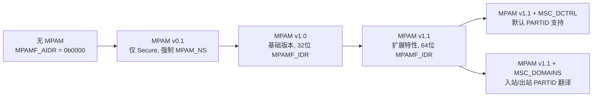

**版本详情：**

| 版本 | MPAMF_AIDR | 描述 |
|------|-----------|------|
| 无 | 0b0000 0b0000 | 不支持 MPAM |
| v0.1 | 0b0000 0b0001 | 有限功能 -- 仅 Secure，强制 MPAM_NS |
| v1.0 | 0b0001 0b0000 | 基础版本，32 位 MPAMF_IDR |
| v1.1 | 0b0001 0b0001 | 扩展特性，64 位 MPAMF_IDR |

### 2.2 核心概念

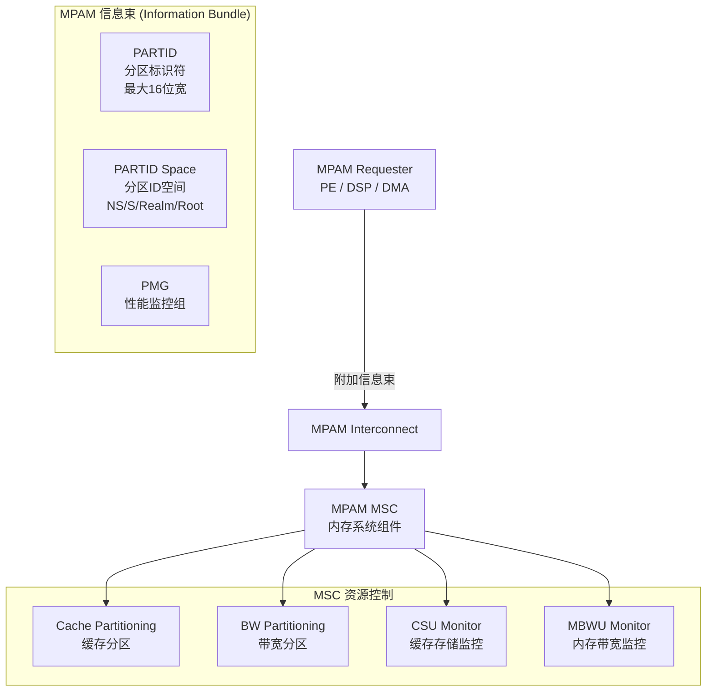

**关键概念说明：**

- **PARTID (Partition Identifier)**: 引用 PARTID 空间中一个分区的编号，最大 16 位宽，默认值为 0
- **PMG (Performance Monitoring Group)**: 用于监控过滤寄存器中对测量进行分组/细分的标识符，默认值为 0
- **PARTID Space (分区 ID 空间)**: 物理空间 -- Non-secure、Secure (可选)、Realm 和 Root (如实现 RME)
- **MPAM Requester**: 生成 MPAM 信息的组件 (PE、DSP、DMA 控制器)
- **MPAM MSC (Memory System Component)**: 提供共享可分区内存资源的组件 (缓存、互连、内存控制器)

### 2.3 v1.0 基础特性

| 特性 | 缩写 | 描述 | 必选/可选 |
|------|------|------|----------|
| Cache Capacity Partitioning | CCAP | 基于百分比的缓存容量分区 | 可选 |
| Cache Portion Partitioning | CPOR | 基于位图的缓存分配分区 | 可选 |
| Memory Bandwidth Partitioning | MBW | 内存带宽分区控制 | 可选 |
| Priority Partitioning | PRI | 内部和下游优先级控制 | 可选 |
| Memory System Resource Monitoring | MSMON | 内存系统资源监控框架 | 可选 |
| Cache Storage Usage Monitoring | CSU | 缓存存储使用量监控 | 可选 |
| Memory Bandwidth Usage Monitoring | MBWU | 内存带宽使用量监控 | 可选 |

### 2.4 v1.1 扩展特性

在 v1.0 基础上，v1.1 新增以下特性：

| 特性 | 缩写/标识 | 描述 |
|------|----------|------|
| 扩展 MPAMF_IDR | EXT | 64 位 IDR 寄存器 (v1.1 强制) |
| 实现定义资源控制/监控 | HAS_IMPL_IDR | IMPLEMENTATION DEFINED 的控制和监控 |
| 资源实例选择 | RIS (HAS_RIS) | 单个 MSC 管理多个资源 |
| MBWU 长计数器 | HAS_LONG | 44 位和 63 位计数器支持 |
| 错误状态寄存器 | HAS_ESR | ESR 发现 (v1.1 强制) |
| 扩展错误状态寄存器 | HAS_EXTD_ESR | 扩展 ESR 支持 |
| 缓存最小容量 | HAS_CMIN | 缓存最小容量分区 |
| 无最大缓存容量 | NO_CMAX | 禁用最大缓存容量 |
| 缓存关联性 | HAS_CASSOC | 缓存关联性分区 |
| CMAX 软限制 | HAS_CMAX_SOFTLIM | 缓存最大容量软限制 |
| MSC 域翻译 | FEAT_MPAM_MSC_DOMAINS | 入站/出站 PARTID 翻译 |
| 默认 PARTID 控制 | FEAT_MPAM_MSC_DCTRL | 默认 PARTID 支持 |

### 2.5 资源分区控制机制

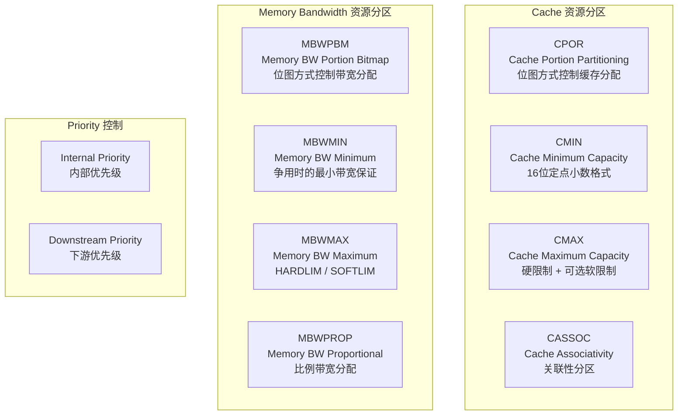

**分区行为要点：**

- PARTID 可启用/禁用 (MPAMCFG_EN / MPAMCFG_DIS)
- 缓存分配优先级：未分配(0) < 已禁用(1) > CMAX(2) < CMAX-CMIN(3) < CMIN(4)
- 带宽跟踪使用计费窗口（固定或移动）
- 缓存和带宽均允许超额分配

---

## 3. MPAM 架构

### 3.1 系统模型

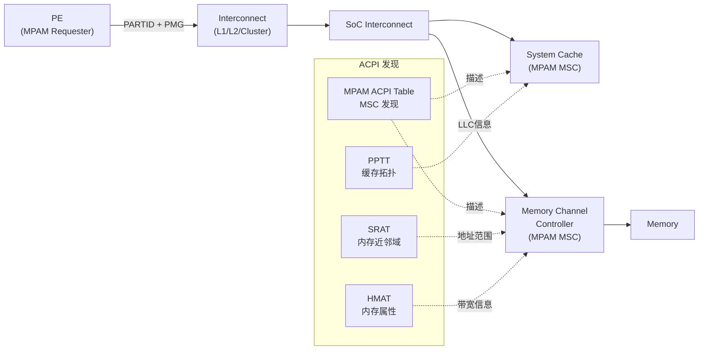

**信息传播规则：**

- MPAM 信息随请求向下游传播
- 缓存将 MPAM 信息与已分配缓存行一起存储
- 驱逐时保留 MPAM 信息
- PARTID 和 PMG 宽度在系统中必须一致
- 复位后仅默认 PARTID (0) 控制被重置；系统表现为无 MPAM

### 3.2 MPAM ACS 软件架构

MPAM ACS 采用三层架构设计：

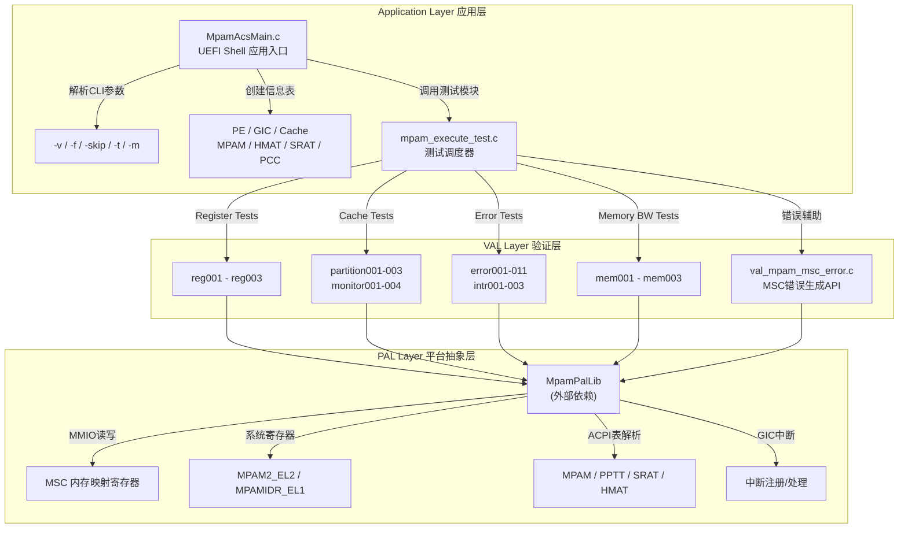

### 3.3 目录结构

```
mpam/
|-- IHI0099B_a_MPAM_system_component_specification.md   # Arm MPAM MSC 规范 (IHI 0099B.a)
|-- mpam/
    |-- README.md                                        # 项目文档
    |-- docs/
    |   |-- arm_mpam_architecture_compliance_test_scenario.md  # 测试场景规范文档
    |-- include/
    |   |-- mpam_val_interface.h                         # VAL 层接口定义
    |   |-- mpam_pal_interface.h                         # PAL 层接口定义
    |-- src/
    |   |-- mpam_execute_test.c                          # 测试调度器
    |   |-- val_mpam_msc_error.c                         # MSC 错误生成辅助库
    |-- scripts/
    |   |-- build_mpam_uefi.sh                           # UEFI 构建脚本
    |-- test_pool/
    |   |-- register/                                    # 寄存器合规测试 (3个)
    |   |-- cache/                                       # 缓存分区/监控测试 (7个)
    |   |-- error/                                       # 错误/中断测试 (14个)
    |   |-- membw/                                       # 内存带宽测试 (3个)
    |-- uefi_app/
        |-- MpamAcs.h                                    # 版本与配置定义
        |-- MpamAcs.inf                                  # EDK2 构建清单
        |-- MpamAcsMain.c                                # UEFI 应用入口
```

### 3.4 关键数据结构

**模块枚举与测试编号 (mpam_val_interface.h)：**

```c
typedef enum {
    REGISTER_MODULE,   // 测试编号基址: 0
    CACHE_MODULE,      // 测试编号基址: 100
    ERROR_MODULE,      // 测试编号基址: 200
    MEMORY_MODULE      // 测试编号基址: 300
} MPAM_MODULE_ID_e;
```

**MSC 节点类型 (mpam_pal_interface.h)：**

```c
typedef enum {
    MPAM_NODE_SMMU = 0x0,  // SMMU 节点
    MPAM_NODE_CACHE,        // 缓存节点
    MPAM_NODE_MEMORY        // 内存节点
} MPAM_NODE_TYPE;
```

**版本与信息表大小 (MpamAcs.h)：**

| 信息表 | 大小 | 支持上限 |
|--------|------|---------|
| PE_INFO_TBL_SZ | 16,384 B | 400 个 PE |
| GIC_INFO_TBL_SZ | 240,000 B | 832 个 GIC 信息条目 |
| CACHE_INFO_TBL_SZ | 262,144 B | 7,280 个缓存条目 |
| MPAM_INFO_TBL_SZ | 262,144 B | 1,800 个 MSC 条目 |
| SRAT_INFO_TBL_SZ | 16,384 B | 500 个内存近邻域 |
| HMAT_INFO_TBL_SZ | 12,288 B | 400 个近邻域 |
| PCC_INFO_TBL_SZ | 262,144 B | 234 个 PCC 条目 |

---

## 4. 功能设计

### 4.1 硬件交互机制

MPAM ACS 通过两种方式与 MPAM 硬件交互：

```mermaid
graph TB
    subgraph "系统寄存器访问"
        SR1["MPAM2_EL2<br/>写入 PARTID_D + PMG_D<br/>标记 PE 流量"]
        SR2["MPAMIDR_EL1<br/>读取 PE 最大 PARTID/PMG 能力"]
    end

    subgraph "MSC 内存映射寄存器 (MMIO)"
        subgraph "ID 寄存器"
            IDR["MPAMF_IDR<br/>版本/特性位"]
        end
        subgraph "配置寄存器"
            PS["MPAMCFG_PART_SEL<br/>PARTID 选择"]
            CPBM["MPAMCFG_CPBM<br/>CPOR 位掩码"]
            CX["MPAMCFG_CMAX<br/>CCAP 最大容量"]
            BMX["MPAMCFG_MBW_MAX/MIN/PBM<br/>带宽分区配置"]
        end
        subgraph "监控寄存器"
            MS["MSMON_CFG_MON_SEL<br/>监控器选择"]
            MC["MSMON_CFG_CSU_CTL/FLT<br/>CSU 监控控制/过滤"]
            MB["MSMON_CFG_MBWU_CTL/FLT<br/>MBWU 监控控制/过滤"]
            MW["MSMON_MBWU<br/>MBWU 计数器"]
        end
        subgraph "错误寄存器"
            ESR["MPAMF_ESR<br/>错误状态 (errcode bits 24-27)"]
            ECR["MPAMF_ECR<br/>错误控制 (中断使能)"]
        end
    end

    PE["PE"] -->|"系统寄存器访问"| SR1
    PE -->|"系统寄存器读取"| SR2
    SW["软件 (ACS)"] -->|"MMIO读写"| IDR
    SW -->|"MMIO读写"| PS
    SW -->|"MMIO读写"| CPBM
    SW -->|"MMIO读写"| CX
    SW -->|"MMIO读写"| BMX
    SW -->|"MMIO读写"| MS
    SW -->|"MMIO读写"| MC
    SW -->|"MMIO读写"| MB
    SW -->|"MMIO读写"| MW
    SW -->|"MMIO读写"| ESR
    SW -->|"MMIO读写"| ECR
```

### 4.2 VAL 层 API 设计

**错误生成 API (val_mpam_msc_error.c)：**

| 函数 | 功能 |
|------|------|
| `val_mpam_msc_reset_errcode()` | 清除 MPAMF_ESR 错误码 (bits 24-27) |
| `val_mpam_msc_get_errcode()` | 读取 MPAMF_ESR 错误码 |
| `val_mpam_msc_generate_psr_error()` | 生成 PARTID 选择范围错误 |
| `val_mpam_msc_generate_msr_error()` | 生成监控器选择范围错误 |
| `val_mpam_msc_generate_por_error()` | 生成请求 PARTID 超范围错误 |
| `val_mpam_msc_generate_pmgor_error()` | 生成请求 PMG 超范围错误 |
| `val_mpam_msc_generate_msmon_config_error()` | 生成 MSMON 配置 ID 超范围错误 |
| `val_mpam_msc_generate_msmon_oflow_error()` | 生成 MBWU 监控器溢出 |
| `val_mpam_msc_trigger_intr()` | 触发 MSC 错误中断 |

**PAL 层 API (外部依赖 bsa-acs)：**

| 类别 | API 示例 |
|------|---------|
| MMIO 访问 | `val_mpam_mmr_read()` / `val_mpam_mmr_write()` / `val_mpam_mmr_read64()` / `val_mpam_mmr_write64()` |
| 系统寄存器 | `val_mpam_reg_read()` / `val_mpam_reg_write()` / `AA64ReadMpam2()` / `AA64ReadMpamidr()` |
| MSC 信息查询 | `val_mpam_get_info()` / `val_mpam_get_msc_count()` |
| 特性检测 | `val_mpam_supports_cpor()` / `val_mpam_supports_ccap()` / `val_mpam_msc_supports_ris()` |
| 分区配置 | `val_mpam_configure_cpor()` / `val_mpam_configure_ccap()` / `val_mpam_configure_mbwpbm()` |
| CSU 监控 | `val_mpam_configure_csu_mon()` / `val_mpam_csumon_enable/disable/read_csumon()` |
| MBWU 监控 | `val_mpam_memory_configure_mbwumon()` / `val_mpam_memory_mbwumon_enable/disable/read_count()` |

### 4.3 错误码设计

MPAM MSC 定义了 12 种错误码，记录在 MPAMF_ESR.ERRCODE (bits 24-27) 中：

| 错误码 | 名称 | 描述 |
|--------|------|------|
| 0b0000 | No Error | 无错误 |
| 0b0001 | PARTID_SEL_Range | MPAMCFG_PART_SEL 中 PARTID 超范围 |
| 0b0010 | Req_PARTID_Range | 请求 PARTID 超范围 |
| 0b0011 | MSMONCFG_ID_RANGE | 监控配置中 PARTID 或 PMG 超范围 |
| 0b0100 | Req_PMG_Range | 请求 PMG 超范围 |
| 0b0101 | Monitor_Range | 监控器选择器超范围 |
| 0b0110 | intPARTID_Range | 内部 PARTID 范围错误 |
| 0b0111 | Unexpected_INTERNAL | 内部标志错误 |
| 0b1000 | Undefined_RIS_PART_SEL | MPAMCFG_PART_SEL 中未定义 RIS |
| 0b1001 | RIS_No_Control | RIS 已选择但无控制 |
| 0b1010 | Undefined_RIS_MON_SEL | MSMON_CFG_MON_SEL 中未定义 RIS |
| 0b1011 | RIS_No_Monitor | RIS 已选择但无监控器 |

### 4.4 中断机制

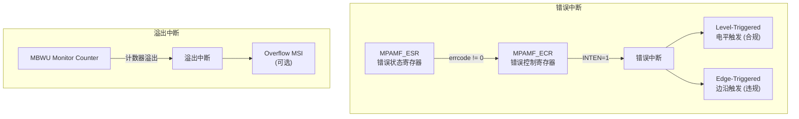

---

## 5. 功能验证

### 5.1 测试框架总览

MPAM ACS 共包含 **27 个测试用例**，分为 4 个测试模块：

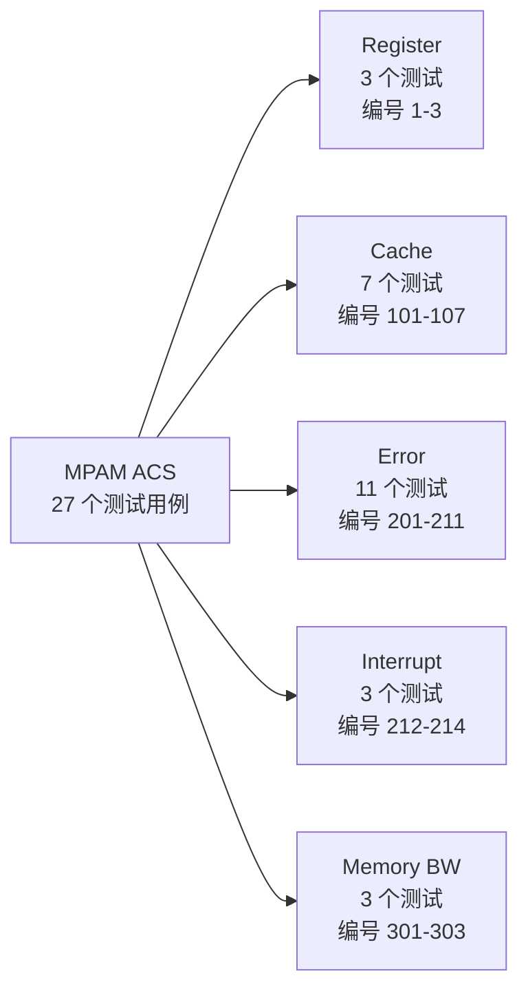

### 5.2 测试执行流程

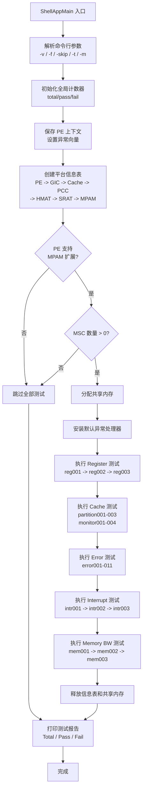

### 5.3 统一测试模式

每个测试用例遵循统一的五阶段模式：

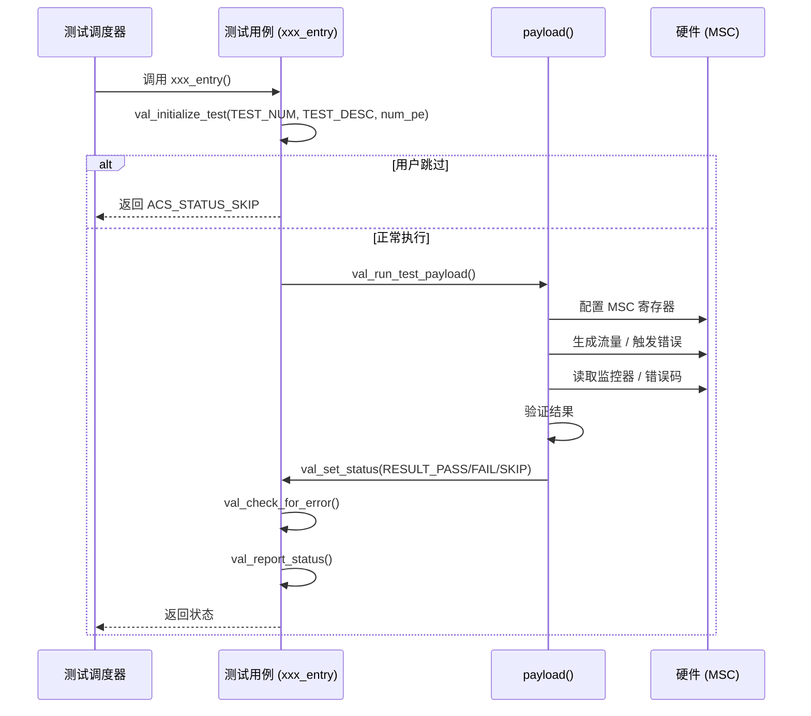

### 5.4 寄存器合规测试 (3个)

| 测试编号 | 文件 | 描述 | 验证规则 |
|---------|------|------|---------|
| 1 | reg001.c | MPAM Version EXT Bit Check | v1.0 要求 EXT=0; v1.1 要求 EXT=1 |
| 2 | reg002.c | Expansion of MPAMF_ESR | HAS_ESR + HAS_RIS + EXT => HAS_EXTD_ESR=1 |
| 3 | reg003.c | MPAM MSC Feature Test | v1.0 禁止多项特性; v0.1/v1.1 有必须特性 |

**reg001 测试逻辑示例：**

```
遍历所有 MSC:
  读取 MSC 版本号 (MPAMF_IDR)
  若 v1.0: 检查 EXT == 0
  若 v1.1: 检查 EXT == 1
  其他版本: 报告无效
```

### 5.5 缓存分区与监控测试 (7个)

| 测试编号 | 文件 | 描述 |
|---------|------|------|
| 101 | partition001.c | CPOR 分区验证 (75%/25% 分配) |
| 102 | partition002.c | CCAP 分区验证 |
| 103 | partition003.c | CPOR + CCAP 组合分区验证 |
| 104 | monitor001.c | PMG 存储隔离 (CPOR 节点) |
| 105 | monitor002.c | PMG 存储隔离 (CCAP 节点) |
| 106 | monitor003.c | PARTID 存储隔离 (CPOR 节点) |
| 107 | monitor004.c | PARTID 存储隔离 (CCAP 节点) |

**partition001 (CPOR 分区) 测试流程：**

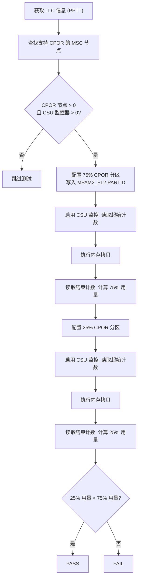

**monitor001 (PMG 存储隔离) 测试流程：**

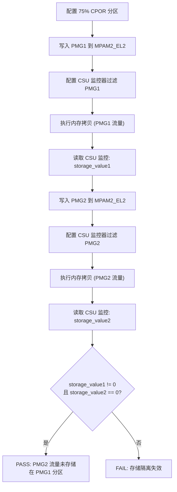

### 5.6 错误处理测试 (11个)

| 测试编号 | 文件 | 描述 | 触发方式 |
|---------|------|------|---------|
| 201 | error001.c | PARTID 选择范围错误 | 写超范围 PARTID 到 MPAMCFG_PART_SEL |
| 202 | error002.c | 请求 PARTID 超范围错误 | 写超范围 PARTID 到 MPAM2_EL2 + 内存事务 |
| 203 | error003.c | MSMON 配置 ID 超范围错误 | 写超范围 PARTID 到监控过滤寄存器 |
| 204 | error004.c | 请求 PMG 超范围错误 | 写超范围 PMG 到 MPAM2_EL2 + 内存事务 |
| 205 | error005.c | 监控器选择范围错误 | 写超范围监控索引到 MON_SEL |
| 206 | error006.c | intPARTID 超范围错误 | 写超范围 PARTID 到 INTPARTID 寄存器 |
| 207 | error007.c | 非预期内部错误 | 触发内部标志错误 |
| 208 | error008.c | MPAMCFG_PART_SEL 中未定义 RIS | 选择未定义的 RIS 值 |
| 209 | error009.c | RIS 无控制错误 | 选择有 RIS 但无控制的资源 |
| 210 | error010.c | MON_SEL 中未定义 RIS | 选择未定义的 RIS 到 MON_SEL |
| 211 | error011.c | RIS 无监控器错误 | 选择有 RIS 但无监控器的资源 |

**error001 测试流程示例：**

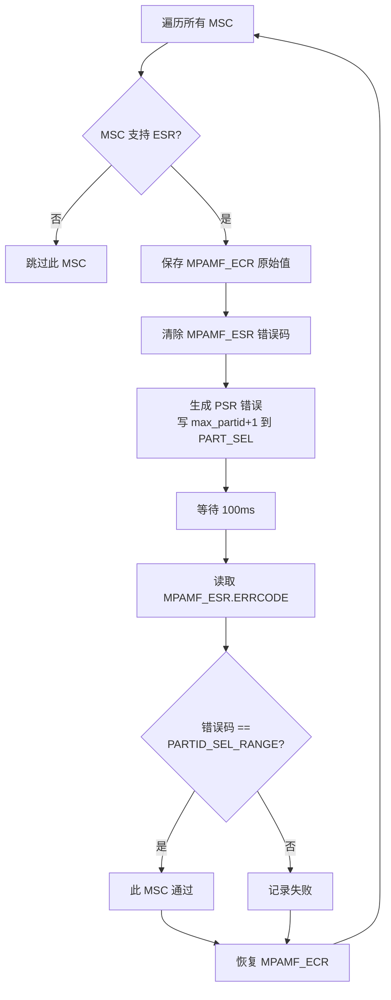

### 5.7 中断测试 (3个)

| 测试编号 | 文件 | 描述 |
|---------|------|------|
| 212 | intr001.c | 电平触发错误中断验证 |
| 213 | intr002.c | 边沿触发错误中断验证 (期望不触发) |
| 214 | intr003.c | MBWU 监控器溢出中断验证 |

**intr001 (电平触发中断) 测试逻辑：**
1. 安装 GIC ISR (中断服务例程)
2. 路由中断到当前 PE
3. 设置 MPAMF_ECR.INTEN=1 (使能错误中断)
4. 写非零值到 MPAMF_ESR.ERRCODE 触发中断
5. 验证 ISR 被调用 (电平触发中断应正常触发)

**intr002 (边沿触发中断) 测试逻辑：**
1. 同样配置，但检查中断类型
2. 根据规范，MPAM 错误中断应为电平触发
3. 若边沿触发中断被触发，则视为违规

**intr003 (MBWU 溢出中断) 测试逻辑：**
1. 配置 MBWU 监控器计数器最大值 (31/44/63位)
2. 使能溢出中断
3. 执行大量内存拷贝操作
4. 验证溢出中断触发

### 5.8 内存带宽分区测试 (3个)

| 测试编号 | 文件 | 描述 | 验证方法 |
|---------|------|------|---------|
| 301 | mem001.c | MBWPBM 分区验证 | 限制带宽后 MBWU 计数器读数应减少 |
| 302 | mem002.c | MBWMIN 分区验证 | 降低最小带宽保证后测量带宽应减少 |
| 303 | mem003.c | MBWMAX 分区验证 | 收紧最大带宽限制后测量带宽应减少 |

**mem001 (MBWPBM) 测试流程：**

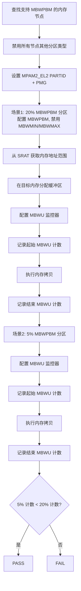

### 5.9 测试覆盖度总结

| 验证维度 | 覆盖内容 |
|---------|---------|
| MSC 节点遍历 | 测试覆盖系统中 ACPI 报告的所有 MSC |
| RIS 支持 | 对支持 RIS 的 MSC 正确配置资源实例选择 |
| ACPI 表发现 | MPAM / PPTT / SRAT / HMAT / PCC |
| 错误恢复 | 每个测试后恢复寄存器原始状态 |
| 异常处理 | 安装默认异常处理器捕获意外异常 |
| 特性检测 | 自动跳过不支持的特性测试 (SKIP) |
| 多场景对比 | 通过不同配置场景的监控器计数对比验证分区效果 |

---

## 6. 软件使用

### 6.1 构建环境

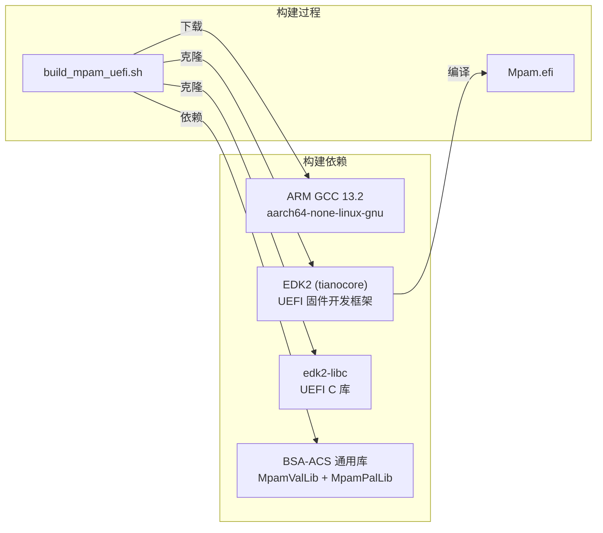

**构建步骤：**

```bash
# 1. 获取代码
git clone https://github.com/ARM-software/bsa-acs.git
cd bsa-acs

# 2. 执行构建脚本 (自动下载工具链和依赖)
source mpam/scripts/build_mpam_uefi.sh

# 3. 构建产物
# workspace/output/Mpam.efi
```

**构建配置 (MpamAcs.inf)：**

| 配置项 | 值 |
|--------|-----|
| 目标架构 | AARCH64 |
| 编译优化 | -O0 (无优化) |
| 指令集 | -march=armv8.1-a |
| 库依赖 | MpamValLib, MpamPalLib, UefiLib, ShellLib, DebugLib |
| 协议依赖 | ACPI Table, Hardware Interrupt, CPU Arch, PCI I/O |

### 6.2 运行方式

MPAM ACS 作为 UEFI Shell 应用运行于裸机 ARM64 平台：

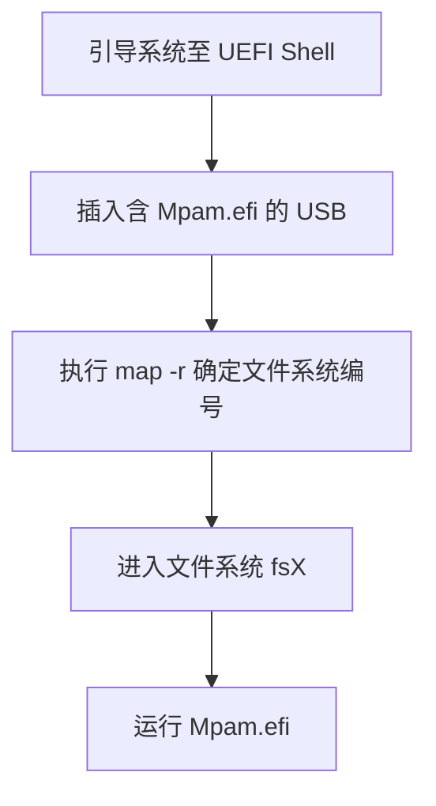

**实机运行步骤：**

1. 将 `Mpam.efi` 复制到 USB 存储设备
2. 将 USB 插入目标系统 USB 端口
3. 引导系统进入 UEFI Shell
4. 执行 `map -r` 确定 USB 文件系统编号
5. 执行 `fsX` 进入文件系统
6. 运行 `Mpam.efi [参数]`

### 6.3 命令行参数

```
Shell> Mpam.efi [-v <n>] [-skip <ids>] [-t <ids>] [-m <ids>] [-f <filename>] [-h]
```

| 参数 | 描述 | 示例 |
|------|------|------|
| `-v <n>` | 日志详细级别 (1=INFO 全部, 5=仅 ERROR) | `-v 1` |
| `-skip <ids>` | 跳过指定测试或模块 | `-skip 15,20,30` 或 `-skip 100` (跳过整个 Cache 模块) |
| `-t <ids>` | 仅运行指定测试 | `-t 101,102` |
| `-m <ids>` | 仅运行指定模块 | `-m 100` (仅 Cache 模块) |
| `-f <file>` | 保存测试输出到文件 | `-f mpam.log` |
| `-h` | 显示帮助 | `-h` |

**使用示例：**

```bash
# 运行全部测试, INFO 级别, 保存日志
Shell> Mpam.efi -v 1 -f mpam_uefi.log

# 跳过特定测试和模块
Shell> Mpam.efi -v 1 -skip 15,20,100 -f mpam.log

# 仅运行 Cache 模块测试
Shell> Mpam.efi -v 2 -m 100

# 仅运行指定测试
Shell> Mpam.efi -v 1 -t 1,2,101,201
```

### 6.4 输出报告格式

测试完成后输出汇总报告：

```
     -------------------------------------------------------
     Total Tests run  =   27;  Tests Passed  =   24  Tests Failed =    3
     ---------------------------------------------------------
```

**测试结果状态：**

| 状态 | 含义 |
|------|------|
| RESULT_PASS | 测试通过 -- 硬件行为符合规范 |
| RESULT_FAIL | 测试失败 -- 硬件行为不符合规范 |
| RESULT_SKIP | 测试跳过 -- 硬件不支持该特性 |

### 6.5 已知限制

- Alpha 质量版本，测试用例数量有限
- 部分错误相关测试仅在有限平台上验证
- 内存带宽分区测试已实现但尚未在任何平台上验证
- 项目已于 2025 年 6 月迁移至 sysarch-acs 仓库，原仓库只读

---

## 7. 参考资料

| 资料 | 说明 |
|------|------|
| Arm IHI 0099B.a | MPAM Memory System Component Specification |
| Arm DDI 0598 | Arm Architecture Reference Manual (MPAM PE 端描述) |
| MPAM ACS Test Scenario Document | arm_mpam_architecture_compliance_test_scenario.md (r1p0, Alpha 0.5.0) |
| MPAM ACS Source Code | mpam/ 目录，27 个测试用例源码 |
| sysarch-acs Repository | https://github.com/ARM-software/sysarch-acs |
| EDK2 / Tianocore | https://github.com/tianocore/edk2 |

---

*文档基于 Arm IHI 0099B.a 规范及 MPAM ACS v0.5.0 代码分析生成。*
